+ 结论：长线看好、跟踪观察，股价回调买入
+ 优势：国内IGBT专业厂商（专注该业务方向15年+，国内唯一进TOP10）、创始人及核心技术团队为国际化专业团队
+ 弱点：股价过分高估，2020年2月上市后连封20多个涨停板，目前股价在220元+（将近15倍）。但新业务（逆变器和汽车电控）现有合作伙伴均为二线或三线，尚未突破一线厂商（阳光/华为等）

+ 机会：中国IGBT产品市场空间增长确定，新能源汽车/充电桩及光伏/风电逆变器是未来5年快速增长点，国产化替代趋势（华为在光伏逆变器及汽车电控（也在网络能源BU）大概率扶植国内厂商）

# 公司概况

## 公司历程

斯达半导2005年4月成立，2020年2月上市主板。斯达半导是一家专门从事半导体元器件尤其是IGBT研发、生产和销售服务的国家级高新技术企业，注册资金1.2亿元。总部位于浙江嘉兴，占地106亩，在国内和欧洲均设有研发中心，是国内IGBT领域的领军企业。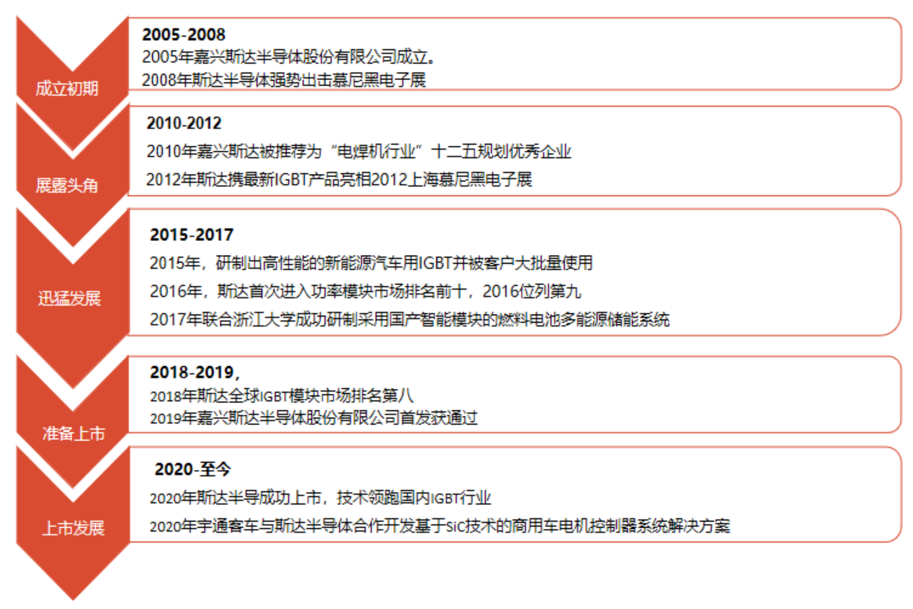

图1-1 斯达半导公司历程

## 股权结构

2020年2月斯达半导登录A股主板，发行4000万股、发行价位12.74元，募集资金5.1亿，首日收盘价位18.35元，公司市值29.4亿元；上市后连封23个涨停板，股价到162元。2021年2月10日收盘价位230.67元，总股本1.6亿股，公司市值369.07亿元。

斯达半导股权结构如图1-2：

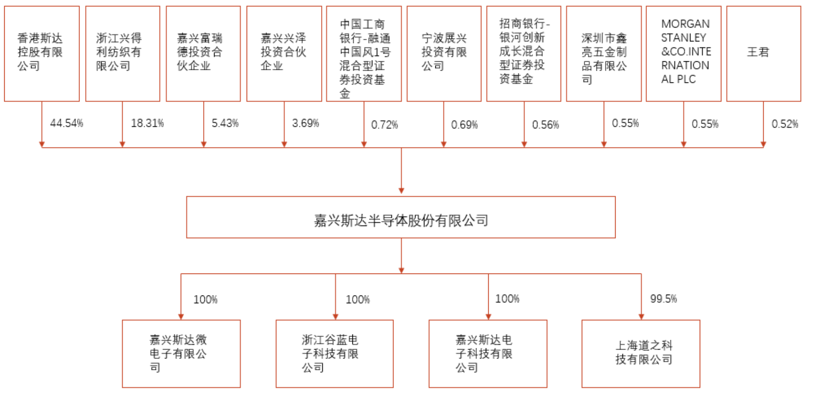

图1-2 斯达半导股权结构

公司实际控制人是创始人沈华（1963年）与胡畏（1964年）夫妻，IPO后实际支配公司股份为44.54%。

## 核心团队

核心管理团队如图1-3：

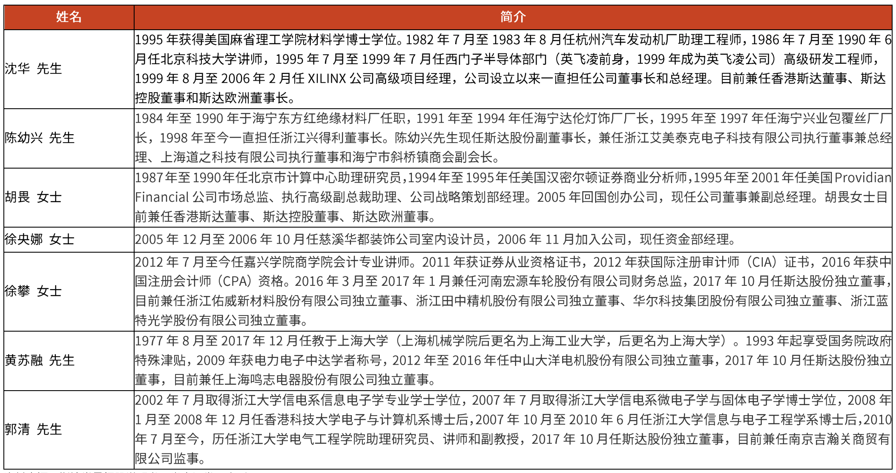

图1-3 斯达半导核心管理团队

核心技术团队：

+ 沈华：见上；
+ 汤艺：副总经理，1973年出生，美国国籍，2003年博士毕业于美国仁斯利尔理工学院（RPI）电子工程系，2003 年7月至2015年3月在美国国际整流器公司（International Rectifier）工作，历任集成半导体器件高级工程师、主管工程师、高级主管工程师、IGBT器件设计经理、IGBT器件设计高级经理。2015年加入公司，现任公司副总经理，负责 IGBT芯片技术研发工作；  
+ 戴志展：副总经理，1970年出生，中国台湾籍，国立清华大学电机工程研究所硕士。1997年6月至1999年9 月在飞瑞股份有限公司工作，历任研发部高级工程师、产品研发小组专案负责人；1999年9月至2002年11月在昀瑞公司工作，历任研发课课长、研发部经理；2002 年11月至2009年2月在乾坤科技股份有限公司工作，历任研发处经理、电源应用部资深经理。2009年2月加入公司，现任公司副总经理；  
+ 刘志红：监事，1983年出生，中国国籍，无境外永久居留权，浙江大学电力电子与电力传动专业硕士研究生。2006年加入公司，历任公司设计工程师、研发部经理，现任公司研发部总监；  
+ 胡少华：监事，1982年出生，中国国籍，无境外永久居留权，硕士学历。2004年7月获南昌大学材料科学与工程专业学士学位，2007年7月获浙江大学材料科学与工程专业硕士学位。2007年7月加入本公司，自2016年1月至今任公司工艺部总监； 

人力资源情况：

+ 员工人数：总605人，管理人员43人，生产人员385人，销售人员45人，研发人员132人；
+ 教育程度：硕士以上4%，本科36%，其他40%。

# 市场分析

## 市场空间

IGBT产品应用场景如图2-1，其中新能源汽车、充电桩及光伏/风电逆变器业务快速发展，对IGBT需求增长快。

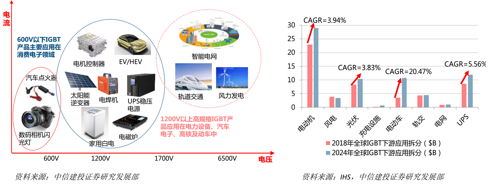

图2-1 IGBT产品应用场景分类

全球IGBT市场持续增长，2018年为58.36亿美元，预计2020年全球市场规模达到70亿美元，预期符合增长率7%。

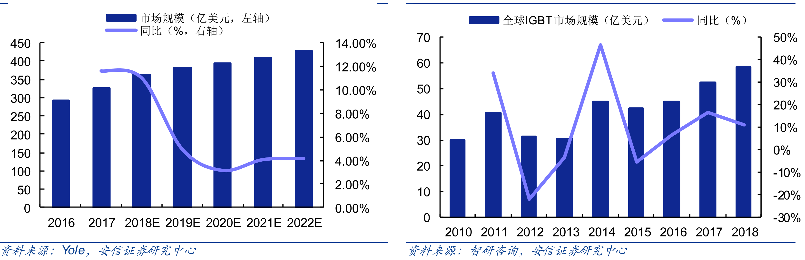

图2-2 全球IGBT市场需求预测

中国IGBT2018年市场规模约150亿元，并有望持续快速增长，预测复合增长率如按20%计，到2022年市场价值为311亿元；如按15%计，到2022年为262亿元。

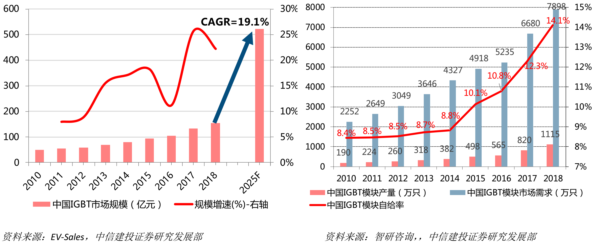

图2-3 中国IGBT市场需求预测

## 竞争态势

全球主要IGBT厂家如表2-1。英飞凌、三菱和富士电机是领先的供应商，斯达半导是国内唯一进入前十的供应商，并且份额持续上升中（2018年：2.2%，2019年2.5%）。

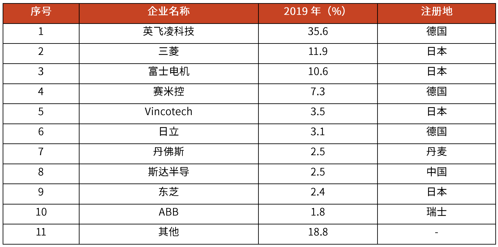

表2-1 全球IGBT主要供应商

中国IGBT供应商包括斯达半导（全品类）、比亚迪半导体（车规类）、中车时代（轨交类）等。

# 营收分析

## 收入分析

斯达半导销售收入及利润预测如图3-1：

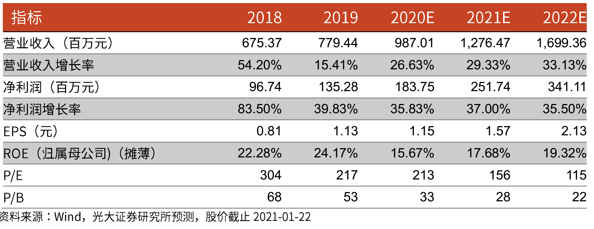

图3-1 斯达半导销售收入及利润预测

## 产品分析

斯达半导产品组合如图3-2：

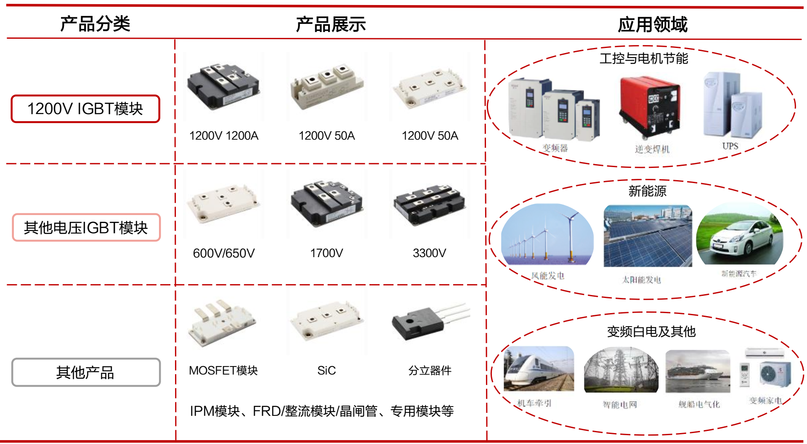

图3-2 斯达半导产品组合

现有产品销售占比：

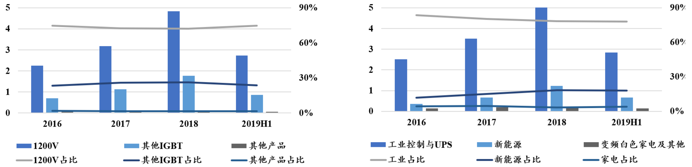

图3-3 斯达半导产品销售占比

主要客户情况：

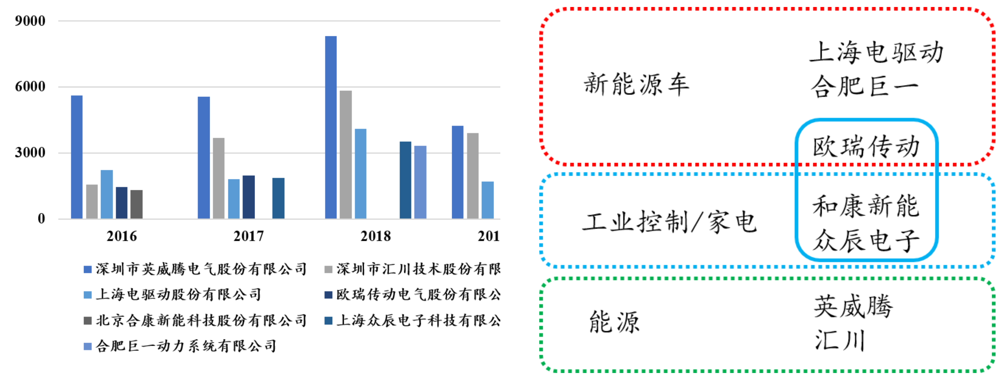

图3-4 斯达半导top客户

现有客户均为行业的二线或三线，尚未突破一线客户：

+ 新能源汽车/充电桩
  + 2019年装车16万台，包括宇通汽车（客车）及部分A级/A0级汽车（通过上海电驱/合肥巨一）【比亚迪自有半导体】
  + 48V轻混已经全面投产和装车，但该方向非行业主方向
  + 与英威腾、汇川技术、合肥巨一、上海电驱、合康新能进行产品合作（二线或三线）

+ 光伏
  + 与英威腾、汇川等规模合作（光伏二线或三线）
  + 阳光电源（一线）和华为网络能源（业界第一）拓展试用中

预计在1~2年内有可能规模突破一线客户，则业绩有进一步扩大机会。

## 募投项目

下一步发展方向：

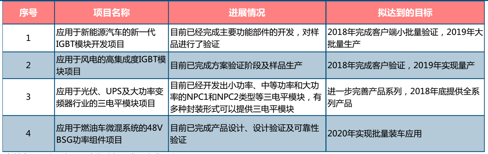

图3-5 斯达半导产品募投项目

# 收入预测

中金对斯达的收入预测：

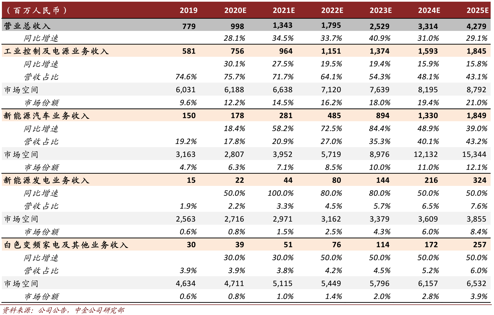

