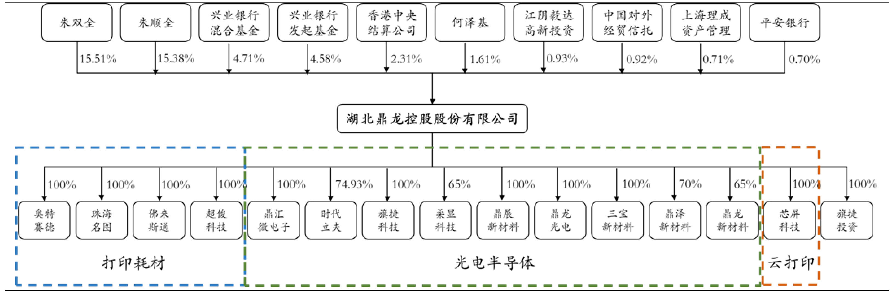
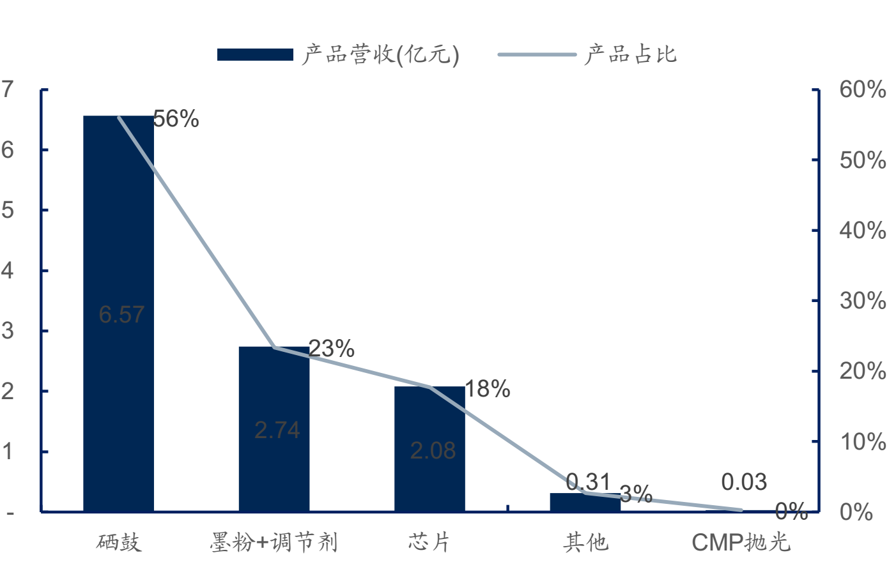
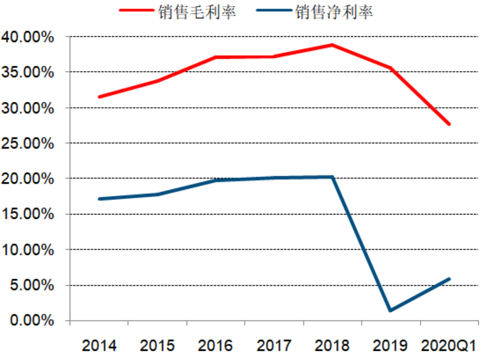
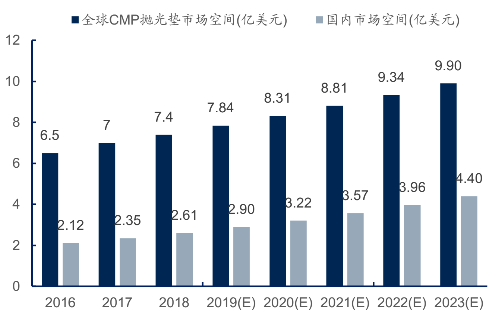
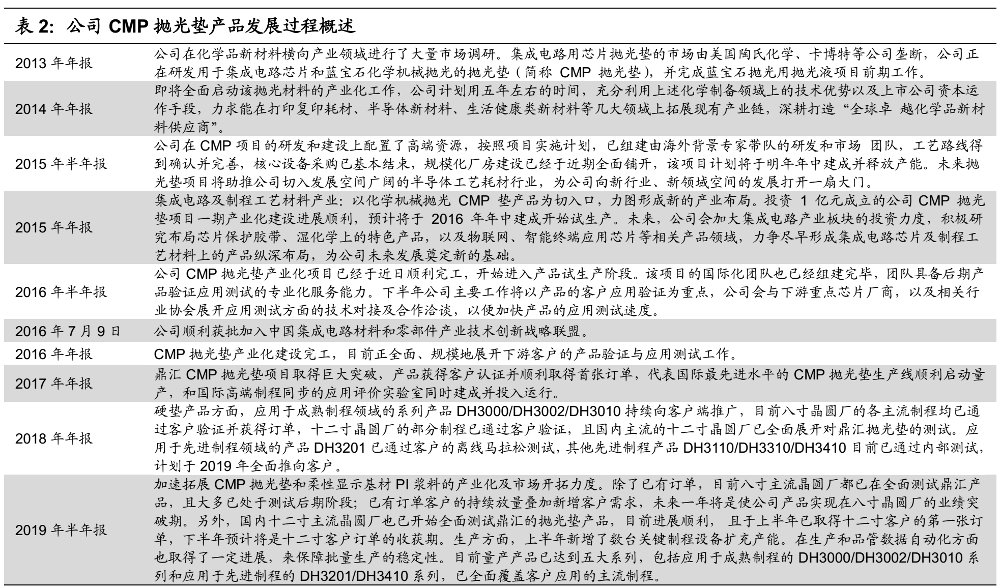
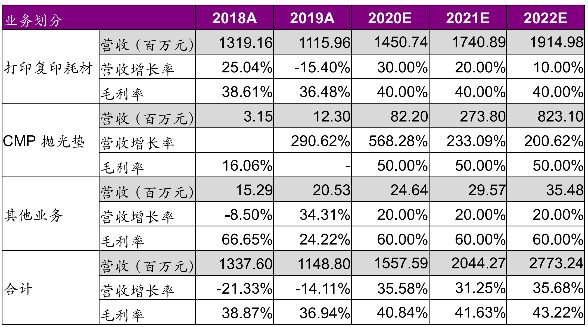
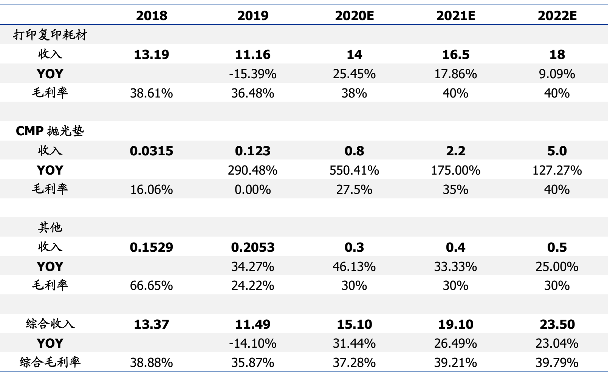

鼎龙股份是我国抛光垫行业唯一取得国内主流厂认证并实现批量供货的厂家，在晶圆厂快速扩充、先进工艺推动和国产替代的需求下，公司作为国内CMP抛光垫龙头有望步入高速成长期。该业务发展速度快（19年1231万，20年8000万，21年2.7亿E）、利润稳定，发展空间确定；抛光垫业务所在鼎汇微电子计划于2022年科创板上市。

打印耗材业务是鼎龙股份现有支柱业务（年销售额14亿+，95%+）和主要利润来源，受制于竞争压力、利润率持续下降，19年和20年均做了较大幅度的商誉减持（20年3.72亿、19年1.74亿，？）。鼎龙股份是国内打印复印通用耗材全产业链龙头，能否整合上下游产业链、升级产品结构维系业务毛利率非常关键；柔性显示PI基液是新业务（液晶等产品材料），未来可能会成为新的增长点。

#  公司概况

##  公司历程

湖北鼎龙化工有限责任公司于 2000 年在湖北省武汉市成立，成立之初主要从事电荷调节剂、商业喷码喷墨及树脂着色剂等产品的生产和销售业务，其生产的电荷调节剂是我国成功进入国际市场的打印耗材产品。2008年公司更名为湖北鼎龙化学股份有限公司，并于 2010 年成功在创业板上市。2019 年 6 月，公司全资子公司鼎汇微电子拟以增资扩股的方式引入战略股东湖北高新产业投资集团后，将于 2022 年进行科创板上市材料申报。  

图1-1 公司发展历程

## 股权结构

鼎龙股份股权结构及子公司布局如图1-2，CMP业务在鼎汇微电子及时代立夫两个子公司。

图1-2 鼎龙股权结构及子公司布局

2020 年 11 月 24 日公司公告将转让控股子公司湖北鼎汇微电子材料有限公司2080万元的注册资本以单价5元即合计人民币10,400万元的价格转让给五家员工持股平台以实施员工持股。交易完成后公司持有鼎汇微电子76.15%股份，员工持股平台占有20%股份，参与持股的核心员工不超过120人。

## 创始人经历

朱双全（董事长）： 男， 1964年出生，硕士研究生学历，武汉市第十三届政协常委，武汉市第十三届工商联副主席。1987年8月至1998年3月，任湖北省总工会干部； 1998年3月至2000年7月，任湖北国际经济对外贸易公司部门经理； 2000年7月至2005年3月，任鼎龙化工执行董事、总经理； 2005年3月至2008年4月，任湖北鼎龙执行董事、总经理； 2008年4月至今，任鼎龙股份第一届至第四届董事会董事长职务。  

朱顺全（总经理）： 男， 1968年出生，大学本科学历，武汉市第十三届政协委员。1997年至2000年，任中国湖北国际经济技术合作公司部门经理； 2000年7月至2005年3月，任鼎龙化工监事； 2005年3月至2008年4月，任湖北鼎龙监事。 2008年11月至今，任鼎龙股份董事、总经理。  

## 人力资源

按2019年年报：

+ 员工总人数2472人；
+ 按专业划分：生产人员1440人，销售人员243人，技术人员524人，财务人员68人，行政人员197人；
+ 按教育程度：博士17人，硕士90人，本科431人，专科380人，中专及以下1554人；

#  公司业务分析

公司上市前主要产品为电子成像显像专用信息化学品，包括碳粉用电荷调节剂、 商业喷码喷墨和高端树脂显色剂等。上市后，鼎龙成为打印机耗材领域的第一家上市公司。公司通过积极拓展彩色聚合碳粉业务，并进行一系列并购整合，通过不断的内生外延，现已发展为上下游一体化的打印机耗材龙头。此外，公司积极拓展CMP 抛光垫、 OLED 柔性显示等领域，已形成打印复印耗材全产业链、集成电路芯片及制程工艺材料、光电显示材料等三大板块的产业布局。  

 图2-1 鼎龙股份业务板块

## 20年业务营收快报

预告 2020 年归母净利润-1.77 亿元至-1.30 亿元，低于市场预期。公司预告营收为17.44至18.22亿元，同比增长52%~59%，归母净利润为-1.77 亿元至-1.30 亿元，其中扣非净利润为-2.93 亿元至-2.46 亿元。

主要由于激光硒鼓市场竞争加剧导致价格下跌以及超俊厂房搬迁影响，子公司珠海名图、深圳超俊计提商誉减值约-3.72 亿元，此外公司进行股权激励费用影响约-0.90亿元，汇兑损失约-0.27亿元。扣除上述影响，公司主营业务利润贡献中值约2.18亿元，相比2019年仍有一定增长。

## 业务营收组成

鼎龙股份2020年H1分业务收入及毛利率如表2-1：

表2-1 鼎龙股份2020年H1分业务收入及毛利率

## 打印耗材业务

鼎龙股份的传统主营业务为深耕打印复印通用耗材全产业链， 核心产品包括“碳粉+墨盒芯片+显影辊+硒鼓”。  

图2-2 鼎龙股份2019年收入构成

长期以来，打印通用耗材业务对业绩做出主要贡献。2019 年打印复印耗材业务营业收入为 11.16 亿元，占营收总额的 97.14%；打印复印耗材的毛利润为 4.07 亿元，占毛利润总额的 99.39%。受行业竞争影响， 打印通用耗材业务毛利率持续下降：

图2-3 鼎龙股份2019年业务收入占比

措施和对策（20年H1中报）：

+ **耗材上游产品**： 公司在打印复印通用耗材产业已形成颇具竞争优势的全产业链模式，掌握了硒鼓产业上游核心材料中的三大核心产品（彩色聚合碳粉、芯片、显影辊）的关键技术，上述核心上游产品均已分别占据领先的国内市场份额，特别是公司作为国内通用化学法彩粉市场的唯一供应商竞争优势显著：
  + 碳粉：下半年公司计划在研发方面加快京瓷5026、理光SPC220等新品的研发进度，推动佳能3530系列、三星S51E等老产品的优化升级；在生产方面计划批量大试生产施乐聚酯碳粉并逐步进入市场，同时完成宁波工厂车间扩产工作；
  + 芯片：随着墨盒业务的开展，芯片销量同比增长69%。由于受行业新品推出少且老产品升级频繁等不利因素影响，芯片平均销售单价同比下降40%，平均芯片毛利率同比下降13.7%，但上半年度芯片出货量的大幅上涨， 在一定程度上降低了因销售价格急剧下跌对营收的不利影响。预计新品芯片下半年推向市场，必将缓解毛利率下滑趋势；
  + 显影辊：销量同比增长90%，收入同比增长82%，主要系H1215DR价格上涨、三期扩产产能逐步释放以及生产效率的提高。下一步，公司将继续加大市场拓展力度，紧盯市场发展趋势，加大产品优化提升。同时，计划进行4期产能扩产，进一步提高工厂的生产效率、降低生产成本，提升盈利能力；
+ **硒鼓成品**： 受到疫情冲击、消费低迷、运输费用上涨、原材料价格波动等各种经营不确定性影响，耗材终端制造企业退出加快，优质大型企业竞争优势越发明显，行业集中度持续提升。本报告期，硒鼓成品端的整体销量和收入均稳定增长，其中，名图硒鼓销量同比增长45%，超俊硒鼓销量同比增长24%。下一步，公司将继续整合和优化现有资源配置，聚焦发展公司具有核心竞争优势的自动化产线，提升份额；
+ **墨盒成品**： 报告期内，北海绩迅销量同比增长34%，收入同比增长14%。通过资源整合，公司在原有耗材成品领域产业优势基础上，布局墨盒业务，使产业链整合延伸，充分发挥产业链上下游协同效应，将北海绩迅、鼎龙汇杰单一产品优势转换为公司该业务的系统竞争优势，发挥耗材上游产品与终端成品在研发、市场、渠道、管理等方面的协同优势，优化资产结构，提升创新能力、盈利能力、抗风险能力及可持续发展能力。  

## CMP业务

包括CMP抛光垫及CMP清洗液两部分。CMP抛光垫详见章节3，CMP清洗液处于起步阶段，产品已经给3个半导体晶元厂送样试用。

>鼎泽目前主推产品为集成电路制程用CU-CMP后清洗液（ PCU-CMP）和蚀刻后残留物去除液（ PERR）。在研发和产品方面，公司推出的CMP清洗液产品DZ381已进入测试阶段，客户反馈结果良好，如进展顺利，将于年底前获得材料验证结果；另一家客户的DZ381样品将于近期在公司内部展开合作测试，并将在获得系统结果后，继续在客户端进行上机验证；此外，已与第三家客户达成一致，计划在今年下半年测试DZ361产品；针对集成电路蚀刻后清洗工艺，公司已有两款产品进入开发阶段，预计在2020年下半年推出DZP500与DZP700两款蚀刻后清洗液产品，并优先为上述三家客户寄送样品。  

## 柔性显示基材PI浆料业务

新业务，尚未规模销售。根据20年H1半年报：

> 公司于2020年第二季度完成了年产1000吨产业化项目，全自动化投料灌装生产线正式投入量产，该生产线为国内首条超
> 洁净柔性AMOLED用PI浆料量产线， 部分产品在客户端验证情况良好，相应通过多条G4.5和G6生产线验证。透明PI产品研
> 发同步进行中，内部测试中主体指标符合主流产品需求。    

#  CMP业务分析

## 市场空间

以12寸等效产能计算，2019年我国大陆晶圆厂产能为144万片/月，至2024年将增长至346万片/月，年均增速高达19%（数据来源：中信建投）。

预计 2023 年CMP垫全球市场规模约 9.9 亿美金，其中中国市场有望达到 **4.40 亿美金**。  （数据来源：国信证券研究所）

图3-1 CMP垫市场空间预测

## 竞争对手

CMP垫市场份额如图3-2，陶氏化学占据现有市场份额80%：

图3-2 CMP垫市场竞争格局

##   业务历程

鼎龙股份CMP抛光垫产品发展过程：

图3-3 鼎龙CMP业务历程

重要节点：

+ 2018年CMP订单突破并获得国家科技重大专项课题（02专项）“极大规模集成电路制造装备及成套工艺”支持；

+ 2019年获得首张12寸订单。2020年H1在国内多个晶圆厂包括长江存储、武汉新芯、中芯国际、合肥长鑫等取得重大进展；

+ 2019 年度对 CMP 抛光垫等项目的研发投入共 3904 万元，同比增长约 15%；

##  营收历程

鼎龙股份CMP抛光垫营收历程：

+ 2018年：314.9万
+ 2019年：1232.9万
+ 2020年：7900万（业绩快报）
  + H1：2102.4万
  + 8月：3113.0万

# 收入预测

光大证券20年7月研报对鼎龙股份的收入预测如图4-1，其中抛光垫部分的业务预测为20年0.82亿、21年2.74亿、22年8.23亿，并给出公司估值330亿元的测算。

图4-1 鼎龙营收分拆预测（光大证券）

国盛证券20年6月的研报测算逻辑类似，数据如图4-2：

图4-2 鼎龙营收分拆预测（国盛证券）
