# 华为终端OS认证范围

参考GB/T18336标准，以关键资产/数据为保护对象，针对威胁和目标要求进行推导，重点将终端OS自研安全特性纳入认证范围。

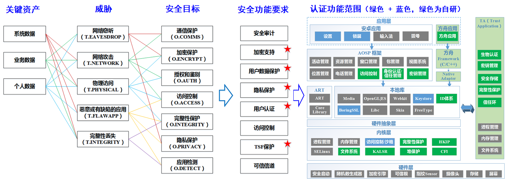

## 明确认证对象

认证对象为操作系统，不包含硬件（硬件安全为假设）：

+ 系统包括REE和TEE，不包含硬件；

+ TEE仅作为对整个在操作系统的部分安全功能的增强，并不单独作为一个OS来认证；

+ 系统介绍：基于EMUI系统持续演进构筑全场景分布式自研操作系统，同时兼容安卓生态

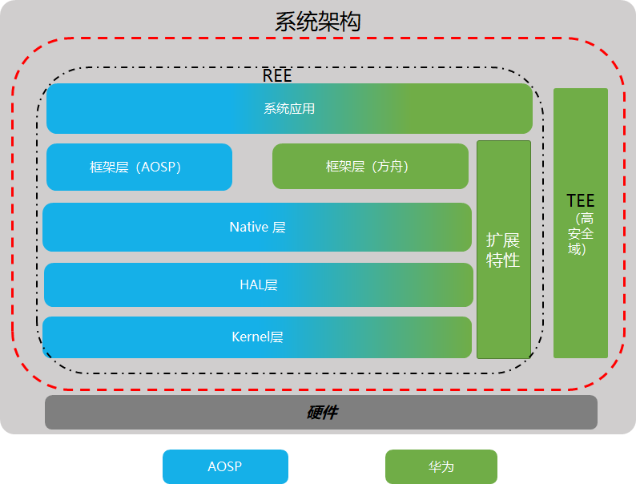

## 选取关键资产（数据）

定义3类数据（系统数据、业务数据和用户数据）为保护对象，三类数据的安全目标和功能要求存在差异：

+ **系统数据**：包括访问控制策略、安全配置数据、安全属性、设备状态等信息，这类数据对完整性有要求而对机密性无要求；比如HOTA升级包、系统镜像、蓝牙配对数据、系统闹钟、设备铃声、密码复杂度要求配置等；

+ **业务数据：**业务应用运行时，为执行业务功能所需的数据，包括应用配置、群体特征；

+ **用户数据**：用户产生的数据，分为个人数据和非个人数据；个人数据是能够追踪或关联到个人的数据；包括健康数据、个人基因、性生活、联系人、短信、日历、通话记录、位置信息等。

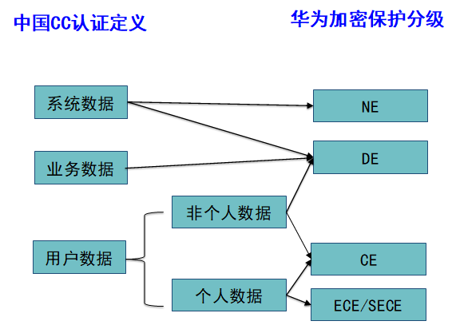

+ **NE**： Not Encrypted, 非加密区，完全不加密，这种情况极少，比如OTA升级包；

+ **DE**： Device Encrypted，设备加密区，在用户开机后，此区域数据即可访问；

+ **CE:**  Credential Encrypted，凭据加密区，首次进入（开机时）需要验证用户合法性；

+ **ECE**： Enhanced Credential Encrypted，增强凭据加密区，CE基础上，再次锁屏后数据会再次被加密；

+ **SECE**： Sub - Enhanced Credential Encrypted，增强凭据加密区，CE基础上，再次锁屏后可写不可读；

## 定义安全威胁、安全目标和安全功能要求

如上图。

## 确定安全功能要求对应当系统功能（认证测试范围）

安全要求中的加密支持、用户数据保护、隐私保护、用户认证、TSF保护对应的系统功能，在此次认证范围的自研特性中，占有较大的比重：

+ **安全审计**：安全日志（开关机/锁屏）；

+ **用户数据保护：**数据分类分级保护**、**锁屏、 SandBox、SELinux、访问控制、文件系统；

+ **隐私保护：**ID脱敏；

+ **加密支持**：keystore/keymaster、 BoringSSL、信任环、Asset存储、密码模块、加密引擎、随机数生成器；

+ **用户认证：**指纹、人脸、锁屏；

+ **访问控制：**权限管理、沙箱；

+ **TSF保护**：EIMA完整性保护、HKIP、CFI、堆保护、KALSR、安全启动；

+ **可信通道**：TLS/EAP-TLS、VPN；

# 安全解决方案

## 系统安全（TSF保护）

系统安全解决方案全景：

+ 系统更新：确保镜像安全可信；

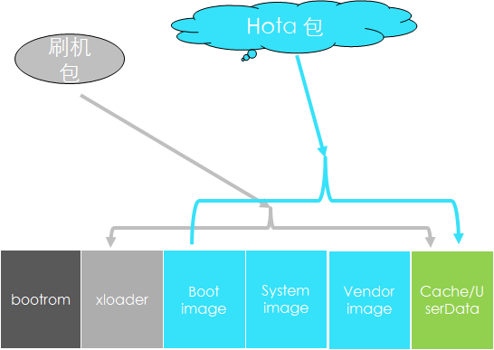

+ 系统运行：以硬件可信根为基础，构建安全启动链，自底向上构造纵深保护体系；

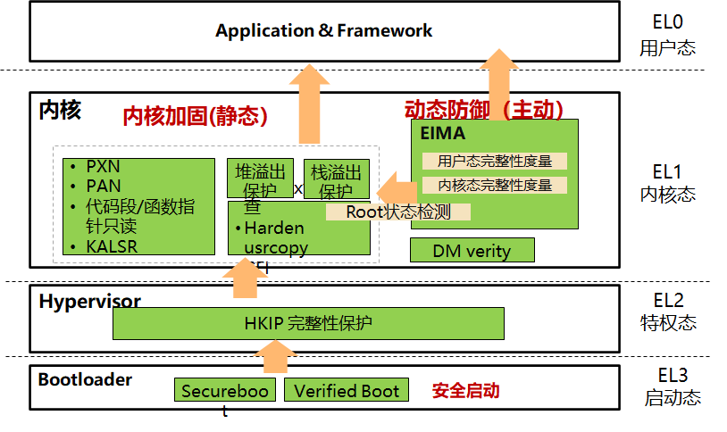

### 系统升级

系统升级安全：确保升级包制作、发布和加载执行的全流程安全：

+ **升级包安全保证**：对升级包进行SHA256摘要，并对摘要结果进行RSA2048加密；

+ **升级包发布安全保证**：全程E2E工具自动执行，工具有严格访问权限管理，避免非授权版本发布；

+ **部署服务器安全**：有防火墙确保访问安全，有双容灾备份；

+ **服务器和客户端交互安全**：
  + 端对云进行https单向证书认证，确保端侧接入的一定是华为HOTA服务器，防访问劫持；
  + 云对端进行PKI证书单向认证，确保接入华为HOTA服务器的一定是指定的华为手机，防接入假冒；
  + 升级包授权证书机制：确保当前用户有下载并升级此升级包的权利，非指定授权用户即使获取到升级包，无此授权文件也不能升级；

+ **升级执行安全**：
  + 执行升级的recovery模块有secure boot启动保护，确保安全；
  + 升级过程对升级包的SHA256+RSA2048的摘要签名结果进行校验，以及授权证书校验，校验通过才能升级；
  + 升级过程的防掉电安全保障机制，确保升级可靠；
  + 手机异常的最小系统恢复机制，确保即使升级出现异常也能恢复。

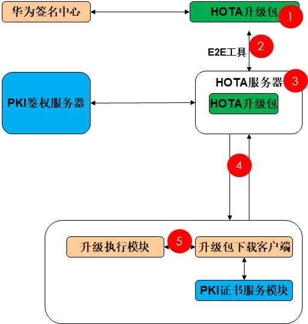

### 安全启动

安全威胁：针对软件启动代码、镜像、系统分区的篡改；

功能特性：以硬件可信根为基础，构建安全启动链，实现层层校验和防护：

+ 可信根+OnChipROM 校验fastboot代码；

+ Fastboot校验Kernel image和TEE OS image；

+ Kernel用DM Verity方案校验各分区，实现完整的校验链；

+ 芯片启动的代码和公钥，通过固化在芯片以及熔丝熔断方式保护，不可篡改；

防护效果：异常则退出；

### 内核完整性保护（HKIP）

安全威胁：针对内核代码段的篡改；

功能特性：通过二次映射，有效保护EL1对内核内存的修改，即使内核被侵入，其漏洞利用的难度也大大增加

+ 对虚拟地址做二次映射，在映射中设置访问权限；
+ 对设置虚拟内存的寄存器进行保护，防关闭，防替换；

保护对象：内核代码段、虚拟内存寄存器；

保护效果：隔离了物理地址，EL1/EL0无法越过二次映射直接访问内核内存；

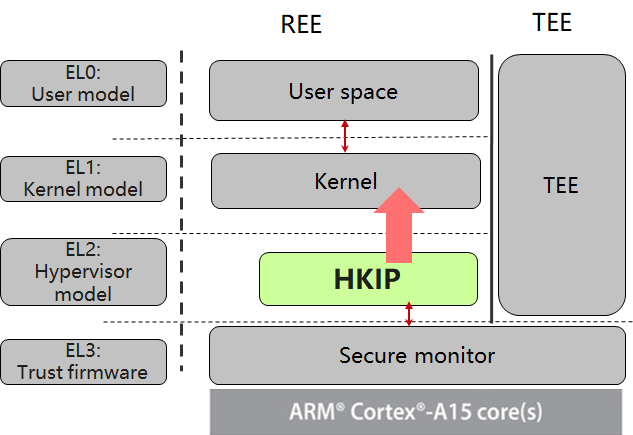

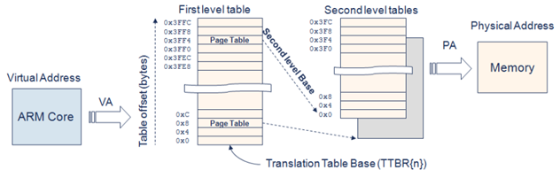

### 内存攻击防护

安全威胁：利用软件的漏洞，对内存进行修改，从而获取特权；

功能特性：通过对内存布局随机化、读写权限控制和事后的度量检查，从藏、防、检三个方面对内存施加保护

+ 采取地址随机化（藏）、PXN/PAN/代码段不可写（防）、代码度量/溢出检查（检）、跳转/调用时检查（CFI）等多种措施实施防护；

防护效果：对常见的攻击手段已能实施防御；

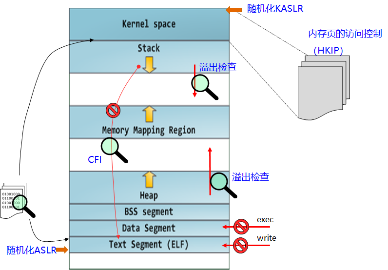

### 系统完整性度量

安全威胁：针对关键进程、内核代码段的篡改；

功能特性：定期检测系统的关键进程和代码完整性，监控系统健康状态

+ EIMA主要提供了对系统完整性的检查，EIMA模块定时对用户态的进程代码段、内核代码段等进行完整性度量，系统root状态检测整性，监控系统健康状态；

防护效果：EIMA如果检测出问题，会阻断TEE与REE的通信，很多依赖TEE的功能将无法使用；

### TSF保护小结

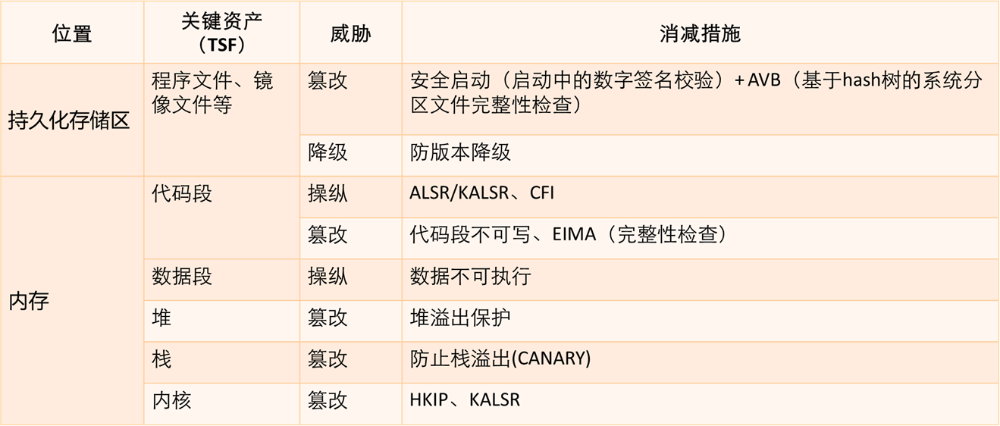

## 数据保护

### 数据分类

+ 个人数据：
  - 用户在使用过程中输入、创建的用户个人数据，Eg：用户密码、信用卡号
  - 安全目标：防止用户隐私泄露

+ 业务数据
  + 业务应用运行时，为执行业务功能所需的数据，Eg：应用配置文件
  + 安全目标：防止业务知识产权泄露、防止数据被篡改导致业务不可用
+ 系统数据
  + 维护系统运行的数据，Eg：运营商信息、系统Root状态、设备锁状态
  + 安全目标：防止系统不可用、防止数据泄露到哦在华为或运营商利益受损

### 数据安全

数据安全：以数据生命周期安全为中心，构建由硬件、内核到用户态的纵深安全保护框架。

数据生命周期安全

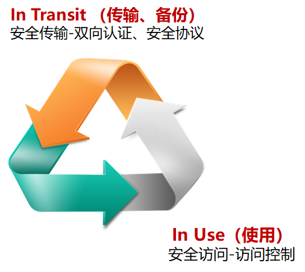

数据安全总体框架

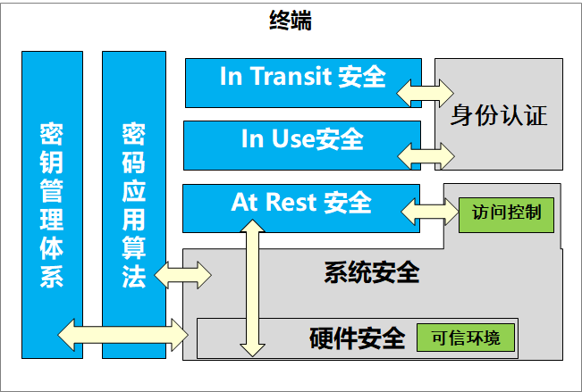

数据保护基础：密钥管理体系

+ 基于硬件设备密钥作为设备信任根构建统一密钥管理体系，防止从应用进程非法提取密钥材料，强化密钥安全

HUK设备唯一密钥保护体系

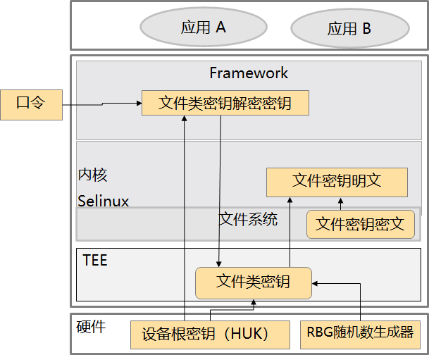

GID平台唯一密钥保护体系

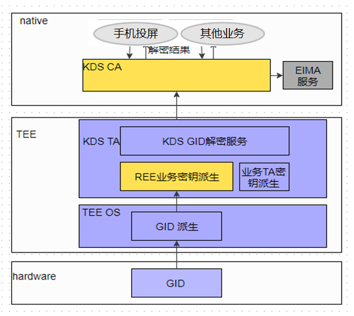

加密算法和密码套件支持：在用户态、内核态和TEE中，都提供通用的算法支持。

### 数据的生命周期保护

#### 数据保护机制

系统数据侧重于完整性保护，防止非法篡改（从系统数据的写入➔状态加密保护➔存储系统数据的保护）。

用户数据侧重于隐私保护，防止数据泄露，尤其是针对数据出设备的情况（从用户数据的产生➔加密➔传输➔存储➔销毁看对流程的保护）。

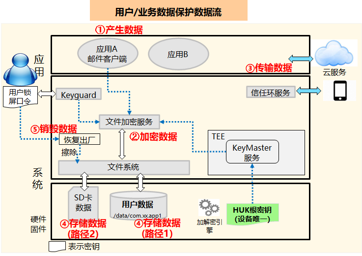

#### 数据保护-At Rest/In Use：数据的加密存储

针对数据分级，在不同场景下加密要求不同，保证敏感等级更高的数据收到更改的保护：

| **保护机制** | **访问限制**                                 | **示例**                   |
| ------------ | -------------------------------------------- | -------------------------- |
| ECE          | 锁屏后立即丢弃密钥，不可读                   | 健康数据(体重、血压）      |
| SECE         | 锁屏状态可写不可读                           | 邮件附件后台下载           |
| CE           | 开机首次解锁后可读。类似全盘加密。默认类别。 | 通讯录、照片               |
| DE           | 锁屏可读的数据                               | 医疗救援信息、闹钟、壁纸等 |

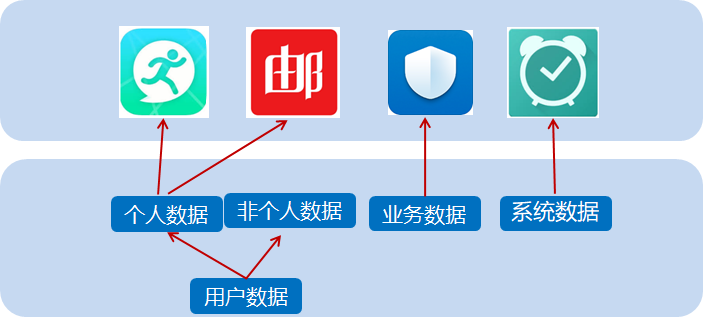

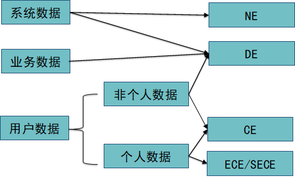

#### 数据保护-In Transit：基于账号体系的安全认证

基于用户口令建立同账号登录的设备间安全传输机制，进行点对点加密传输。

基于账号体系的安全认证：

+ 主设备创建账号密钥；
+ 基于用户锁屏口令加密账号主密钥；
+ 加密的帐号主密钥上云；
+ 加入信任环设备2，下周加密的账号主密钥；
+ 获得主设备机主的授权界面；
+ 基于密钥进行点对点加密通信（安全）；

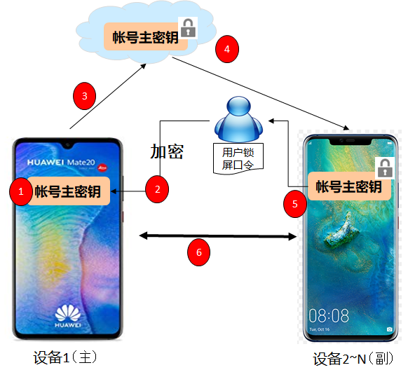

## 隐私保护

个人数据定义：

+ 能够用来区别（distinguish）或追踪(trace)个体身份的信息；
+ 能够和个人相光临(linked or linkable)的信息；

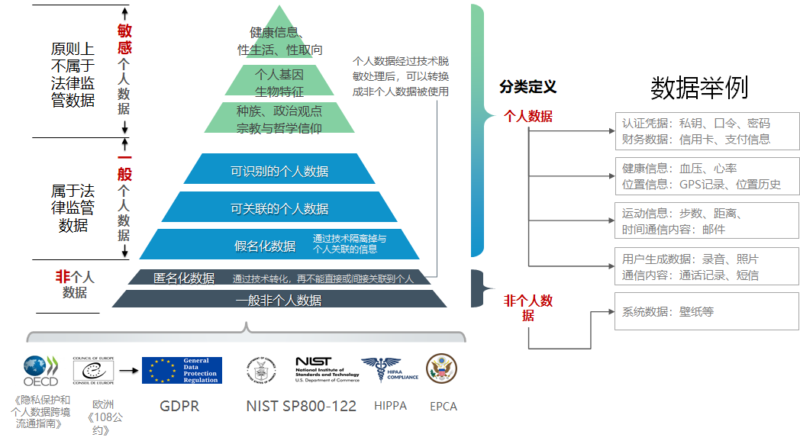

个人数据身份脱敏：使用变化的ID替换恒定不管的设备标识，避免应用使用同一ID关联所有用户数据，泄露隐私。

华为ID体系：

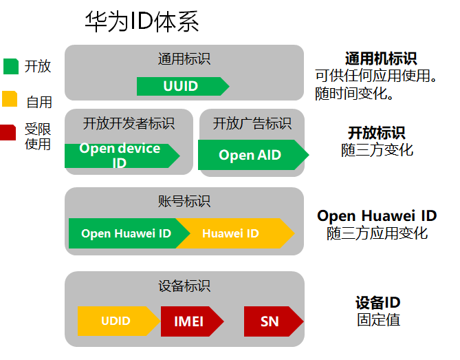

外部随机ID与内部ID的映射机制：

+ 支持空间隔离机制：针对业务制定的接收方生成不同的脱敏ID，避免不同第三方关联用户；
+ 支持时间隔离机制：建立重置撤销能力，用户取消隐私申明后第三方无法持续追踪用户；

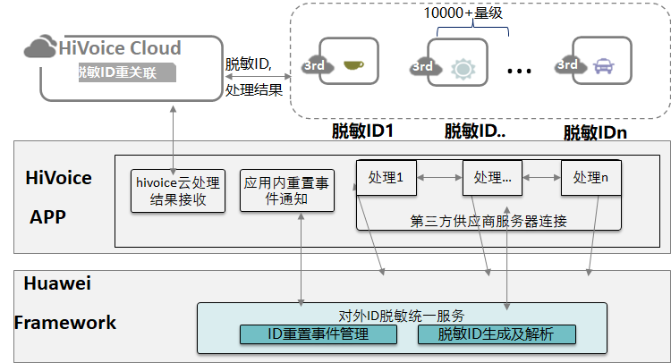

## 身份认证

基于PKI系统，在产线对每台设备预置唯一证书，提供信任锚点，用于设备身份认证、系统配置合法修改、合法镜像签名校验等：

+ 产线颁发和预置设备证书；
+ 安全敏感业务使用证书进行设备身份认证；
+ 颁发证书授权系统配置修改；
+ 颁发证书进行合法镜像签名；

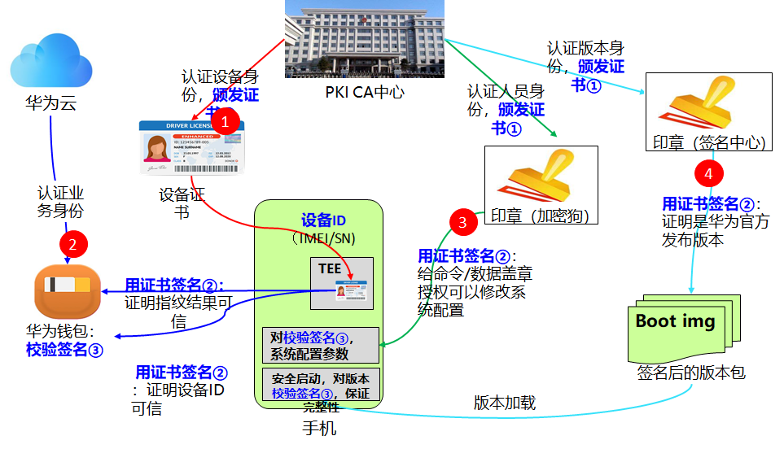

身份认证：生物识别

+ 生物特征的采集、存储不出高安全域，防止生物特征泄露；
+ 生物特征认证运行在高安全域，认证结果经签名后传出，保证认证过程和结果的安全性；

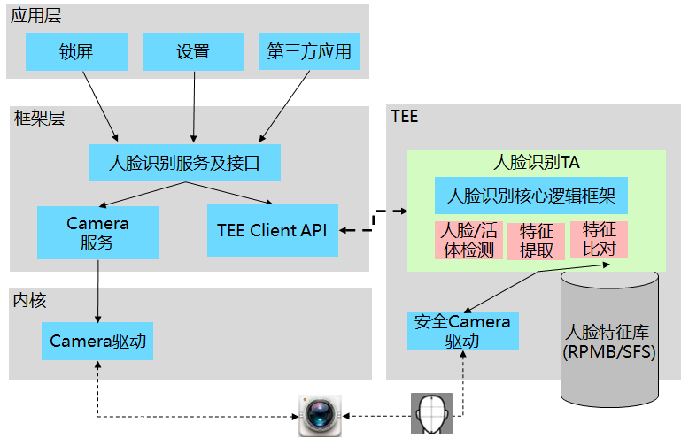

身份凭据：基于硬件的数字证书（车钥匙/门钥匙/手机盾），关键证书凭据放到SE中，身份校验在TEE中进行，提供安全性。

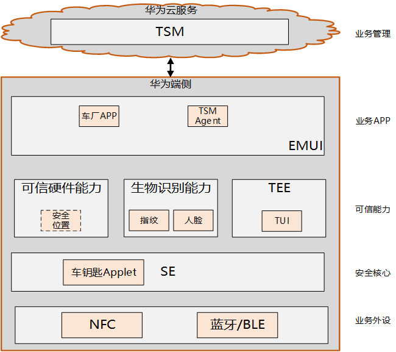

