# 可信背景及定义

可信将成为客户愿买、敢买和政府接受、信任华为的基本条件。**可信**不仅仅是产品外在表现的高质量结果，更是产品内在实现的高质量过程，是**结果和过程的双重可验证**的高质量。而只有**全面提升软件工程能力和实践**，才有可能打造出可信的高质量产品。

## 可信特征定义

+ Security安全: the ability of the system to remain protected against malicious deliberate threats系统对恶意威胁的防护能力：
  + Possible threats include but not limited to unauthorized access, use, disclosure, disruption, modification, or destruction可能的威胁包括但不限于未授权访问、使用、泄露、破坏、修改、毁灭；
  + The objective of protection from possible attacks is to provide confidentiality, integrity, and availability防护目标是保持信息的机密性、完整性和可用性；

+ Resilience韧性：The ability of the system to continue to be in a known state while under attack, even if in a degraded state, and to rapidly recover operational capabilities for essential functions and data，and recover to an effective operational posture in a time frame consistent with mission needs after an attack. 系统受攻击时保持在有定义的运行状态（包括降级）、遭遇攻击时快速恢复核心系统、受攻击后在业务需要的时间窗内恢复到有效运行态；

+ Reliability可靠性：The ability to perform as required, without failure, for a given time interval, under given conditions. 在给定的条件、给定的时间区间能无失效地执行要求的能力；

+ Availability可用性：The ability to be in a state to perform as required.处于按要求执行状态的能力；

+ Safety安全性：absence of unreasonable risk of physical injury or of damage to the health of persons, either directly, or indirectly as a result of damage to property or to the environment due to hazards caused by malfunctioning behavior of the system系统失效导致的危害不存在不可接受的风险，不会伤害自然人生命或危及自然人健康，不管是直接还是通过损害环境或财产间接造成的；

+ Privacy隐私性：The ability provided for the rights and obligations of individuals and organizations with respect to the collection, use, retention, disclosure, and disposal of personal information. 系统具备能力能使客户（含组织和个人）能够就收集、使用、保有、披露和处置个人信息履行其权利和义务。

## 硬件可信

硬件可信：用硬件去构建数据安全、运行可信的技术

+ 权限：app < OS < 固件 < 硬件
+ 构建硬件可信，成为整个系统可信的底座

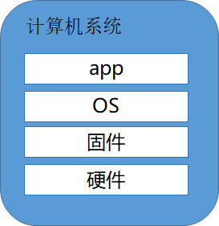

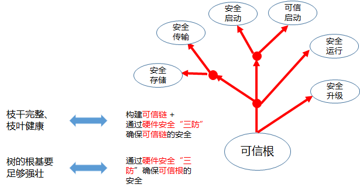

硬件可信特征解码：

+ **安全**(Security)和**韧性**(Resilience)是需重点构建的能力；
+ 短期落地基于可信根的启动技术方案，中长期构建硬件安全三防、认证与标准能力；

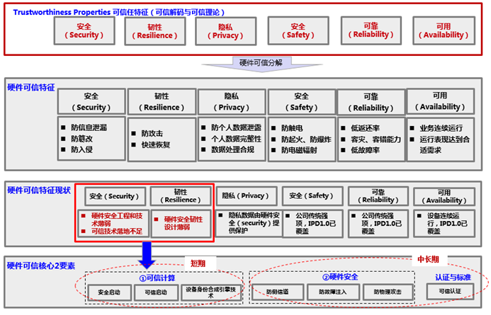

# 硬件可信核心要素分析

硬件可信与安全理论基础

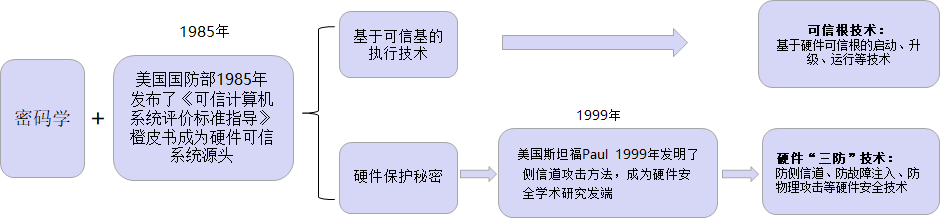

## 基于可信根的可信计算

**基于可信根的可信计算**：以硬件为基础，以软件为支撑，实现系统身份可认证和系统行为可预期，主要有安全启动、安全存储、安全运行等技术支撑.

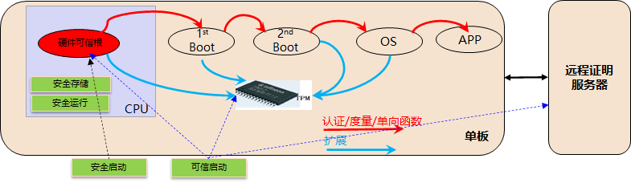

**可信计算基本思想：**

+ **安全启动**：建立硬件信任根（不可篡改），从信任根开始，一级认证一级，建立信任链，把信任扩展到整个系统，实现系统行为可预期；

+ **可信启动**：建立硬件信任根（不可篡改），从信任根开始，一级度量一级，建立信任链，把信任扩展到整个系统，结合远程证明，实现系统行为可预期；

+ **安全存储**：芯片提供安全存储空间（DDR安全区/eFUSE）存储敏感数据（私钥/HUK），只有安全世界能够访问；

+ **安全运行**：以ARM TrustZone为基础，构建最小安全OS，任何非安全世界的访问都需要经过安全OS的权限控制。

## 硬件安全三防

**硬件安全三防：**基于硬件的信息安全保护，主要特征为防侧信道、防故障注入、防物理攻击等。

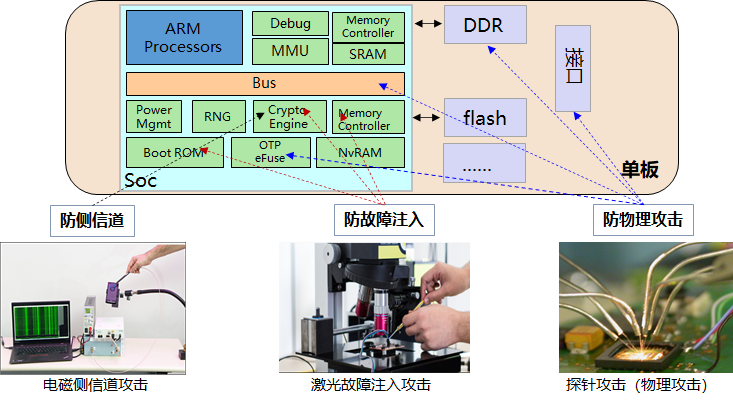

# 可信计算关键技术分析

可信计算的核心概念：可信根和可信链

+ 可信环境必须有一个基于密码学和物理保护的可靠的信任源头，这一信任源头就是系统的可信根；

+ 系统中的可信元件（安全机制），其可信性应通过这一可信根出发，经过一环套一环的可信传递过程来保障其可信性；

+ 系统的可信计算基中所有元件应构成一个完整的可信链条，以确保整个可信计算基的可信性。

基于硬件可信根的可信计算：

+ 安全启动和可信启动；
+ 安全运行；
+ 安全存储；
+ 安全升级；

## 安全启动和可信启动

**安全启动**：只有经过验证的代码才可加载和执行

+ 首先建立一个信任根，信任根是信任链的起点，不可篡改；

+ 再建立一条信任链：从信任根开始到启动代码、到操作系统，再到应用，一级验证一级，一级信任一级。从而把这种信任扩展到整个计算机；

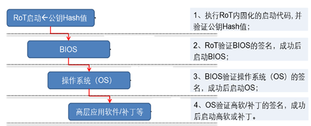

**安全启动**：设备启动时，先执行RoT，验证公钥的HASH值，基于公钥对BIOS进行数据完整性和数据可信性验证，确认BIOS完整可信后，再执行，按同样的方式，逐级认证、执行。

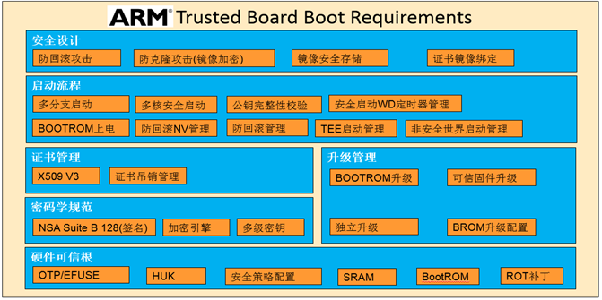

ARM TBBR规范从6个维度定义了安全启动：硬件可信根、密码学标准、镜像签名管理、启动流程管理、安全升级管理和安全设计：

+ 硬件可信根：
  + SoC需指出OTP/eFuse等安全存储机制，用于系统根密钥对安全存储及完整性管控；
  + OTP/eFuse最新需指出384bit（如使用EK最小为640bits，如果使用SSK Key则最新微768bits）。OTP及eFuse徐支持编程禁止功能；
  + 可信根私钥属于OEM，用于根证书签名；二级根私钥可属于OEM或其他第三方；可信根签名须包含二级根公钥，以支持对二级密钥及镜像进行校验；如在根证书中包含下一级的公钥，如下一级的私钥发生泄漏，则需吊销当前密钥，重新签发；可信根私钥属于OEM，用于对二级公钥及镜像进行签名；
  + SOC需支持硬件唯一密钥设计HUK，该密钥必须随机生成，一机一密。某设备的HUK泄露，只可影响该设备，不可影响其他设备；
  + 冷复位：如果是产品化场景，在系统上电启动阶段，初始执行位置必须在片上BootROM内；
  + BootROM固件支持配置SOC安全策略：如Trustzone控制器及异常向量、安全启动策略；
  + SoC支持安全SRAM，用于存放L2 Boot；

+ 密码学规范：
  + 镜像签名需兼容及满足NSA Suite B 128位安全规范，可采用：AES 128、SHA256、ECC 256（EC-DSA）、RSA 2048（RSA-PSS）等算法；
  + 基于密码学硬件引擎或软件实现的密码算法，需支持非侵入式侧信道攻击的防护能力；软件实现的密码算法，需支持时间侧信道攻击防护；

+ 镜像签名管理：
  + 安全启动的证书格式兼容X509 V3，其中X509 V3的扩展项可用于传递NV计数器、固件哈希值、公钥以及SOC安全配置等参数；
  + 二级密钥支持吊销管理；
  + 镜像签名需保护签发者、独一无二的数字串、算法和公钥信息；出于限制证书长度的目的，公钥可以不用每次都包含在证书中；
  + 在任何可信固件证书验证被之前，需确保证书和镜像文件被加载在安全存储介质中，如安全内存；

+ 安全升级管理：
  + 可信固件及安全OS支持独立升级；
  + BootROM固件支持固件升级判断，如需升级则发起升级流程；

+ 启动流程管理：
  + BootROM固件在使用SRAM之前，必须先擦除；
  + BootROM固件须invalidate L1/L2 cache，防止caheline碰撞攻击；
  + BootROM固件支持将下一级固件写入可信RAM中，并校验；
  + 基于证书中的ROTPK校验证书前，应确保ROTPK的哈希值跟efuse中预存储的哈希值保持一致；
  + 安全启动过程需校验哈希值、NV计数器；证书中包含的被签名的哈希值须等于实际对镜像文件计算所得的哈希值；
  + 证书认证通过，在加载下一级镜像前，需刷新WD定时器，防止溢出；
  + 在切换到非安全模式前，BootROM固件需确认非安全内存空间足以存放bootloader；
  + 在切换到非安全模式前，BootROM固件应刷新WD定时器，防止溢出；
  + 在安全启动核完成启动前，其他Cluster内外的核需保持在WFI、WFE状态；
  + AP处理器须安装EL3可信固件；
  + 所有cluster都支持EL3 Monitor模式启动；
  + 至少一个核运行安全OS；
  + 安全启动流程进入非安全世界后，跳转到IPMI固件或虚拟化管理器；
  + EL3 monitor模式的固件须配置ARM虚拟化扩展模式，执行非安全模式boot程序；
  + 非安全虚拟化管理器执行在HYP模式，负责guest OS的启动；
  + UEFI负责将非安全世界软件从NVM拷贝到DDR中，并在DDR内执行完整性校验；
  + 可信定时器在以下场景不得刷新：签名安全校验不通过、防回滚攻击计数器值小于SOC中的NVM；
  + 可信WD定时器溢出后，可触发系统热启动，系统进入修复模式；
  + 安全固件须预留安全内存用于安装TEE；
  + 安全OS的签名及镜像须从NVM中获取并拷贝到安全内存中；
  + 安全固件基于安全根公钥对安全OS签名及镜像执行完整性校验；

+ 安全设计：
  + 所有的签名及固件需支持防回滚攻击(NV计数器）；
  + 签名、可信固件镜像等从非安全存储介质加载的对象，须加密存储，防御克隆攻击；
  + 为支持密钥废除功能，可信debug、固件、安全OS、Bootloader必须支持多层级不同的密钥对签名，且各自支持NV计数器，防止回滚攻击；
  + SOC需具备防克隆软件攻击能力，支持将签名和软件镜像绑定到SOC。绑定可通过加密完成，如将签名和镜像利用设备独一无二的密钥(BSSK)或安全存储秘钥加密后保存；
  + BSSK不能支持NVM方式存储，需在系统冷启动后动态生成（AES_HUK）；
  + 安全启动固件支持在boot阶段解除绑定；软件及固件在安全升级环节，需重新生成绑定关系；
  + 非安全事件软件启动之初防回滚攻击；

**可信启动**：

+ 本地设备启动时逐级度量并将度量值拓展到TPM中；

+ 远程证明服务器获取本地设备TPM中的度量值，并与预置的度量值比较；

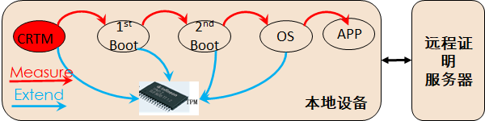

小结：安全启动 vs 可信启动

| **安全启动**                                                 | **可信启动**                                                 |
| :----------------------------------------------------------- | ------------------------------------------------------------ |
| 安全启动也称为verify boot，就是启动过程中，前一个部件验证后一个部件的数字签名，验证通过后，运行后一个部件：  -  CRTM验证BootLoader的签名，验证通过后运行BootLoader，验证不通过就停下来。  -  Bootloader 验证OS的签名，验证通过后运行OS，验证不通过就停下来 | 可信启动也称为measure boot，就是启动过程中，前一个部件度量（计算HASH值）后一个部件，然后把度量值安全的保存下来，比如扩展到TPM的PCR中：  -CRTM度量BootLoader把度量值扩展到PCR中  - BootLoader度量OS把度量值扩展到PCR中 |
| 安全启动解决恶意刷机问题，如果机器被恶意刷机，那么安全启动验证签名不通过，就停止启动了 | 可信启动能够发现老版本BootLoader问题，比如老版本BootLoader有BUG，这时安全启动验证签名通过，继续启动，无法发现BUG；而可信启动可以把老版本的BootLoader度量值保存起来，在远程接入云端时把这个度量值安全的发送给云端，云端就知道这是个老版本的BootLoader，可以禁止这个设备接入云端或者提示升级BootLoader |

## 安全运行

### 可信硬件

根据可信任计算系统（橘皮书）的定义，构建计算平台的可信必须从硬件开始：

+ CPU可信架构通过软硬件的修改，提供可信任的执行环境，用于抵御部分软硬件攻击。一般来讲，CPU可信架构需要实现新的特权模式，如SGX的enclave模式，TrustZone的安全世界等；
+ CPU可信架构的典型实现包括Intel SGX、AMD SEV、ARM TrustZone等；

可信硬件是构建可信系统的基石，根据《硬件可信-可信运行方案参考设计》，将可信运行系统的设计原则总结如下：

+ 被信任的软件的所有系统状态，都应该收到严格的保护。软件状态包括：内存、IO、CPU状态、特权模式、Cache、寄存器等；
+ 通过加密技术实现实现的机密性，如加密内存中的数据，对芯片外的敏感数据通过加密，抵御部分硬件攻击；
+ 通过隔离技术增强机密性，如通过页表隔离、模式隔离等技术；
+ 对系统状态进行强制刷新以强化系统机密性，主要指Cache、TLB等不同运行实例间共享资源的刷新；
+ 利用加解密的哈希算法保护系统完整性，完整性保护用户防止篡改。如保护系统代码、部分核心表项等，值得注意的是，完整性保护需考虑全生命周期；
+ TCB运行时，免受TCB外实例的干扰；TCB结束运行后，其运行所遗留的痕迹对非TCB实例不可见；
+ TCB自身的实现是无缺陷的。TCB的主体应该由硬件实现；
+ 可信系统引入的性能开销和资源开销，应该尽可能小。

业界的可信硬件技术如下表：

| **编号** | **技术**                   | **机构**   | **时间** |
| -------- | -------------------------- | ---------- | -------- |
| **1**    | LPAR逻辑分区技术（大型机） | IBM        | 1970     |
| **2**    | ARM  TrustZone             | ARM        | 2000s    |
| **3**    | XOM                        | Stanford   | 2000     |
| **4**    | AEGIS                      | MIT        | 2003     |
| **5**    | Bastion                    | 2010       | 2010     |
| **6**    | Sanctum                    | 伯克利&MIT | 2016     |
| **7**    | NoHype                     | 普林斯顿   | 2010     |
| **8**    | Cheri                      | 剑桥       | 2014     |
| **9**    | Keystone                   | 伯克利&MIT | 2017     |
| **10**   | TXT  & TPM                 | Intel      | 2000s    |
| **11**   | SGX                        | Intel      | 2013     |
| **12**   | SEV                        | AMD        | 2017     |
| **13**   | Titan                      | Google     | 2017     |
| **13**   | MKTME                      | Intel      | 待定     |
| **14**   | Bowmore                    | ARM        | 待定     |

### CPU可信架构：Intel SGX

+ 提供了一种用户态的全新的保护模式Enclave，CPU在内存管理上实现了基于Enclave的隔离；
+ 属于某enclave的内存，除了enclave自身之外任何特权软件都无法访问；
+ 对属于enclave的内存也实现了透明的加密，加密引擎部署在MEE中，加密密钥由硬件生成，软件无法获取；

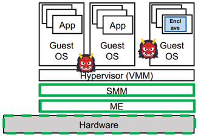

SGX提供的飞地模型可信架构，特别适用于云安全架构，云服务商可基于该技术给云租户提供技术上自证清白的远程安全计算架构。被认为是未来云安全的核心技术之一

### CPU可信架构：AMD SEV

+ CPU中集成了一个平台安全处理单元PSP，PSP提供了虚拟机内存加密的密钥管理；PSP生成的某VM内存加密密钥直接发给内存控制器，在内存控制器中寄存了一个AES加密引擎；

+ 当CPU对某内存进行访问时，AES加解密引擎通过识别VMID而索引到不同的密钥，并利用该密钥对所访问的内存实现加解密处理；

- 某恶意VM或VMM非法访问某虚拟机内存时，硬件获取的密钥无法正确加解密内存，从而保护被攻击VM的数据安全；

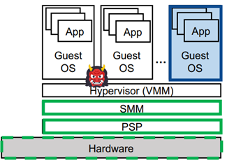

AMD SEV相比SGX推出时间较晚，可认作是AMD对标Intel SGX的一项技术。SEV的实现方式跟SGX区别较大，同时保护的对象颗粒也从应用程序扩大到了虚拟机。

### 安全运行技术：CFI

代码重用ROP攻击的影响财产安全、生命安全和国家安全。

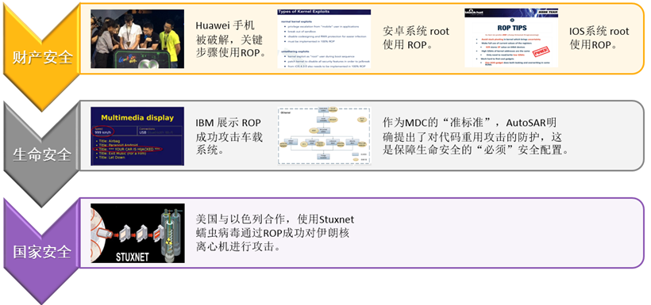

为了抵御控制流劫持攻击，加州大学和微软公司于2005年提出了控制流完整性（Control Flow Integrity, CFI）的防御机制。其核心思想是限制程序运行中的控制转移，使之始终处于原有的控制流图所限定的范围内。

具体做法是通过分析程序的控制流图，获取间接转移指令（包括间接跳转、间接调用、和函数返回指令）目标的白名单，并在运行过程中，核对间接转移指令的目标是否在白名单中。控制流劫持攻击往往会违背原有的控制流图，CFI使得这种攻击行为难以实现，从而保障软件系统的安全。

| **实现分类** | **优势**                                             | **代价**             |
| ------------ | ---------------------------------------------------- | -------------------- |
| 细粒度       | 严格控制每一个间接转移指令的转移目标                 | 通常会引入很大的开销 |
| 粗粒度       | 一组类似或相近类型的目标归到一起进行检查，以降低开销 | 安全性的下降         |

### 硬件信任根：真随机数TRNG

真随机数产生器（True Random Number Generator），是通过随机物理过程，如热噪音，光电效应，量子效应等，将熵提取，数字化的硬件。

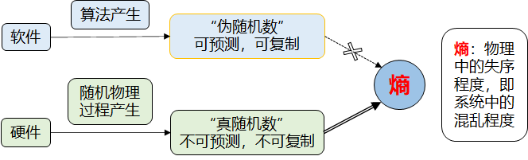

真随机数发生器

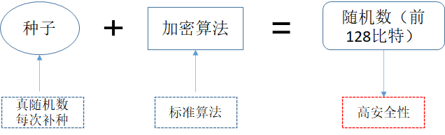

金融支付，身份认证等高安全场景中的EAL 4+均要求以上架构：

+ 芯片制造商需要提供种子是真随机数的理论证明，从而在算法层面，保障种子的安全；
+  每一次都需要补种，确保了，即使标准算法有后门，也不会降低其安全性。

为何AIS31要求每比特熵大于0.997，而NIST不要求？

+ 如果不提供理论证明证明这是真随机数，那么讨论多少熵是无意义的。NIST不要求真随机数证明

为何不直接使用真随机熵源产生的结果，而需要经过加密算法？

- 从算法层面来说，这是不需要的。但实际上有需要：一方面是真随机熵源质量可能不好，达不到满熵。另一方面，是防止其他攻击。例如低电压，毛刺等对熵源攻击，就算攻击成功，我还有个加密算法，算是个双保险。第三方面，熵源的效率是很低的，一个芯片可能有高安全场景，但也有低安全场景，低安全场景的话，补种一次，就可以一直用了。

### 硬件可信根：物理不可克隆方法PUF

物理不可克隆方法PUF：

+ 密钥不在设备上以数字形式存储；
+ 仅仅当需要时才从电路特征中提取密钥；
+ 密钥一旦使用了，设备中的寄存器和存储中密钥全部删去；

提取制造过程中不可避免的制造差异获得密码信息：

+ 当电路断电的时候，秘密信息消失，攻击者无法用传统的攻击方式获得电路中的秘密信息，而且一般的侵入式攻击还会破坏电路中的制造差异，导致攻击无效

物理不可克隆方法就是一个实体的指纹

|        **物理不可克隆方法**        | **人类指纹** |
| :--------------------------------: | :----------: |
|         **制造完成就存在**         | **与生俱来** |
|  **相同设计的电路的制造特征不同**  | **独一无二** |
| **制造厂也无法造出两个相同的电路** | **不可克隆** |

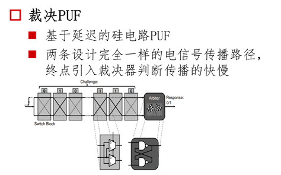

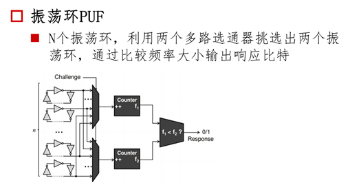

PUF的评估方法：

+ 独一无二性；
+ 可靠性；

# 硬件安全三防关键技术分析

硬件安全三防技术全景：

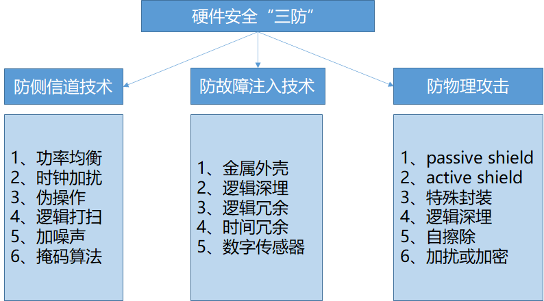

## 防侧信道攻击

### 基本概念

侧信道攻击：利用设备的接口对芯片进行电磁和功耗的分析，无需对芯片进行破坏。常见测评/攻击类型：功耗分析、电磁辐射分析。

侧信道密码分析（**Side Channel Attack**）利用密码系统实现时泄露的额外信息，推导密码系统中的秘密参数。[计算错误、执行时间、能量消耗、电磁辐射]

### 攻击模型

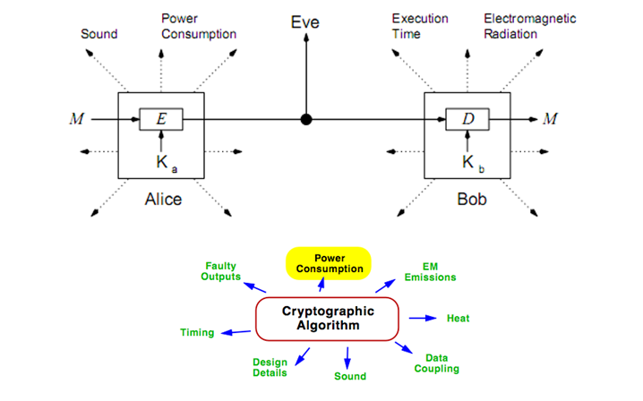

### 防护技术

防护原理：消除或降低侧信道信息与密钥的相关性。

常用手段：

+ 掩码技术：引入随机掩码，平衡中间值中的“0”、“1”分布，防御侧信道分析；
+ 隐藏技术：均化侧信道信息，降低数据的可区分度，防御侧信道攻击；
+ 混淆技术：降低信噪比（有效侧信道信息），如使用随机时钟等，增加侧信道分析难度；

| **防护技术** | **实施难度** | **防护效果** | **代价**                   |
| ------------ | ------------ | ------------ | -------------------------- |
| 掩码技术     | 高           | 高           | 增加面积多                 |
| 隐藏技术     | 中           | 中           | 性能降低                   |
| 混淆技术     | 低           | 中           | 增加少量面积  性能少量降低 |

### 侧信道攻击案例：DES密码算法案例

在使用电磁设备采集密码引擎运算的电磁辐射信号前，需要先定位到最优采集点，否则采集到的信号信噪比很低，不利于数据分析。

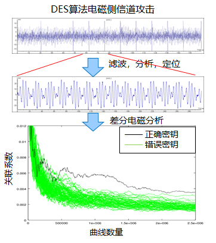

目前针对标准算法测评，已经有基本测评用例，测评用例中：

- 针对滤波、曲线对齐参数会给出说明（曲线预处理过程中各环节参数直接影响测评结果）；

- 针对不同的分析模型下的相关性计算（一般来说，跑完基础用例所要求的分析模型，可以认为该算法实现具备了基础的防侧信道能力）；

## 防故障注入攻击

### 基本概念

故障注入攻击：利用故障注入分析芯片内部的敏感信息，改变程序运行等。

常见测评/攻击类型：电压注入、时钟注入、电磁注入、激光注入。

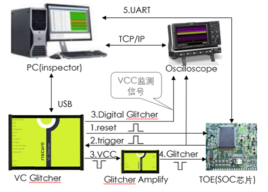

### 防护技术

| **防护技术**      | **技术概述**                                                 |
| :---------------- | :----------------------------------------------------------- |
| Logic  sensor     | 数字传感器（电压、频率、温度等）对电压、时钟故障可以起到检测和告警作用 |
| 逻辑&时间冗余     | 逻辑冗余分为面积冗余和时间冗余：  面积冗余是指多份计算逻辑各计算一次，最终对比各个计算逻辑的结果来检查是否有故障注入；  时间冗余是指一份计算逻辑计算多次，比较多次的结果来检查是否有故障注入； |
| 金属外壳&特殊封装 | 通过金属外壳，可以对激光故障注入，电磁故障注入等手段具有一定的抑制作用 |
| 逻辑深埋          | 将关键电路逻辑部署在芯片内层，而不是直接部署在芯片表层，使得故障注入的难度增加 |
| CRC检验算法       | 对于关键敏感数据，计算CRC检验值，如果检测到CRC检验值不正确，则告警，表明关键敏感数据发生错误，不能使用 |

# 可信认证--CC认证简介

**CC(Common Criteria)**认证：是一种信息技术产品和系统安全性的评估标准，它提供了一组通用的安全功能要求和一组通用的安全保证要求，并在这些保证要求的基础上提供衡量IT安全性的尺度，使得独立的安全评估结果可以互相比较。

CC认证主要由4个主体：

+ 认可机构(AB)认可发证机构(CB)和评估实验室(EB) ，AB和CB属于政府机构； 

+ 评估实验室(EB)评估厂商的产品；

+ 发证机构(CB)对评估实验室(EB)的评估工作进行评定； 

+ 发证机构(CB)确认通过后，颁发证书给厂商的产品，CCRA认可证书，在CC官网上可查到对应产品证书和ST； 

CC评估内容：

+ 评估安全功能是否正确实现；

+ 开发过程中是否存在安全缺陷：

  - 产品设计文档，测试内容，使用手册；

  - 开发环境和交付过程；

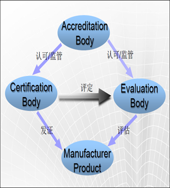

CC EAL（Evaluation Assurance Level）分为7级：

+ **评估**级别由评估要求的严格程度决定，与评估了多少安全功能无关；

+ 同一个产品认证（安全功能需求保持不变的情况下），认证级别越高，需要提交给实验室的证据材料越多；

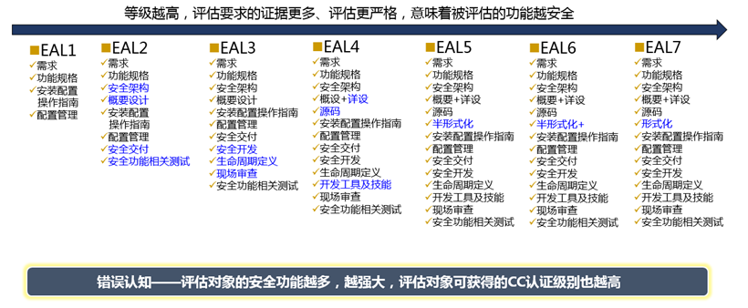