# 概述

## 移动智能终端

移动智能终端（mobile smart terminal MST，或称移动终端）是个人处理政府、企事业单位工作事务（如移动办公、移动作业）而使用的电子设备，如手机、平板电脑（PAD），MST可访问政企（非密）内部网络、数据及应用，也可与其他MST进行通信。政企单位使用的MST应具备一定的安全功能，如数据存储保护、文件访问控制、App签名验证、用户安全登录以及移动设备管理等。

MST可通过公共移动网络设施，如蜂窝网、无线局域网（WLAN）、公共互联网（internet网络）访问政企（非密）内网信息系统，也可通过政企单位自建无线局域网（WLAN）访问政企（非密）内网信息系统。

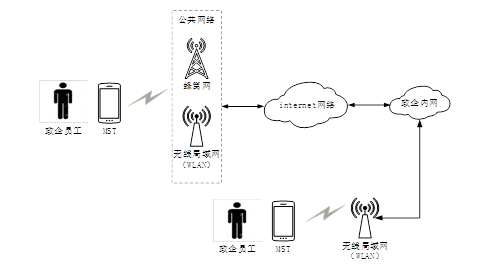

## 移动安全威胁

+  **网络窃听。**攻击者可在无线网络信道上或网络基础设施中窃听MST通信内容，包括文件、语音、图片、视频以及密码信息等； 
+ **网络攻击。**攻击者可在无线网络信道上或网络基础设施中主动向MST发起攻击（包括假冒、修改通信内容等），对MST中的应用软件（App）进行恶意更新，使MST访问恶意网址，以及添加带有恶意代码的电子邮件附件等； 
+ **物理介入。**MST丢失或被窃后，攻击者可通过其他设备、终端用户界面访问MST获取用户敏感数据，或直接破坏MST设备，读取设备中的存储介质，获取用户敏感数据；
+ **应用软件（App）攻击**。MST可能下载恶意或谋利软件代码，这些代码可能是App开发者有意或无意加入，也可能来自开源软件库。恶意App可窃取MST数据，也可获得系统权限导致新的攻击，如，控制移动终端GPS、摄像头及麦克风等； 
+ **高级持续威胁APT（advanced persistent threat）。**由于受到攻击，MST丧失安全性，攻击者可以持续对MST数据实施控制，且如合法用户一样不被察觉。

## 1.3 密码技术作用

在移动互联系统中密码技术可提供MST接入认证、用户身份验证、移动网络加密通信、MST文件加密、移动应用app签名/验证等安全功能，以应对网络信息系统移动安全威胁： 

+ **保证信息机密性。**采用密码技术对移动通信以及MST中的信息进行加密，使他人（没有密钥）不能读懂加密信息。如本标准给出的网络传输加密、语音电话加密、邮件加密及即时通讯加密、文件加密等技术； 
+ **保证信息完整性。**采用密码摘要算法（Hash算法）技术对移动通信以及MST中的软件、信息进行摘要计算，保证数据不被修改。如本标准给出的移动终端可信启动技术； 
+ **保证用户行为不可抵赖性。**采用密码技术对移动通信以及MST中的信息进行数字签名，使信息签名者不能抵赖其签名的行为。如本标准给出的App签名与验证、用户证书登录、电子签章技术。

# 基础应用

## 可信启动

### 应用场景

MST可信启动是使用密码技术，在MST启动引导过程中对系统引导程序、操作系统内核进行完整性校验，防止系统引导程序及操作系统内核被非法篡改。

### 密码保护原理

为了保证MST引导程序及操作系统内核不被非法修改，在MST硬件、软件开机“启动链”（开机ROM指令→引导程序→操作系统内核加载到处理）中，使用公钥密码或摘要算法技术对引导程序、操作系统内核代码逐层进行完整性验证，直至MST完全启动，一旦某一层验证不通过则终止系统启动。

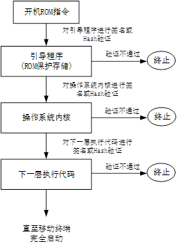

### 密码模块部署

MST可信启动一般使用MST出厂搭载的硬件密码模块（如TPM安全芯片、TEE芯片），由启动链各层代码调用。

### 密钥管理

MST可信启动涉及到密钥包括：

+ 引导程序签名验证公钥。非对称密钥，由MST厂家生成，保存在不可修改的存储器中，用于MST开机时对引导程序进行签名验证；
+ 操作系统内核签名验证公钥。非对称密钥，由MST厂家（或操作系统厂家）生成，保存在引导程序中，用于引导程序时对操作系统内核进行签名验证；
+ 下一层执行代码签名公钥。非对称密钥，由执行代码开发者生成，保存在操作系统内核中，用于操作系统内核对下一层执行代码进行签名验证。

## App签名与验证

### 应用场景

App签名与验证是采用公钥密码技术对政企移动App进行实名签名与验证，以防止App被篡改和仿冒，保证App完整性以及App责任可溯源性，且保护App知识产权：

+ App签名
  + 开发者签名：开发者使用公钥密码技术对App进行数字签名；
  + 官方机构签名（App分发渠道）：官方机构使用公钥密码技术对其审核、管理和发布的App进行数字签名，防止恶意App传播；

+ App验证
  + 官方机构验证（Appp分发渠道）：官方机构（App分发渠道）在审核、管理及发布App时使用公钥密码技术对App开发者的App进行签名验证，确保App开发者的真实性；
  + MST验证：MST在安装、运行App时操作系统使用公钥密码技术对官方机构（App分发渠道）发布的App进行签名验证，以决定是否安装和运行该App，可实现政企在自己专用MST上运行指定官方机构（App分发渠道）分发的App；

### 密码保护原理

+ App开发者签名。App开发者使用其在官方机构（App分发渠道）登记的私钥对其开发的App进行数字签名。由于数字签名可保证签名数据完整性，官方机构（App分发渠道）及MST可通过验证App签名识别App开发者真实身份，从而决定是否发布、安装和运行该App；
+ 官方机构（App分发渠道）签名。官方机构（App分发渠道）使用自己的私钥对开发者签名的App进行二次签名，仍保持App开发者签名的有效性，即“双签名”。采用双签名机制保证App是经过官方机构安全审核、检测的，防止恶意App传播，进一步降低App安全风险；
+ MST验证App签名。MST在安装或运行App时使用开发者数字证书中开发者公钥，对App开发者签名进行验证，验证App是否被篡改，再使用指定官方机构（App分发渠道）公钥，对开发者数字证书进行验证，验证开发者是否真实；MST使用指定官方机构（App分发渠道）公钥，对官方机构（App分发渠道）App签名进行验证，验证App是否是指定官方机构（App分发渠道）发布；
+ **官方机构（App分发渠道）验证App签名。**官方机构（App分发渠道）收到App开发者开发的App，用开发者数字证书中的公钥，对其App签名进行验证，验证App是否被篡改，再使用官方机构（App分发渠道）公钥，对该App开发者的数字证书进行验证，验证其是否是本官方机构（App分发渠道）签发；

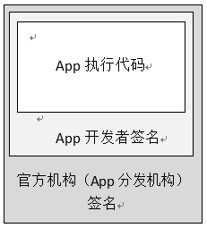

### 密码模块部署

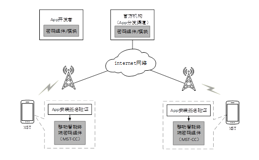

### 密钥管理

+ App开发者签名公钥和私钥。非对称密钥，由App开发者使用的密码组件/模块产生，私钥在开发系统的密码组件/模块中保护，公钥以开发者数字证书方式由官方机构（App分发渠道）签发给App开发者，App开发者向官方机构提交App时，将开发者数字证书一同提供给官方机构；
+ 官方机构（App分发渠道）签名公钥和私钥。非对称密钥，由官方机构使用的密码组件/模块产生，私钥在官方机构（App分发渠道）的密码组件/模块中保护，公钥以官方机构数字证书形式保存在MST（操作系统）中；

## 无线局域网接入

### 应用场景

在政企内网中架设无线局域网（WLAN），如WAPI（无线局域网鉴别与保密基础结构）、WiFi，MST通过WLAN接入单位信息系统是政企移动作业的一种方式。采用WAPI对无线局域网空口接入进行控制，实现MST与无线接入点（AP）身份鉴别、接入控制、密钥管理及数据保密通信等功能，防止非法MST接入政企内网、政企MST接入非法网络，防范无线传输数据泄露。

### 密码保护原理

政企信息系统运行前，MST、AP在政企证书认证中心（CA）、密钥管理中心进行注册并生成自己的公钥、私钥及数字证书。当MST通过WLAN接入政企信息系统时，MST和AP使用自己的数字证书及私钥通过鉴别服务器进行双向身份鉴别，鉴别服务器通过事先注册的MST和AP的数字证书判别它们是否是政企单位的合法设备，鉴别成功后，MST方可接入政企信息系统，并采用对称加密算法对通信内容进行加密保护。

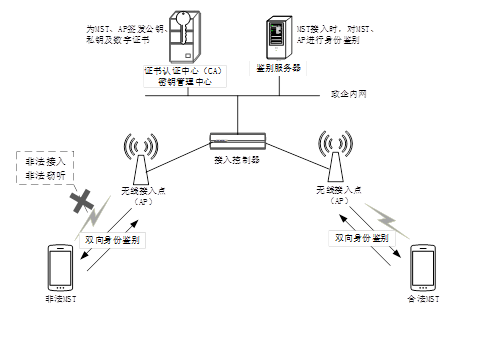

### 密码模块部署

WAPI无线局域网接入安全使用硬件或软件密码组件/模块进行保护。其中支持对称密码算法的密码组件/模块部署在MST和AP上，支持签名和杂凑算法的密码组件/模块部署在MST、AP以及鉴别服务器上。

### 密钥管理

+ MST和AP的公钥和私钥。非对称密钥，密钥管理中心负责其生命周期管理，包括密钥的生成、分发、存储、更新及销毁等；
+ MST和AP的私钥可遵循T/EMCG 001-2019保存在各自的密码组件/模块中；
+ MST和AP的公钥由证书认证中心放入各自证书中，发到MST和AP中；
+ MST和AP的通信加密会话密钥，在MST接入鉴别成功后通过WAPI协议协商得到，用于对通信信息进行加密。

## 网络传输加密

### 应用场景

移动网络传输加密是使用密码技术对移动互联网通信数据实施加解密计算，可实现政企信息系统MST实体鉴别和数据传输加密保护，防止政企数据在网络传输中泄露和篡改。

### 密码保护原理

移动网络传输加密是在移动网络传输中加入密码保护机制，在政企信息系统移动接入网关和MST之间建立一条保密通道，实现通信数据加密传输以及MST实体鉴别。

MST与移动接入网关采用非对称密码算法，通过它们在证书认证中心签发的公钥和私钥生成用于数据传输加密的“会话密钥”，对通信信息进行加解密，使得加密信息在MST和移动接入网关之间经过的线路（包括无线、有线）及设备中（在没有获得解密密钥情况下）无法还原信息明文，保证MST和移动接入网关通信信息的全程传输安全，也保证了MST接入政企内网的合法性。

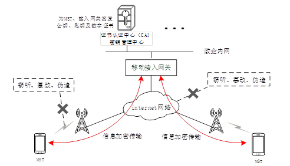

### 2.4.3 密码模块部署

移动网络传输加密使用硬件或软件密码组件/模块实施移动通信数据加密。

### 2.4.4 密钥管理

+ 移动接入网关加密公私钥对：公钥（PS）和私钥（dS）。非对称密钥，由密钥管理中心密码机产生，用于“会话密钥”加密保护，PS预置在MST-CC中，ds在密钥管理中心和移动接入网关密码组件/模块中存储；
+ MST加密公私钥对：公钥（PM）和私钥（dM）。非对称密钥，MST-CC初始化时有密钥管理中心产生，用于“会话密钥”加密保护，dM用MST主密钥（MK）加密保存在MST-CC中，并加密备份保存在密钥管理中心中；
+ MST主密钥（MK）。对称密钥，MST-CC初始化时产生，由MST用户掌握，不在MST-CC和信息系统中保存，用于MST-CC私钥dM加密保护。 MK生成和使用遵循T/EMCG 001-2019；
+ 会话密钥。对称密钥，每次加密通信建立时，由MST和移动接入网关协商产生，用于通信信息加密，用公钥密码算法保护。

# 3 系统应用

## 3.1 语音电话加密

### 3.1.1 应用场景

移动语音电话加密是使用密码技术对MST通话双方（不包括电话会议）的语音信息进行加密处理，实现政企工作人员之间使用MST进行语音通信的加密保护。

### 3.1.2 密码保护原理

常用的语音加密方法：

+ **直接加密法：**将需要加密的语音信息作为二进制数据，使用密码算法对整体语音信息进行加密；
+ **选择加密法：**一般针对多媒体通信，只对其中较重要的语音信息进行加密；

MST语音电话加密原理：

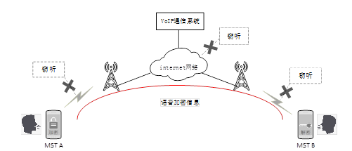

### 3.1.3 密码模块部署                               

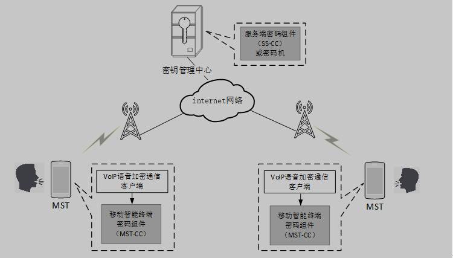

### 3.1.4 密钥管理

+ 密钥管理中心加密公私钥对：公钥（PS）和私钥（dS）。非对称密钥，由密钥管理中心密码机产生，PS预置在MST-CC中，ds存储在密码机中，用于MST初始化时与SS-CC安全通信；
+ MST（用户）加密公私钥对：公钥（PM）和私钥（dM）。非对称密钥，MST-CC初始化时由密钥管理中心产生，并安全分发到MST-CC，用于通话双方密钥协商时保护会话密钥，dM 安全保存在MST-CC中，并加密备份保存在密钥管理中心；
+ MST用户主密钥（MK）。对称密钥，MST-CC初始化时产生，由MST用户掌握，不在MST-CC和信息系统中存储，用于MST-CC敏感信息加密保护；
+ 会话密钥。对称密钥，用于语音信息加密，每次VoIP通话建立时，由通话双方VoIP语音加密通信客户采用非对称密码技术完成会话密钥协商生成。

## 3.2 电子邮件加密

### 3.2.1 应用场景

移动电子邮件加密是使用密码技术对邮件内容(包括标题、正文、附件等)进行加密处理，防止邮件内容在传输中被非授权者知悉、篡改或伪造。

### 3.2.2 密码保护原理

常用的电子邮件加密方法是数字信封加密法。数字信封加密法综合使用对称算法加密法和非对称算法加密法，避免了对称算法加密法密钥分配成本高，以及非对称算法加密法加解密效率低的问题。

数字信封加密法原理：在电子邮件系统中加入密码保护机制，由MST邮件客户端调用密码组件/模块对邮件内容(包括正文、附件等)加密，经由邮件服务器转发到接收方的邮箱中，接收方MST邮件客户端进行解密。从而实现邮件内容在传输经过的线路（包括无线、有线）及网络设备中（在没有获得解密密钥情况下）无法还原成明文，防止通信内容被窃听、篡改和伪造。邮件内容密文在MST邮件客户端和邮件服务端均加密存储，即使邮件服务商也不能知晓邮件内容。 

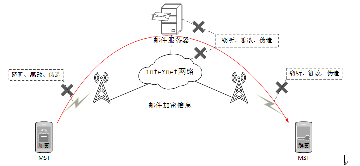                            

  ### 3.2.3 密码模块部署

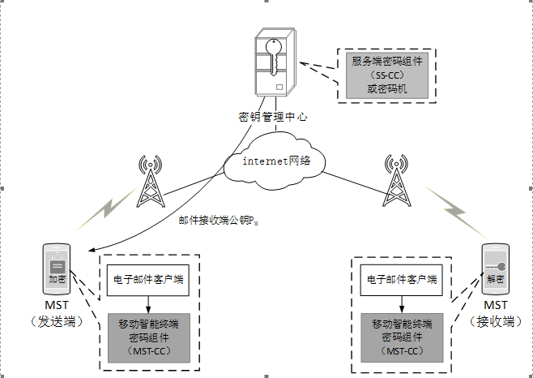                                                            

### 3.2.4 密钥管理

同3.1.4。

## 3.3 用户证书登录

### 3.3.1 应用场景

MST用户使用密码技术登录政企信息系统（如移动办公系统、手机银行等），实现用户身份鉴别，防止非法人员访问政企信息系统。

### 3.3.2 密码保护原理

证书登录的安全性依赖于公钥密码数字签名的不可篡改性，其基本原理：用户和政企信息系统互相交换已签名数据，分别对对方的签名数据进行验证，以鉴别对方身份的真实性、合法性，从而保证政企信息系统不被非法用户访问，同时保证用户访问的政企信息系统也是真实的。

假设，用户A是政企信息系统（简称信息系统）注册用户，已获得CA机构签发的公钥（PM）、私钥（dM）、包含PM的数字证书Cert-M以及CA机构公钥（Pc）；信息系统也拥有CA机构签发的公钥（PS）、私钥（dS）、包含PS的数字证书Cert-S以及CA机构公钥（Pc）。用户A证书登录信息系统基本步骤如下： 

① 用户A向信息系统发出登录请求；

② 信息系统生成随机数RS，使用自己的私钥dS对RS签名得令牌Token-S，将Token-S、信息系统证书Cert-S发送给用户A；

③ 用户A使用CA机构公钥（Pc）验证证书Cert-S合法性，再使用Cert-S中公钥Ps验证令牌Token-S合法性，获得RS；

④ 用户A生成随机数RM，使用自己私钥dM对RS和RM合并签名，得到令牌Token-M，将Token-M和用户A证书Cert-M发送给信息系统；

⑤ 信息系统使用CA机构公钥（Pc）验证Cert-M合法性；再使用Cert-M中公钥PM验证令牌Token-M合法性，得到两个随机数RS、RM；校验RS与第②步生成的RS是否一致，若一致则登录成功；

⑥ 信息系统通知用户A登录是否成功。

                               

上述第②步，信息系统使用自己私钥dS对随机数RS签名得到令牌Token-S，第③步用户A使用信息系统的公钥Ps对Token-S验签，如果通过验签，根据公钥密码特性说明Token-S是信息系统签名，从而用户A认定信息系统是合法的。

同理，第④步，用户A使用自己私钥dM对随机数RM签名得到令牌Token-M，第⑤步信息系统使用用户A的公钥PM对Token-M验签，如果通过验签，根据公钥密码特性说明Token-M是用户A签名，从而信息系统认定用户A是合法的。

第②、④步随机数RS、RM作用是防御登录认证过程网络重放攻击。

### 3.3.3 密码模块部署

同3.2.3.

### 3.3.4 密钥管理

移动用户证书登录主要使用国家密码主管部门批准的非对称密码算法（如SM2），涉及管理的密钥：

+ MST(用户)公私钥对：公钥（PM）和私钥（dM）。非对称密钥，用户在向政企信息系统注册时由MST-CC产生，dM在MST-CC中保护，PM包含在用户数字证书中（由政企或第三方CA机构签发），存储在MST-CC；
+ 政企信息系统公私钥对：公钥（Ps）和私钥（dS）。非对称密钥，由SS-CC产生，dS在SS-CC中保护，Ps包含在政企信息系统数字证书中（由政企或第三方CA机构签发），存储在政企信息系统服务端。

## 3.4 电子签章

### 3.4.1 应用场景

MST电子签章将可视化印章图形与数字签名绑定，在MST电子文档中实现数字签名可视化，确保文件印章可信、文件内容未被篡改。根据《中华人民共和国电子签名法》，政企单位在网上移动办公进行公文流转、审批、签订电子合同时，使用的电子签章与纸质盖章、手写签名具有同等法律效力。

### 3.4.2 密码保护原理

+ 电子签章过程：“盖章”操作者（简称“盖章者”）经授权将政企电子印章数据与待盖章的电子文件进行绑定，即在电子文件上形成可视印章图形——带印文件（文件中包括电子印章数据、政企数字证书等信息），再使用政企单位私钥，通过公钥密码算法对带印文件进行数字签名，生成“电子签章文件”；

+ 电子签章验证：使用政企单位的公钥对已签章文件的签章数据进行验证，包括数字签名、盖章者的数字证书等信息，如果验证通过，根据数字签名不可抵赖性原理，说明该电子文件的签章是政企单位的合法印章，且文件未被篡改，此电子签章与纸质签章具有同等法律效力。

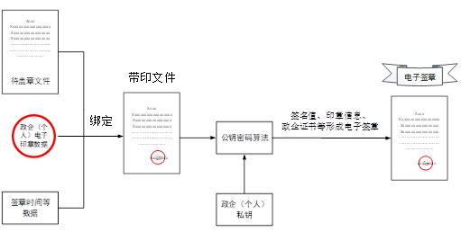

### 3.4.3 密码模块部署

在MST上部署移动终端密码组件（MST-CC），实现对电子文件签章和验证。

### 3.4.4 密钥管理

同3.3.4。

## 3.5 即时通讯加密

### 3.5.1 应用场景

移动即时通信加密是使用密码技术对即时通信系统（Instant Message System，IMS，如微信）群组通信内容（包括文字、语音、短视频、文件等）进行加密，防止消息内容在传输中被非授权者知悉、篡改和伪造。

### 3.5.2 密码保护原理

即时通讯加密通常使用对称算法加密法，消息收、发双方均使用对称密码算法（如SM4）进行消息加解密。消息发送方生成一个“会话密钥”对消息进行加密，得到消息密文，再使用事先分配的“群组密钥”加密会话密钥，将消息密文和会话密钥密文一同发给接收方；接收方使用事先分配的群组密钥解密会话密钥，再用会话密钥解密消息密文。

进一步原理如下：

+ IMS在群组创建时，由密钥管理中心为每个群组（两个用户通信为最小群组）产生一个群组密钥，并秘密分配给群组所有成员，用于保护会话密钥；每个群组的群组密钥不同；
+ 用户在即时通信时，消息发送方IMS客户端随机生成会话密钥，调用密码组件/模块对消息明文加密，再用群组密钥加密会话密钥，IMS客户端将消息密文以及会话密钥密文一起发送给IMS服务端，由IMS服务端转发到群组每个MST上，MST用群组密钥解密会话密钥，再用会话密钥解密消息密文；
+ 加密的即时通信消息在传输经过的线路（包括无线、有线）及设备中（在没有获得解密密钥情况下）无法还原成明文，保证了通信内容不被窃听、篡改和伪造。

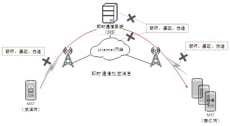

### 3.5.3 密码模块部署

同3.4.3。

### 3.5.4 密钥管理

移动即时通信加密使用国家密码主管部门批准的对称密码算法（如SM4、ZUC）、摘要算法(如SM3)和非对称密码算法（如SM2），涉及管理的密钥： 

+ 即时通信系统服务端加密公私钥对：公钥（PS）和私钥（dS）。非对称密钥，由密码机产生，PS预置在MST-CC中，dS存储在SS-CC（或密码机）中，用于MST与IMS服务端进行安全参数传递；
+ MST（用户）公私钥对：公钥（PM）和私钥（dM）。非对称密钥，MST-CC初始化时由密钥管理中心产生，并安全分发到MST-CC，用于MST与IMS服务端进行群组密钥的安全传递； dM安全保存在MST-CC中，并加密备份保存在密钥管理中心中；
+ MST用户主密钥（MK）。对称密钥，MST-CC初始化时产生，由MST用户掌握，不在MST-CC和信息系统中存储，用于对MST-CC敏感信息加密存储保护；
+ 会话密钥。对称密钥，用于对即时通信内容进行加密的密钥，由MST-CC在加密即时消息时随机产生，用群组密钥加密保护，随加密消息发送给所有群组成员；
+ 群组密钥。对称密钥，由密码管理中心在IMS创建群组时产生并分配给每个群组成员MST保存，用于会话密钥加密保护；不同群组的群组密钥不同，以实现各群组会话密钥独立加密保护。

## 3.6 文件加密

### 3.6.1 应用场景

政企单位使用MST开展业务时，MST可存有政企单位的数据文件，采用密码技术对这些数据文件进行加密保护，以防止MST数据文件被非法读取，如保证在MST失控时数据不被泄露。

### 3.6.2 密码保护原理

MST文件加密使用对称密码算法对政企移动应用（App）的数据文件进行加密存储。由于只有政企App用户拥有加密密钥，政企用户可以安全使用MST进行信息处理，而没有加密密钥的App或非授权者不能获得政企文件明文，即使MST丢失，没有文件加密密钥也不能获得加密文件的明文。

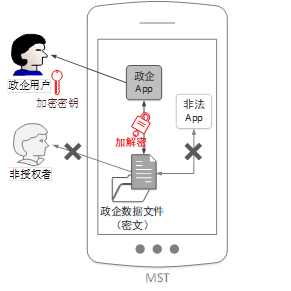

### 3.6.3 密码模块部署

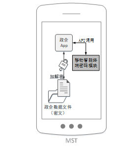

### 3.6.4 密钥管理

MST文件加密使用国家密码主管部门批准的对称密码算法（如SM4）和非对称密码算法（如SM2），涉及管理的密钥：

+ MST用户加密公私钥对：公钥（PM）和私钥（dM）。非对称密钥，MST密码模块初始化时由密钥管理中心产生和备份，用于保护“文件加密密钥”,保存在MST密码模块中；
+ MST用户主密钥（MK）。对称密钥，MST密码模块初始化时产生，由MST用户掌握，不在MST-CC存储，用于用户私钥dM加密存储；
+ 文件加密密钥。对称密钥，用于政企App文件数据加解密，每次调用密码模块对App文件数据进行加密时随机产生，实施加密后，用PM加密保存在专门区域，当文件数据解密时使用dM对文件加密密钥进行解密。