# 1 5G网络E2E威胁分析

## 1.1 5G网络关键资产识别

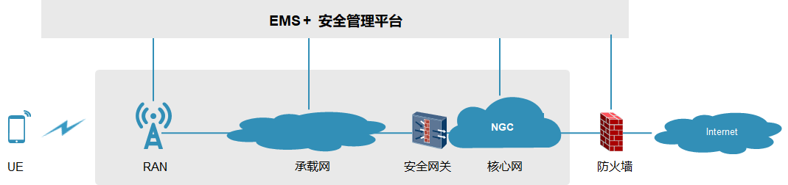

关键资产：

+ 数据资产（机密性、完整性）
  + 用户通信数据
  + 用户的隐私信息：签约信息、位置信息等
  + 运营商关键数据：报表、话单等
  + 系统运行运维关键数据：账号、口令、日志、配置数据等

+ 设备资产（可用性、机密性及完整性）
  + 硬件资产
    + RAN BBU/RRU硬件
    + 机柜
    + COTS Server
    + 防火墙、安全网关硬件
    + 路由器、交换机硬件
  + 软件资产
    + RAN、核心网、EMS软件
    + 操作系统软件
    + Docker软件
    + DB软件
    + 开源及第三方软件

## 1.2 5G安全威胁

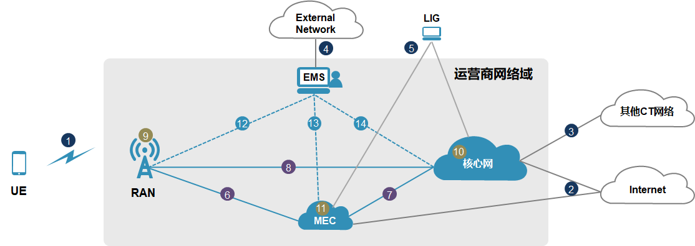

### 1.2.1 运营商网络域外安全威胁

+ 空口安全威胁
  + 用户数据、信息窃听/窜改
  + DDoS攻击拒绝用户接入
  + 非授权终端违法接入网络
  + 空口恶意干扰
+ Internet安全威胁
  + 用户数据传输泄漏、篡改
  + 仿冒网络应用拒绝特定服务
  + Internet侧DDoS攻击，拒绝数据业务
  + 能力开放API非授权访问
+ 网络漫游安全威胁
  + 用户敏感信息传输泄露、篡改
  + 仿冒转接运营商拒绝服务
+ 外部访问EMS安全威胁
  + 用户敏感信息传输泄露
  + 非授权用户的越权访问
  + 合法用户的恶意操作
  + DDoS攻击瘫痪运维功能
  + Web攻击(SQL注入)
+ 合法监听访问安全威胁
  + 非法监听网关接入
  + 监听目标号码泄露
  + 监听端口数据窃听和攻击

### 1.2.2 运营商网络域内安全威胁

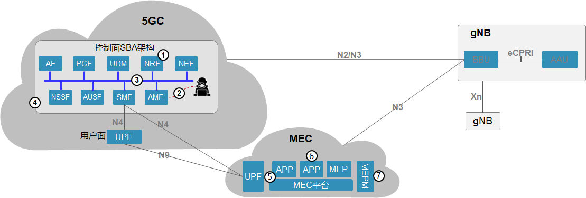

**网元间/网元内模块间关键威胁**

+ SBA服务化架构威胁
  + 对NRF进行DoS攻击，导致服务无法注册/发现
  + 攻击者假冒NF接入核心网络，进行非法访问
  + NF间传输的通信数据被窃听或篡改
  + 利用业界公开已有的HTTPS协议漏洞进行攻击
+ MEC模块间威胁
  + 恶意App对MEC平台或UPF VNF进行攻击
  + App间抢占资源（计算/存储/网络），影响其他App
  + 越权进行第三方应用的管理运维
+ 网元间接口及网元内模块间接口威胁
  + 窃听及篡改传输数据
  + 非法访问网元/模块

**网元/设备自身关键威胁**

+ 软硬件安全威胁
  + 设备被非法闯入破坏或者通过物理接口非法接入
  + 非授权用户访问网元、对网元进行非授权操作
  + 篡改网元软件、植入恶意软件

+ 云化安全威胁
  + 开源软件漏洞多，利用漏洞攻击云化设施及应用
  + 资源共享，非法抢占资源、访问应用层数据、篡改镜像等
  + 多厂商集成，问题定位定界困难
  + 通过虚拟网络数据窃听或篡改应用层通信内容
+ 设备内数据安全威胁
  + 本地存储的机密信息被非法窃取、篡改，如用户口令、秘钥、用户上下文信息等
  + 用户隐私信息被非法窃取、篡改，包括签约数据、话单等
  + 管理面、控制面非法访问用户面数据
+ 切片安全威胁
  + 切片间非法访问、UE访问未经授权的切片
  + 切片间资源抢占，导致资源过度消耗
  + 越权进行切片运维管理

**域内OM关键威胁**

+ 非授权访问
+ 口令破解及泄漏
+ 合法用户恶意操作
+ 用户隐私泄露
+ 日志删除及篡改
+ 篡改及泄漏OM敏感数据
+ 恶意软件植入

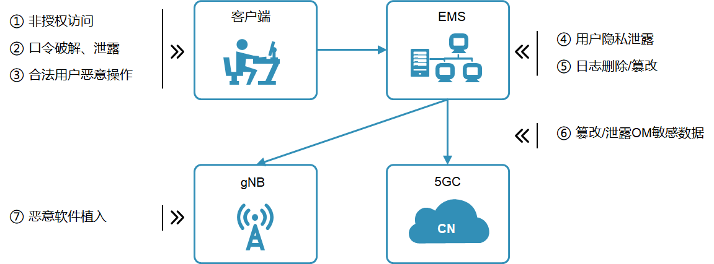

# 2 3GPP定义的安全架构和安全目标

## 2.1 安全架构

3GPP定义的安全架构：

+ 网络访问安全
+ 网络域安全
+ 用户域安全
+ 应用域安全
+ 服务域安全

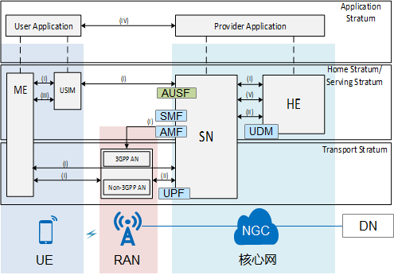

## 2.2 安全目标

+ 确保合法接入网络
  + UE与网络间进行双向认证，防范伪基站
  + UE由高制式网络回落到低制式

+ 保障空口的机密性、完整性
  + 加密算法秘钥使用256bit秘钥
  + 新增IMSI加密保护用户隐私
  + 用户面新增完整性保护

+ 确保3GPP网元间连接安全
  + 3GPP各网元间使用IPSec保护传递信息安全
  + 5GC归属域与漫游域之间通过SEPP保证安全
  + 5GC服务功能间使用HTTPS

## 2.3 安全措施

### 2.3.1 机密性：SUPI加密传输解决4G空口IMSI泄漏问题

4G注册认证前有IMSI明文传输，存在泄漏可能

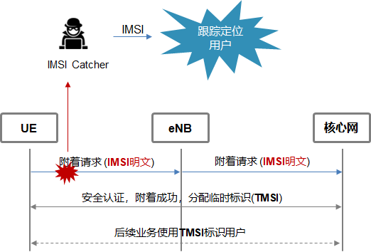

5G SUPI加密传输，避免IMSI泄漏

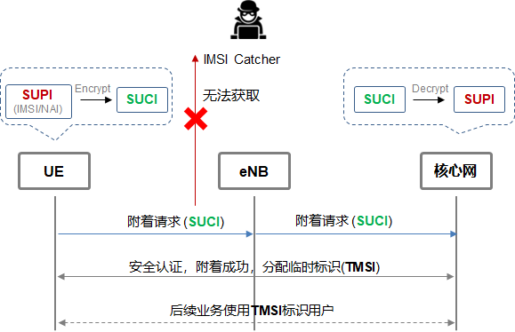

### 2.3.2 连接安全：IPSec保证网元间安全，TLS保证功能模块间安全

+ 3GPP各网元间支持使用IPSec保护传递信息安全
  + IPSec加密和校验确保数据传输的机密性和完整性
  + IPSec认证确保数据源的真实性

+ 5GC功能模块间使用HTTPS保护传递信息安全
  + 通过TLS对传输数据进行加密、完整性保护
  + TLS双向身份认证防止假冒NF接入网络

# 3 5G网络可信解决方案

设备安全模型：

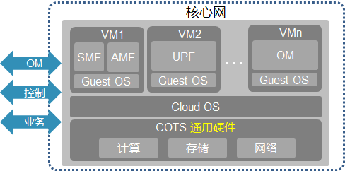

## 3.1 传统安全范畴

## 3.1.1 访问控制

#### 3.1.1.1 **基于角色的身份管理确保授权访问**

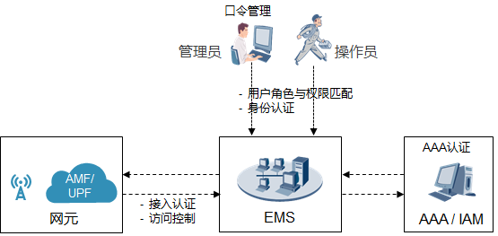

安全威胁

+ 非法访问网元、非授权操作网元（比如修改配置）

+ 非法访问EMS、越权访问EMS

+ 非法访问切片

安全策略：基于RBAC的访问控制机制，口令管理、最小授权

+ 授权访问：基于角色的授权访问控制（RBAC）
+ 身份认证：EMS/网元接入认证（AAA）
+ 访问控制：访问白名单（ACL）
+ 口令管理：弱口令检测、口令复杂度检测、口令有效期管理、历史口令相同性检查、非法登录次数限制及帐户自动锁定

#### 3.1.1.2 管理/控制用户面严格隔离、避免互访

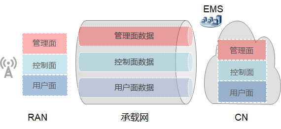

安全威胁：非法访问其它面数据，造成数据泄漏

安全策略：三面严格分离，数据不能互防

+ 接入网
  + RAN资源三面隔离
  + VLAN隔离
  + 端口隔离

+ 承载网
  + 三面隔离传输
  + VPN/VLAN隔离
  + 重要数据加密传输

+ 核心网
  + CN资源三面隔离
  + VLAN/VxLAN隔离
  + VM隔离/设备隔离

### 3.1.2 机密性/完整性

#### 3.1.2.1 软件完整性：数字签名/安全启动和动态度量消减软件篡改风险

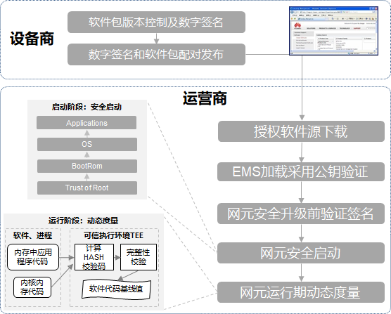

安全风险：恶意软件植入网元或恶意更换网元软件

安全策略：数字签名、安全启动和动态度量消减恶意软件植入

#### 3.1.2.2 OM传输：TLS/SSH消减OM数据窃取和篡改风险：

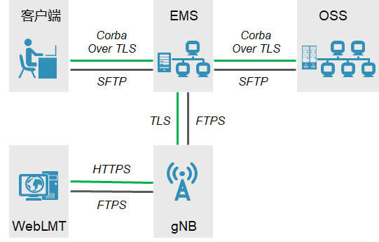

安全风险：网元与OM之间的数据传输面临窃取和篡改风险

安全策略：管理面接口采用TLS/SSH进行安全传输

### 3.1.3 可用性

传输DDoS攻击：基站/核心网内置防火墙

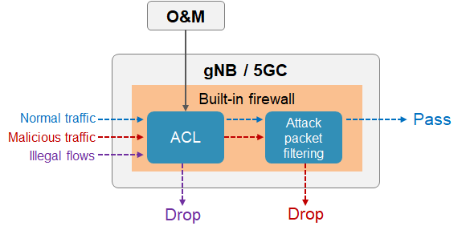

安全风险：对核心网/基站端口进行DDoS/畸形报文攻击

安全策略：内置防火墙ACL规则和包过滤

+ ACL机制仅允许合法对端与基站/核心网建立连接
+ 包过滤能够防御非法报文以及各类泛洪

### 3.1.4 可追溯性

安全日志、安全监控与审计确保可追溯：

+ 安全告警健康功能
  + 支持受攻击后自动上报安全告警，记录安全日志
  + 实时通知客户，以助快速消除安全风险
+ 集中日志审计功能
  + 集中存储网管和网元安全/操作日志
  + 支持上传日志服务器，以便日志检索和审计，快速发现网络安全异常
+ 用户在线活动监控功能
  + 启用活动订阅，实时监控目标设备上活动用户，消除潜在网络风险

## 3.2 云化安全

### 3.2.1 云化关键威胁：资源共享/开源软件/分层多厂商/业务动态划分

传统核心网部署相对安全：

+ 独立硬件
+ 物理边界隔离
+ 软硬件同一厂商

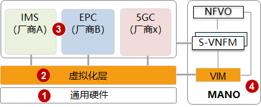

云化部署给核心网带来新威胁：

+ 物理资源共享
  + 共享存储，数据迁移后残留
  + 逻辑网络间无明显边界
+ 新增虚拟化层
  + 虚拟化开源软件多引入更多漏洞
  + 虚拟网络内部流量难以监控
+ 分层多厂商
  + 安全问题定责风险加大
  + 多厂商账号、权限和认证管理
+ 业务动态编排
  + 业务迁移安全策略需自动调整
  + 编排接口被攻击后，恶意挂载资源

### 3.2.2 多层隔离构建云化纵深防御体系、增强安全防护，防止攻击扩散

#### 3.2.2.1 云化部署分层隔离，构筑纵深防御

+ 建立深层防御，防止单点突破，提升攻击难度

+ 建立“隔离舱”，防止攻击范围扩大，降低影响范围

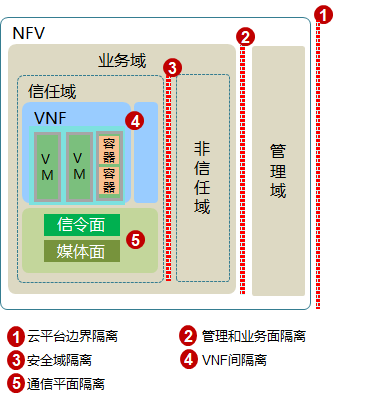

#### 3.2.2.2 资源隔离，应对VM间资源共享威胁

设备具备资源隔离能力，基于安全等级和业务需求，选择隔离方式

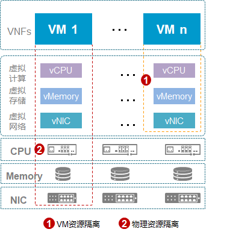

#### 3.2.2.3 网络分层分面隔离，增强传输安全，应对网络攻击

+ 云化平台通信按照不同流量类型分三面隔离
+ 业务网络按照流量类型(维护、信令、数据)进一步三面隔离，提升传输安全

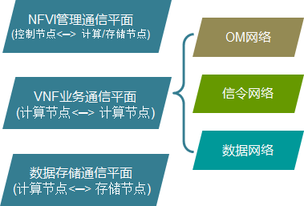

### 3.2.3 基础设施架构：持续检测、修复软件漏洞，缩小攻击面

#### 3.2.3.1 产品发布前系统加固

安全加固(裁剪系统、移除冗余服务，关闭不使用端口及和最小化授权等)，消除开源软件漏洞，减少攻击面，提升平台的安全性

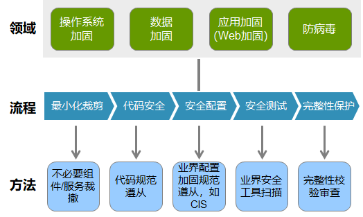

#### 3.2.3.2 产品发布后日常检测

产品发布后，持续安全漏洞检测、扫描，通过安全补丁即时消除新漏洞

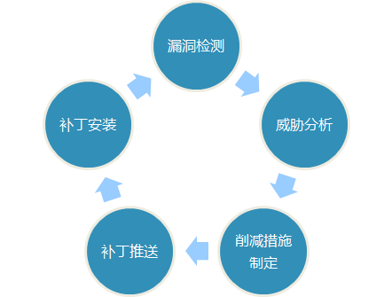

### 3.2.4 基础设施数据安全：端到端数据生命周期安全防护，确保数据安全

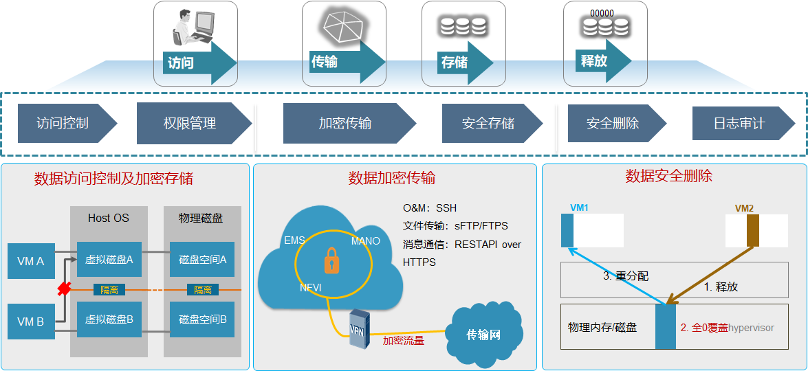

### 3.2.5 应用安全：5GC进行云化加固，增强数据安全，确保业务及时恢复

NFVI和VM对核心网网元的威胁：

+ 通过虚拟网络窃听或篡改应用层通信内容
+ 攻击虚拟存储，非法访问应用层的用户数据，篡改镜像
+ VM之间攻击、NFVI非法攻击VM，导致业务不可用

安全措施：VNF加固，确保自身安全

+ VM间关键数据传输加密
+ VNF关键数据加密后存储备份
+ 入侵检测和业务快速恢复

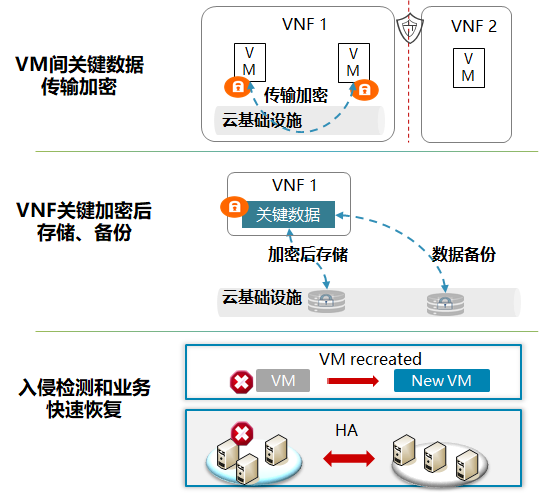

## 3.3 未来挑战

### 3.3.1 切片安全

#### 3.3.1.1 多重安全措施协同，应对非法访问和越权管理

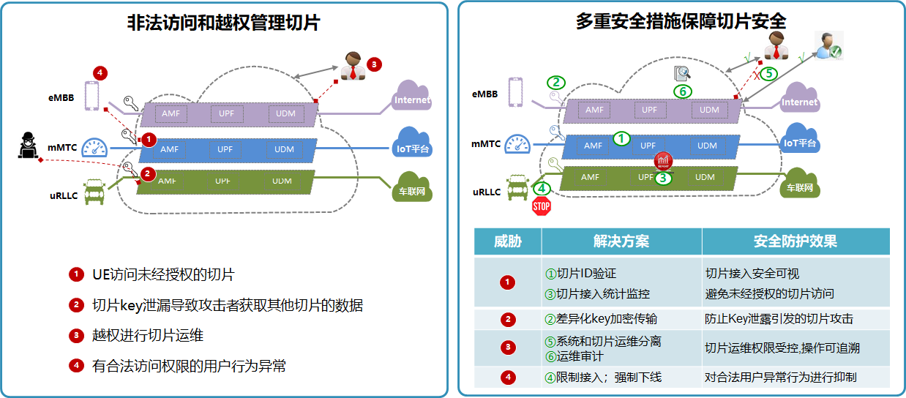

#### 3.3.1.2 资源有效隔离消减切片间相互影响

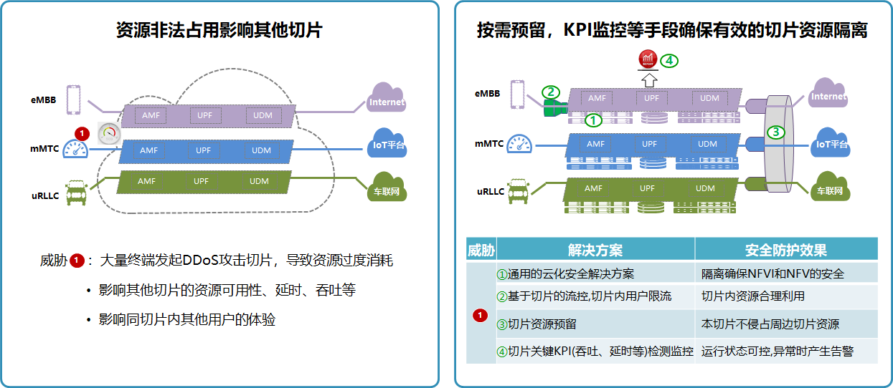

### 3.3.2 MEC

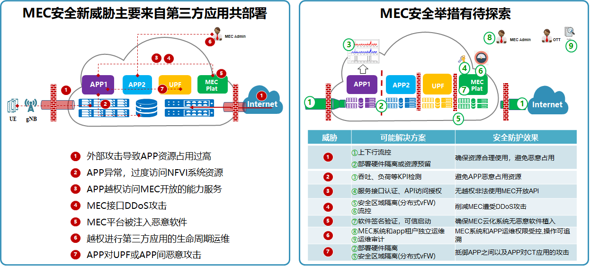

### 3.3.3 合法监听

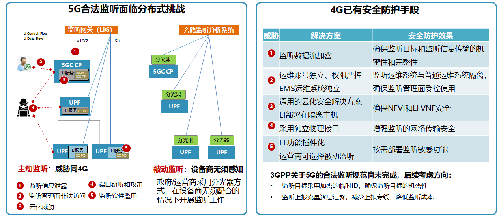

# 4 总结：5G网络安全基本可控，面向未来需持续增强

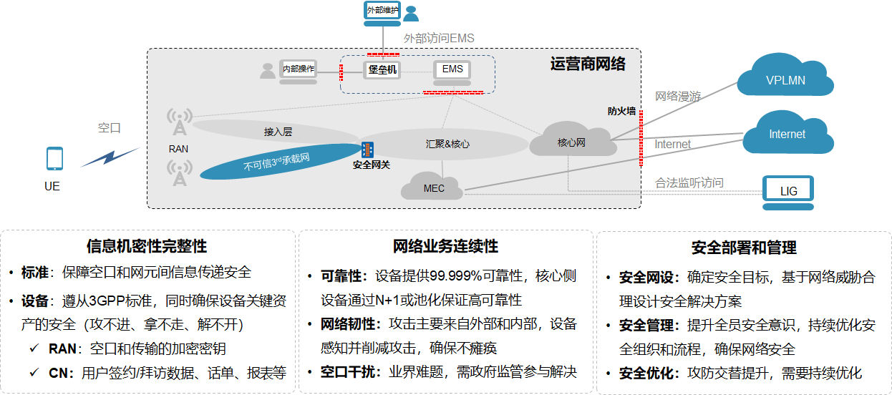