# 1 Architecture Model and Concepts

## 1.1 General Concepts

The 5G System architecture is defined to support data connectivity and services to use techniques such as NFV and SDN. Some key principles and concepts are to:

+ Separate UP functions from CP functions, allowing independent scalability, evolution and flexible deployments e.g. centralized location or distributed (remote) location;

+ Modularize the function design, e.g. to enable flexible and efficient network slicing;

+ Wherever applicable, define procedures (i.e. the set of interactions between network functions) as services, so that their re-use is possible;

+ Enable each Network Function and its Network Function Services to interact with other NF and its NF Services directly or indirectly via a proxy if required;

+ Minimize dependencies between AN and CN;

+ Support a unified authentication framework;

+ Support "stateless" NFs, where the "compute" resource is decoupled from the "storage" resource;

+ Support capability exposure;

+ Support concurrent access to local and centralized services. To support low latency services and access to local data networks, UP functions can be deployed close to the Access Network;

+ Support roaming with both Home routed traffic as well as Local breakout traffic in the visited PLMN.

## 1.2 Architecture Reference Model

### 1.2.1 General

The 5G architecture is defined as service-based and the interaction between network functions is represented in two ways:

+ A service-based representation, where NF (e.g. AMF) within CP enables other authorized NF to access their services. This representation also includes point-to-point reference points where necessary; 
+ A reference point representation, shows the interaction exist between the NF services in the NF described by point-to-point reference point (e.g. N11) between any two NF (e.g. AMF and SMF).

### 1.2.2 Network Functions and Entities

The 5G System architecture consists of the following NFs:

+ Authentication Server Function (AUSF);
+ Access and Mobility Management Function (AMF);
+ Data Network (DN), e.g. operator services, Internet access or 3rd party services; 
+ Unstructured Data Storage Function (UDSF);
+ Network Exposure Function (NEF);
+ Network Repository Function (NRF);
+ Network Slice Specific Authentication and Authorization Function (NSSAAF);
+ Network Slice Selection Function (NSSF);
+ Policy Control Function (PCF);
+ Session Management Function (SMF);
+ Unified Data Management (UDM);
+ Unified Data Repository (UDR);
+ User Plane Function (UPF);
+ UE radio Capability Management Function (UCMF);
+ Application Function (AF);
+ User Equipment (UE);
+ (Radio) Access Network ((R)AN);
+ 5G-Equipment Identity Register (5G-EIR);
+ Network Data Analytics Function (NWDAF);
+ CHarging Function (CHF).

### 1.2.3 Non-roaming Reference Architecture

5G system architecture:

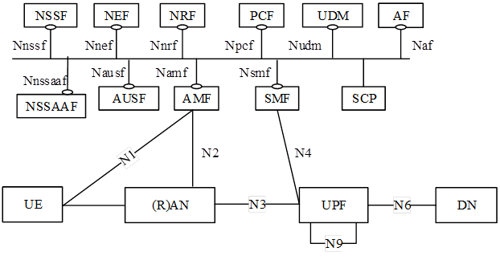

5G system architecture in reference point representation:

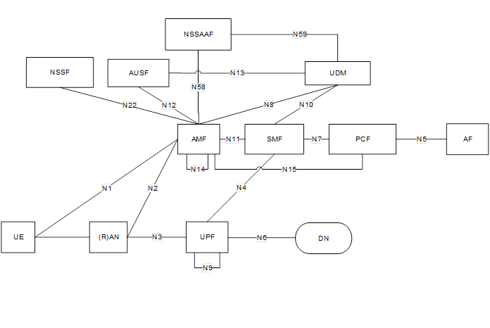

### 1.2.4 Roaming Reference Architectures

Roaming 5G System architecture – local breakout scenario in service-based interface representation:

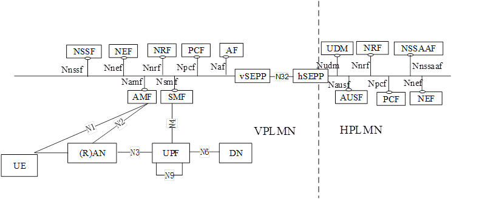

Roaming 5G System architecture - local breakout scenario in reference point representation:

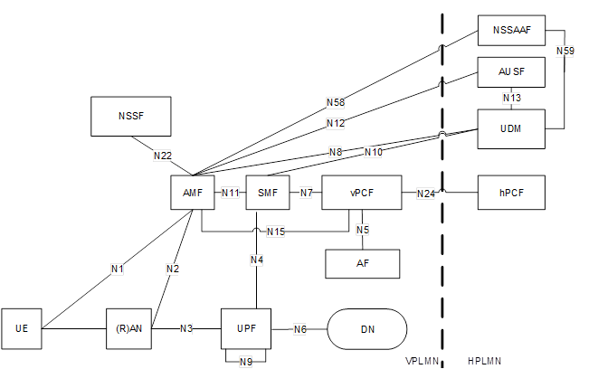

### 1.2.5 Data Storage Architectures

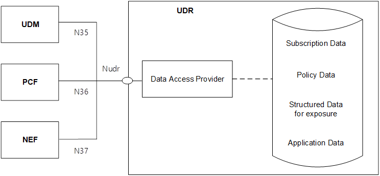

### 1.2.6 Support of non-3GPP Access

Non-roaming architecture for 5G Core Network with untrusted non-3GPP access:

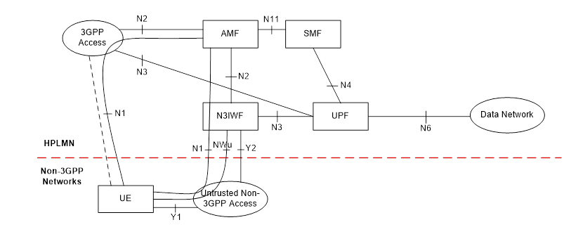

Non-roaming architecture for 5G Core Network with trusted non-3GPP access:

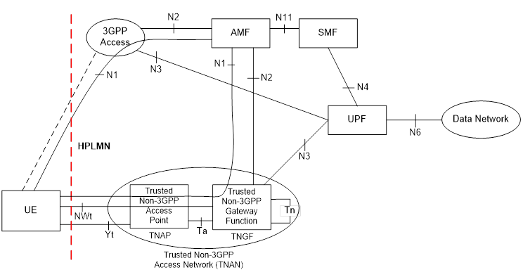

## 1.3 Inter-working with EPC

### 1.3.1 Non-roaming Architecture

Non-roaming architecture for inter-working between 5GS and EPC/E-UTRAN:

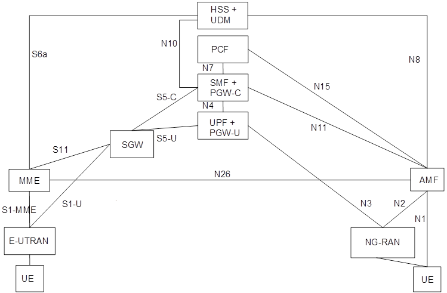

### 1.3.2 Roaming Architecture

Local breakout roaming architecture for inter-working between 5GS and EPC /E-UTRAN:

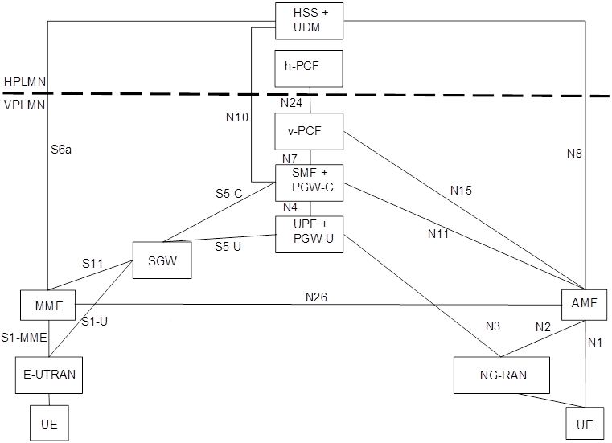

## 1.4 Specific services

### 1.4.1 SMS over NAS

Non-roaming system architecture for SMS over NAS:

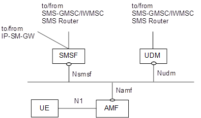

Non-roaming System Architecture for SMS over NAS in reference point representation:

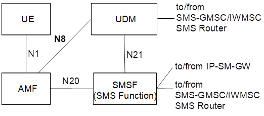

### 1.4.2 IMS Support

The 5G System architecture supports N5 interface between PCF and P-CSCF and supports Rx interface between PCF and P-CSCF, to enable IMS service.

### 1.4.3 Location Services

Location Service feature is optional and applicable to both regulatory services and commercial services, defined in TS23.273.

### 1.4.4 Application Triggering Services

Application trigger message contains information that allows the network to route the message to the appropriate UE and the UE to route the message to the appropriate application.

### 1.4.5 5G  LAN-type Services

Local-switch based user plane architecture in non-roaming scenario:

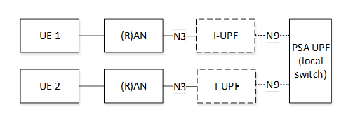

### 1.4.6 MSISDN-less MO SMS Services

The UE is pre-configured with the Service Centre address that points to SMS-SC that performs this MO SMS delivery via NEF delivery procedure. The recipient of this short message is set to the pre-configured address of the AF (i.e. Address of the destination SME).

### 1.4.7 Time Sensitive Communicaiton

System architecture view with 5GS appearing as TSN bridge:

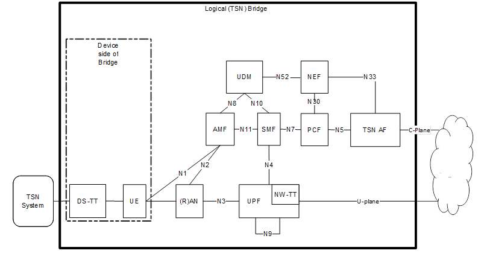

# 2 High Level Features

## 2.1 Network Access Control

Network access is the means for the user to connect to 5G CN. Network access control comprises the following functionality:

+ Network selection,
+ Identification and authentication,
+ Authorization, 
+ Access control and barring, 
+ Policy control, 
+ Lawful Interception.

### 2.1.1 Network Selection

In order to determine to which PLMN to attempt registration, the UE performs network selection. The network selection procedure comprises two main parts, PLMN selection and access network selection.

### 2.1.2 Identification and Authentication

The network may authenticate the UE during any procedure establishing a NAS signaling connection with the UE. The security architecture is specified in TS 33.501.

### 2.1.3 Authorization

The authorization for connectivity of the subscriber to the 5GC and the authorization for the services that the user is allowed to access based on subscription (e.g. Operator Determined Barring, Roaming restrictions, Access Type and RAT Type currently in use) is evaluated once the user is successfully identified and authenticated. This authorization is executed during UE Registration procedure.

### 2.1.4 Access Control and Barring

When the UE needs to transmit an initial NAS message, the UE shall request to establish an RRC Connection fist and the NAS shall provide the RRC establishment related information to the lower layer. The RAN handles the RRC Connection with priority during and after RRC Connection Establishment procedure, when UE indicates priority in Establishment related information.

Under high network load conditions, the network may protect itself against overload by using the Unified Access Control functionality to limit access attempts from UE. Depending on network configuration, the network may determine whether certain access attempt should be allowed or blocked based on categorized criteria. The NG-RAN may broadcast barring control information associated with Access Categories and Access Identities.

The NG-RAN node may initiate such Unified Access Control when: 

+ AMFs request to restrict the load for UEs that access the network by sending OVERLOAD START message containing conditions, or 
+ requested by OAM, or 
+ triggered by NG-RAN itself.

## 2.2 Registration and Connection Management

The Registration Management is used to register or de-register a UE/user with the network and establish the user context in the network. The Connection Management is used to establish and release the signaling connection between the UE and the AMF.

### 2.2.1 Registration Management

A UE/user needs to register with the network to receive services that requires registration. The UE updates its registration with the network:

+ Periodically in order to remain reachable (Periodic Registration Update), 
+ Upon mobility (Mobility Registration Update),
+ To update its capabilities or re-negotiate protocol parameters (Mobility Registration Update).

The Initial Registration procedure involves execution of Network Access Control functions. As result of the Registration procedure, the identifier of the serving AMF and the UE will be registered in UDM.

#### 2.2.1.1 Registration Management States

Two RM states are used in the UE and the AMF that reflect the registration status of the UE in the selected PLMN:

+ RM-DEREGISTERED
+ RM-REGISTERED

In the RM-DEREGISTERED state, the UE is not registered with the network. The UE context in AMF holds no valid location or routing information for the UE so the UE is not reachable by the AMF. However, some parts of UE context may still be stored in the UE and the AMF e.g. to avoid running an authentication procedure during every Registration procedure.

In the RM-REGISTERED state, the UE is registered with the network. In the RM-REGISTERED state, the UE can receive services that require registration with the network.

#### 2.2.1.2 Registration Area Management

Registration Area management comprises the functions to allocate and reallocate a Registration area to a UE. Registration area is managed per access.

### 2.2.2 Connection Management

Connection management comprises the functions of **establishing and releasing a NAS signaling connection between a UE and the AMF over N1**. This NAS signaling connection is used to **enable NAS signaling exchange between the UE and the core network**. It comprises both the AN signaling connection between the UE and the AN (RRC Connection over 3GPP access or UE-N3IWF connection over N3GPP access) and the N2 connection for this UE between the AN and the AMF.  

#### 2.2.2.1 5GS Connection Management States

Two CM states are used to reflect the NAS signaling connection of the UE with the AMF:

+ CM-IDLE. A UE in CM-IDLE state has no NAS signaling connection established with the AMF over N1;
+ CM-CONNECTED. A UE in CM-CONNECTED state has a NAS signaling connection with the AMF over N1. A NAS signaling connection uses an RRC Connection between the UE and the NG-RAN and an NGAP UE association between the AN and the AMF for 3GPP access.

#### 2.2.2.2 NAS signaling Connection Management

NAS signaling connection management includes:

+ NAS signaling connection establishment: the UE and the AMF to establish a NAS signaling connection for a UE in CM_IDLE state;
+ NAS signaling connection release. the AN node or the AMF initiate the procedure of releasing a NAS signaling connection;

### 2.2.3 UE Mobility 

#### 2.2.3.1 Mobility Restrictions

Mobility Restrictions consists of RAT restriction, Forbidden Area, Service Area Restrictions and Core Network type restriction.   

For a given UE, the core network determines the Mobility Restrictions based on UE subscription information, UE location and local policy. The Mobility Restriction may change due to e.g. UE's subscription, location change and local policy.

The UE's subscription data in the UDM includes a Service Area Restriction which may contain either Allowed or Non-Allowed Areas–specified by using explicit Tracking Area identities and/or other geographical information (e.g., longitude/latitude, zip code, etc). 

#### 2.2.3.2 Mobility Pattern

The Mobility Pattern is a concept that may be used by the AMF to characterize and optimize the UE mobility. The AMF determines and updates Mobility Pattern of the UE based on subscription of the UE, statistics of the UE mobility, network local policy, and the UE assisted information, or any combination of them.   

#### 2.2.3.3 Radio Resource Management functions

To support radio resource management in RAN the AMF provides the parameter RFSP Index (Index to RAT /Frequency Selection Priority) to RAN across N2. The RFSP Index is mapped by the RAN to locally defined configuration in order to apply specific RRM strategies, taking into account any available information in RAN. The RFSP Index is UE specific and applies to all the Radio Bearers. Examples of how this parameter may be used by the RAN:

+ to derive UE specific cell reselection priorities to control idle mode camping.

- to decide on redirecting active mode UEs to different frequency layers or RATs.

#### 2.2.3.4 UE Mobility event notification

5G System supports the functionality of tracking and reporting UE mobility events. 

The AMF provides the UE mobility related event reporting to NF that has been authorized to subscribe to the UE mobility event reporting service. Any NF service consumer such as SMF, PCF or NEF that wants to be reported on the UE location is able to subscribe to the UE mobility event notification service to the AMF with the following parameters:

- Event reporting type that specifies what to be reported on UE mobility (e.g. UE location, UE mobility on Area of Interest);
- Area Of Interest that specifies a geographical area within 3GPP system. The Area Of Interest is represented by a list of Tracking Areas, list of cells or list of (R)AN node identifiers;
- Event Reporting Information: event reporting mode, number of reports, maximum duration of reporting, event reporting condition (e.g. when the target UE moved into a specified Area Of Interest);
- Notification address (i.e. Endpoint Address of NF service consumer to be notified to);
- The target of event reporting that indicates a specific UE, a group of UE(s) or any UE (i.e. all UEs). Further details on the information provided by the NF service consumer.  

## 2.3 3GPP Access Specific Aspects

### 2.3.1 UE reachability in CM-IDLE

Reachability management is responsible for detecting whether the UE is reachable and providing UE location for the network to reach the UE. the UE location tracking includes both UE registration area tracking (i.e. UE registration area update) and UE reachability tracking (i.e. UE periodic registration area update). Such functionalities can be either located at 5GC (in the case of CM-IDLE state) or NG-RAN (in the case of CM-CONNECTED state).

Two UE reachability categories are negotiated between UE and AMF for CM-IDLE state:

+ UE reachability allowing Mobile Terminated data while the UE is CM-IDLE state
  + The UE location is known by the network on a Tracking Area List granularity
  + Paging procedures apply to this category
  + Mobile originating and mobile terminated data apply in this category for both CM-CONNECTED and CM-IDLE state;

+ Mobile Ini

### 2.3.2 UE reachability in CM-CONNECTED

### 2.3.3 Paging strategy handling

### 2.3.4 UE Radio Capability handling

### 2.3.5 DRX framework

### 2.3.6 Core Network assistance information for RAN optimization

### 2.3.7 NG-RAN location reporting

## 2.4 Non-3GPP Access Specific Aspects

## 2.5 Session Management

## 2.6 QoS Model

## 2.7 User Plane Management

## 2.8 Identifiers

+ SUPI (5G Subscription Permanent Identifier). The 5G System supports identification of subscriptions independently of identification of the user equipment;
+ PEI (Permanent Equipment Identifier). In the scope of this Release, this applies only to devices supporting at least one 3GPP access technology;
+ 5G-GUTI (The 5G System supports allocation of a temporary identifier) in order to support user confidentiality protection.  

## 2.9 Security Aspects

The security features in the 5G System include:

+ Authentication of the UE by the network and vice versa;
+ Security context generation and distribution;
+ User Plane data confidentiality and integrity protection;
+ Control Plane signaling confidentiality and integrity protection;
+ User identity confidentiality;
+ Support of LI requirements subject to regionlao/national regulatory requirements, including protection of LI data stored or transferred by an NF;

### 2.9.1 Security Model for non-3GPP access

When a UE is connected via a NG-RAN and via a standalone non-3GPP accesses, the multiple N1 instances are secured using independent NAS security contexts, each created based on the security context in the corresponding SEAF derived from the UE authentication.

### 2.9.2 PDU Session User Plane Security (3GPP access)

The User Plane Security Enforcement information provides the NG-RAN with User Plane security policies for a PDU session. It indicates:

+ whether UP integrity protection is: Required, Preferred, Not Needed
+ whether UP confidentiality protection is: Required, Preferred, Not Needed

The SMF determines at PDU session establishment a User Plane Security Enforcement information for the user plane of a PDU session based on:

+ subscribed User Plane Security Policy which is part of SM subscription information received from UDM;
+ User Plane Security Policy locally configured per (DNN, S-NSSAI) in the SMF when the UDM does not provide User Plane Security Policy information;
+ The maximum supported data rate per UE for integrity protection for the DRBs, provided by the UE in the Integrity protection maximum data rate IE during PDU Session Establishment; 

## 2.10 Support for Dual Connectivity, Multi-Connectivity

## 2.11 Charging

## 2.12 Support for Edge Computing

## 2.13 Policy Control

## 2.14 Network Slicing

## 2.15 Support for Specific Services

## 2.16 Inter-working and Migration

## 2.17 Network Sharing

## 2.18 Control Plane Load Control, Congestion and Overload Control

## 2.19 External Exposure of Network Capability

## 2.20 Architectural Support for Virtualized Deployments

## 2.21 System Enablers for Priority Mechanism

## 2.22 Supporting for Asynchronous Type Communication

## 2.23 3GPP PS Data Off

## 2.24 Support of OAM Features

## 2.25 Configuration Transfer Procedure

# 3 Network Functions

## 3.1 Network Function Functional Description

### 3.1.1 AMF 

The Access and Mobility Management Function (AMF) includes the following functionality:

+ Termination of RAN CP interface (N2)
+ Termination of NAS (N1), NAS ciphering and integrity protection
+ Registration management
+ Connection management
+ Mobility Management
+ Lawful intercept (for AMF events and interface to LI System)
+ Provide transport for SM messages between UE and SMF
+ Access Authentication
+ Access Authorization
+ Provide transport for SMS messages between UE and SMSF
+ Security Anchor Functionality (SEAF)
+ Location Services management for regulatory services
+ Provide transport for Location Services messages between UE and LMF as well as between RAN and LMF
+ EPS Bearer ID allocation for inter-working with EPS
+ UE mobility event notification

### 3.1.2 SMF

The Session Management Function (SMF) includes the following functionality:

+ Session Management, e.g. Session Establishment, modify and release, including tunnel maintain between UPF and AN node
+ UE IP address allocation and management (including optional Authorization)
+ DHCPv4 (server and client) and DHCPv6 functions
+ Functionality to respond to Address Resolution Protocol (ARP) requests and / or IPv6 Neighbor Solicitation requests based on local cache information for the Ethernet PDUs. The SMF responds to the ARP and / or the IPv6 Neighbor Solicitation Request by providing the MAC address corresponding to the IP address sent in the request
+ Selection and control of UP function, including controlling the UPF to proxy ARP or IPv6 Neighbor Discovery, or to forward all ARP/IPv6 Neighbour Solicitation traffic to the SMF, for Ethernet PDU Sessions
+ Configures traffic steering at UPF to route traffic to proper destination
+ Termination of interfaces towards Policy control functions
+ Lawful intercept (for SM events and interface to LI System)
+ Charging data collection and support of charging interfaces
+ Control and coordination of charging data collection at UPF
+ Termination of SM parts of NAS messages
+ Downlink Data Notification
+ Initiator of AN specific SM information, sent via AMF over N2 to AN
+ Determine SSC mode of a session 
+ Roaming functionality:
  - Handle local enforcement to apply QoS SLAs (VPLMN) 
  - Charging data collection and charging interface (VPLMN)
  - Lawful intercept (in VPLMN for SM events and interface to LI System) 
  - Support for interaction with external DN for transport of signalling for PDU Session by external DN    

### 3.1.3 UPF

The User Plane Function (UPF) includes the following functionality:

+ Anchor point for Intra-/Inter-RAT mobility (when applicable) 
+ External PDU Session point of interconnect to Data Network
+ Packet routing & forwarding (e.g. support of Uplink classifier to route traffic flows to an instance of a data network, support of Branching point to support multi-homed PDU Session)
+ Packet inspection (e.g. Application detection based on service data flow template and the optional PFDs received from the SMF in addition) 
+ User Plane part of policy rule enforcement, e.g. Gating, Redirection, Traffic steering) 
+ Lawful intercept (UP collection)
+ Traffic usage reporting 
+ QoS handling for user plane, e.g. UL/DL rate enforcement, Reflective QoS marking in DL 
+ Uplink Traffic verification (SDF to QoS Flow mapping)
+ Transport level packet marking in the uplink and downlink
+ Downlink packet buffering and downlink data notification triggering
+ Sending and forwarding of one or more "end marker" to the source NG-RAN node
+ Functionality to respond to Address Resolution Protocol (ARP) requests and / or IPv6 Neighbour Solicitation requests based on local cache information for the Ethernet PDUs. The UPF responds to the ARP and / or the IPv6 Neighbour Solicitation Request by providing the MAC address corresponding to the IP address sent in the request

### 3.1.4 PCF

The Policy Control Function (PCF) includes the following functionality:

+ Supports unified policy framework to govern network behaviour
+ Provides policy rules to Control Plane function to enforce them
+ Accesses subscription information relevant for policy decisions in a Unified Data Repository

### 3.1.5 NEF 

The Network Exposure Function (NEF) supports the following independent functionality:

+ Exposure of capabilities and events:
  + NF capabilities and events may be securely exposed by NEF for e.g. 3rd party, Application Functions, Edge Computing
  + NEF stores/retrieves information as structured data using a standardized interface (Nudr) to the Unified Data Repository (UDR)
+ Secure provision of information from external application to 3GPP network. It provides a means for the Application Functions to securely provide information to 3GPP network, e.g. Expected UE Behaviour. In that case the NEF may authenticate and authorize and assist in throttling the Application Functions
+ Translation of internal-external information. It translates between information exchanged with the AF and information exchanged with the internal network function. For example, it translates between an AF-Service-Identifier and internal 5G Core information such as DNN, S-NSSAI. In particular, NEF handles masking of network and user sensitive information to external AF's according to the network policy 
+ The Network Exposure Function receives information from other network functions (based on exposed
  capabilities of other network functions). NEF stores the received information as structured data using a
  standardized interface to a Unified Data Repository (UDR). The stored information can be accessed and "reexposed" by the NEF to other network functions and Application Functions, and used for other purposes such as analytics.  
+ A NEF may also support a PFD Function: The PFD Function in the NEF may store and retrieve PFD(s) in the UDR and shall provide PFD(s) to the SMF on the request of SMF (pull mode) or on the request of PFD management from NEF (push mode).  

### 3.1.6 NRF

The Network Repository Function (NRF) supports the following functionality:

+ Supports service discovery function. Receive NF Discovery Request from NF instance, and provides the
  information of the discovered NF instances (be discovered) to the NF instance 
+ Maintains the NF profile of available NF instances and their supported services. NF profile of NF instance maintained in an NRF includes the following information:
  + NF instance ID
  + NF type
  + PLMN ID
  + Network Slice related Identifier(s) e.g. S-NSSAI, NSI ID 
  + FQDN or IP address of NF
  + NF capacity information 
  + NF priority information
  + NF Specific Service authorization information
  + if applicable, Names of supported services
  + Endpoint Address(es) of instance(s) of each supported service
  + Identification of stored data/information
  + Other service parameter, e.g., DNN, notification endpoint for each type of notification that the NF service is interested in receiving
  + Location information for the NF instance
  + TAI(s)
  + Routing Indicator, for UDM and AUSF 
  + One or more GUAMI(s), in case of AMF
  + SMF area identity(ies) in case of UPF
  + UDM Group ID, range(s) of SUPIs, range(s) of GPSIs, range(s) of external group identifiers for UDM 
  + UDR Group ID, range(s) of SUPIs, range(s) of GPSIs, range(s) of external group identifiers for UDR
  + AUSF Group ID, range(s) of SUPIs for AUSF 
  + PLMN level (the NRF is configured with information for the whole PLMN) 
  + shared-slice level (the NRF is configured with information belonging to a set of Network Slices) 
  + slice-specific level (the NRF is configured with information belonging to an S-NSSAI)   

### 3.1.7 UDM

The Unified Data Management (UDM) includes support for the following functionality:

+ Generation of 3GPP AKA Authentication Credentials  
+ User Identification Handling (e.g. storage and management of SUPI for each subscriber in the 5G system)
+ Support of de-concealment of privacy-protected subscription identifier (SUCI)
+ Access authorization based on subscription data (e.g. roaming restrictions) 
+ UE's Serving NF Registration Management (e.g. storing serving AMF for UE, storing serving SMF for UE's
  PDU Session) 
+ Support to service/session continuity e.g. by keeping SMF/DNN assignment of ongoing sessions
+ MT-SMS delivery support
+ Lawful Intercept Functionality (especially in outbound roaming case where UDM is the only point of contact for LI) 
+ Subscription management
+ SMS management  

### 3.1.8 AUSF

The Authentication Server Function (AUSF) supports the following functionality:

+ Supports authentication for 3GPP access and untrusted non-3GPP access  

### 3.1.9 N3IWF

The functionality of N3IWF in the case of untrusted non-3GPP access includes the following:

+ Support of IPsec tunnel establishment with the UE: The N3IWF terminates the IKEv2/IPsec protocols with theUE over NWu and relays over N2 the information needed to authenticate the UE and authorize its access to the 5G Core Network
+ Termination of N2 and N3 interfaces to 5G Core Network for control - plane and user-plane respectively
+ Relaying uplink and downlink control-plane NAS (N1) signalling between the UE and AMF
+ Handling of N2 signalling from SMF (relayed by AMF) related to PDU Sessions and QoS 
+ Establishment of IPsec Security Association (IPsec SA) to support PDU Session traffic
+ Relaying uplink and downlink user-plane packets between the UE and UPF. This involves:
  + De-capsulation/ encapsulation of packets for IPSec and N3 tunnelling
+ Enforcing QoS corresponding to N3 packet marking, taking into account QoS requirements associated to such marking received over N2
+ N3 user-plane packet marking in the uplink
+ Local mobility anchor within untrusted non-3GPP access networks using MOBIKE per IETF RFC 4555
+ Supporting AMF selection

### 3.1.10 AF

The Application Function (AF) interacts with the 3GPP Core Network in order to provide services, for example to support the following:

+ Application influence on traffic routing
+ Accessing Network Exposure Function
+ Interacting with the Policy framework for policy control

### 3.1.11 UDR

The Unified Data Repository (UDR) supports the following functionality:

+ Storage and retrieval of subscription data by the UDM
+ Storage and retrieval of policy data by the PCF 
+ Storage and retrieval of structured data for exposure
+ Application data (including Packet Flow Descriptions (PFDs) for application detection, AF request information for multiple UEs), by the NEF

The Unified Data Repository is located in the same PLMN as the NF service consumers storing in and retrieving data from it using Nudr. Nudr is an intra-PLMN interface.  

### 3.1.12 UDSF

The UDSF is an optional function that supports the following functionality:

+ Storage and retrieval of information as unstructured data by any NF  

### 3.1.13 SMSF

The SMSF supports the following functionality to support SMS over NAS: 

+ SMS management subscription data checking and conducting SMS delivery accordingly
+ SM-RP/SM-CP with the UE
+ Relay the SM from UE toward SMS-GMSC/IWMSC/SMS-Router
+ Relay the SM from SMS-GMSC/IWMSC/SMS-Router toward the UE
+ SMS related CDR
+ Lawful Interception.  

### 3.1.14 NSSF

The Network Slice Selection Function (NSSF) supports the following functionality:

+ Selecting the set of Network Slice instances serving the UE 
+ Determining the Allowed NSSAI and, if needed, the mapping to the Subscribed S-NSSAIs 
+ Determining the Configured NSSAI and, if needed, the mapping to the Subscribed S-NSSAIs 
+ Determining the AMF Set to be used to serve the UE, or, based on configuration, a list of candidate AMF(s), possibly by querying the NRF  

### 3.1.15 5G-EIR

 The 5G-EIR is an optional network function that supports the following functionality:

+ Check the status of PEI (e.g. to check that it has not been blacklisted)

### 3.1.16 LMF

The LMF includes the following functionality:

+ Supports location determination for a UE
+ Obtains downlink location measurements or a location estimate from the UE
+ Obtains uplink location measurements from the NG RAN 
+ Obtains non-UE associated assistance data from the NG RAN  

### 3.1.17 SEPP

The Security Edge Protection Proxy (SEPP) is a non-transparent proxy and supports the following functionality: 

+ Message filtering and policing on inter-PLMN control plane interfaces
+ Topology hiding   

### 3.1.18 NWDAF

NWDAF represents operator managed network analytics logical function. NWDAF provides slice specific network data analytics to a NF. NWDAF provides network analytics information (i.e., load level information) to a NF on a network slice instance level and the NWDAF is not required to be aware of the current subscribers using the slice. NWDAF notifies slice specific network status analytic information to the NFs that are subscribed to it. NF may collect directly slice specific network status analytic information from NWDAF.   

## 3.2 Principles for the Network Function and Network Function Service discovery and selection

The NF discovery and NF service discovery enables an NF to discover a set of NF instance(s) for a specific NF service or an NF type. 

NF service discovery is enabled via the NF discovery procedure. In order for the requested NF type or NF service to be discovered via the NRF, the NF instance need to be registered in
the NRF. The registration may take place e.g. when the producer NF instance and its NF service instance(s) become operative for the first time. 

In order for the requester NF to obtain information about the NF and/or NF service(s) registered or configured in a PLMN/slice, the requester NF may initiate a discovery procedure with the NRF by providing the type of the NF and optionally a list of the specific service(s) it is attempting to discover. The requester NF may also provide other service
parameters e.g. slicing related information.       

### 3.2.1 SMF Discovery and Selection

The SMF selection function is supported by the AMF and is used to allocate an SMF that shall manage the PDU Session. The AMF shall utilize the Network Repository Function to discover the SMF instance(s) unless SMF information is available by other means, e.g. locally configured on AMF. The NRF provides NF profile(s) of SMF instance(s) to the AMF. The SMF selection function in the AMF selects an SMF instance and an SMF service instance based on the available SMF instances obtained from NRF or on the configured SMF information in the AMF.

The following factors may be considered during the SMF selection:

+ Selected Data Network Name (DNN)
+ S-NSSAI
+ NSI-ID
+ Subscription information from UDM, e.g.
  + per DNN: whether LBO roaming is allowed
  + per S-NSSAI: the subscribed DNN(s)

### 3.2.2 User Plane Function Selection

The selection and re-selection of the UPF are performed by the SMF by considering UPF deployment scenarios such as centrally located UPF and distributed UPF located close to or at the Access Network site. The selection of the UPF shall also enable deployment of UPF with different capabilities, e.g. UPFs supporting no or a subset of optional functionalities.  

The UPF selection involves:

+ a step of SMF Provisioning of available UPF
+ a step of selection of an UPF for a particular PDU Session

#### 3.2.2.1 SMF Provisioning of available UPFs

The UPF selection functionality in the SMF may optionally utilize the NRF to discover UPF instance(s). In this case, the SMF issues a request to the NRF that may include following parameters: DNN, S-NSSAI, SMF Area Identity. In its answer, the NRF provides the NF profile(s) that include(s) the IP address(es) or the FQDN of the N4 interface of
corresponding UPF instance(s) to the SMF.  

UPFs may be associated with an SMF Area Identity in the NRF. This allows limiting the SMF provisioning of UPF(s) using NRF to those UPF(s) associated with a certain SMF Area Identity. This can e.g. be used in the case that an SMF is only allowed to control UPF(s) configured in NRF as belonging to a certain SMF Area Identity.  

#### 3.2.2.2 Selection of an UPF for a particular PDU Session

If there is an existing PDU Session, and the SMF receives another PDU Session request to the same DNN and SNSSAI, and the UE subscription data indicates the support for interworking with EPC for this DNN and S-NSSAI, the same UPF should be selected.   

The following parameter(s) and information may be considered by the SMF for UPF selection and re-selection:  

+ UPF's dynamic load
+ UPF's relative static capacity among UPFs supporting the same DNN
+ UPF location available at the SMF
+ UE location information
+ Capability of the UPF and the functionality required for the particular UE session: An appropriate UPF can be selected by matching the functionality and features required for an UE 
+ Data Network Name (DNN)
+ PDU Session Type (i.e. IPv4, IPv6, IPv4v6, Ethernet Type or Unstructured Type) and if applicable, the static IP address/prefix
+ SSC mode selected for the PDU Session 
+ UE subscription profile in UDM
+ DNAI as included in the PCC Rules
+ Local operator policies 
+ S-NSSAI
+ Access technology being used by the UE
+ Information related to user plane topology and user plane terminations, that may be deduced from: AN-provided identities (e.g. CellID, TAI), available UPF(s) and DNAI(s)
+ Information regarding the user plane interfaces of UPF(s).This information may be acquired by the SMF using N4
+ Information regarding the N3 User Plane termination(s) of the AN serving the UE. This may be deduced from AN-provided identities (e.g. CellID, TAI)
+ Information regarding the N9 User Plane termination(s) of UPF(s) if needed 
+ Information regarding the User plane termination(s) corresponding to DNAI(s).  

### 3.2.3 AUSF Discovery and Selection

The AMF performs AUSF selection to allocate an AUSF Instance that performs authentication between the UE and 5G CN in the HPLMN. 

The AUSF selection function should consider one of the following factors:

+ Home network identifier (MNC and MCC) of SUCI/SUPI and Routing Indicator
+ AUSF Group ID the UE's SUPI belongs to
+ SUPI

### 3.2.4 AMF Discovery and Selection

5G-AN selects an AMF Set and an AMF under the following cirumstances:

+ When the UE provides no 5G-S-TMSI nor the GUAMI to the 5G-AN
+ When the UE provides 5G-S-TMSI or GUAMI but the routing information is not sufficient or not usable
+ AMF has instructed AN that the AMF is unavailable and no traget AMF is identified or AN has detected the AMF failed

The AMF selection functionality in the 5G-AN may consider the follwoing factors for selecting the AMF Set:

+ AMF Region ID and AMF Set ID derived from GUAMI
+ Requested NSSAI
+ Local operator policies

AMF selection functionality considers the following factors for selecting an AMF from AMF Set:

+ Availabilty of candidate AMF
+ Load balancing across candidate AMF

### 3.2.5 N3IWF Selection

etc

### 3.2.6 PCF Discovery and Selection

Underlying principles for PCF selection and discovery:

+ There may be multiple and separately addressable PCFs in a PLMN
+ The PCF must beable to correlate the AF service session established over N5 or Rx with the associated PDU Session (Session binding) handled over N7
+ It shall be possible to deploy a network so that the PCF may serve only specific DN
+ Unique identification of a PDU Session in the PCF shall be possible based on the (UE ID, DNN)-tuple, the (UE IP Address, DNN)-tuple and (UE ID, UE IP Address, DNN)

#### 3.2.6.1 PCF discovery and selection for a UE or a PDU Session

PCF discovery and selection functionality is used by the AMF to slect the PCF for a UE and by the SMF to select the PCF for a PDU Session, following the principles below:

+ The AMF may utilize the NRF to discover the candidate PCF instances for a UE, considering the following facts:
  + SUPI
  + S-NSSAI	

+ The SMF may utilize the NRF to discover the candidate PCF instances for a PDU Session, considering the following facts:
  + Local operator policies
  + Selected Data Network Name
  + S-NASSAI of the PDU Session
  + SUPI

#### 3.2.6.2 Providing policy requirements that apply to multiple UE and hence to multiple PCF

An authorized Application Function may provide policy requirements that apply to multiple UE. After relevant validation of the AF request (and possible parameter mapping), the NEF stores this request received from the Af into the selected UDR instance as the Data Subset of the Application data. The possible parameter mapping includes mapping UE identifiers provided by the AF to identifiers used within the 5GC, e.g. from GPSI to SUPI and/or from External Group Identifier to Internal Group Identifier. Parameter mapping may also include mapping from the identifier of AF towards internal identifiers such as the DNN or the S-NSSAI. 

The NEF associates the AF request with information allowing to later modify or delete the AF request in the UDR; it associates the AF request with:

+ When the AF request targets PDU Sessions established by any UE: the DNN, the slicing information target of the AF request
+ When the request targets PDU Sessions established by UE belonging to an Internal Group: the DNN, the slicing information and Internal Group Identifier target of the application request
+ The AF transaction identifier in the AF request

### 3.2.7 UDM Discovery and Selection

The NF consumer performs UDM discovery to discover a UDM instance that manages the user subscriptions. 

The UDM selection should considr one of the following factors when available to the UDM NF consumer:

+ Home network identifier (MNC and MCC) of SUCI/SUPI and UE's Routing Indicator
+ UDM Group ID of the UE's SUPI
+ SUPI
+ GPSI or External Group ID

### 3.2.8 UDR Discovery and Selection

Multiple instances of UDR may be deployed, each one storing specific data or providing service to a specific set of NF consumers. The consumer shall utilize the NRF to discover the appropriate UDR instance contains relevant information for the consumer, such as :

+ UDM selects a UDR instance that contains subscription data
+ NEF (when used to access data for exposure) selects a UDT that contains data for exposure
+ PCF selects a UDR that contains Policy Data or Application Data

The UDR selection function in UDR NF consumers considers the Data Set Identifier of the data to be managed in UDR. Additionally, the UDR selection fuction should consider one of the following factors:

+ UDR Group ID the UE's SUPI belongs to
+ SUPI
+ GPSI or External Group ID

### 3.2.9 SMSF Discovery and Selection

The SMSF selection function is supported by the AMF and is used to allocate an SMSF instance that shall manage the SMS. 

The SMSF selection may be based on the following methods:

+ SMSF instance address preconfigured in the AMF (SMSF FQDN or IP address)
+ SMSF information available in the serving PLMN if received from an old AMF or the UDM
+ AMF invokes Nnrf_NFDiscovery service operation from NRF to discover SMSF instance 

### 3.2.10 CHF Discovery and Selection

The CHF discovery and selection function is supported by the SMF and the PCF. It is used by the SMF to select a CHF that manages the online charging or offline charging for a PDU Session of a subscriber. It is used by the PCF to select a CHF that manages the spending limits for a PDU Session of a subscriber.

# 4 Network Function Services and Descriptions

## 4.1 Network Function Service Framework

An NF service is one type of capability exposed by an NF to other authorized NF through a service-based interface:

+ NF services are derived from the system procedures that describe end-to-end functionality. Services may also be defined based on information flows ;
+ System procedures can be described by a sequence of NF service invocations;

### 4.1.1 NF Service Consumer - NF Service Producer interactions

The interaction between two Network Functions within this NF service framework follows two mechanisms:

+ Request-response

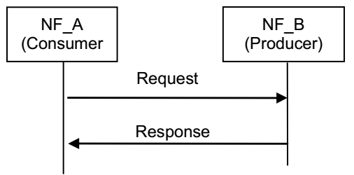

+ Subscribe-Notify

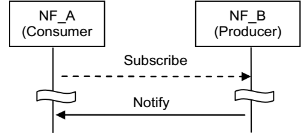

### 4.1.2 Network Function Service Discovery

Refer to clause 3.2.1.

### 4.1.3 Network Function Service Authorization

NF service authorization shall ensure the NF Service Consumer is authorized to access the NF service provided by the NF Service Provider, according to e.g. the policy of NF, the policy from the serving operator, the inter-operator agreement.

Due to roaming agreements and operator policies, a NF Service Consumer shall be authorized based on UE/subscriber/roaming information and NF type, the Service authorization may entail two steps:

+ Check whether the NF Service Consumer is permitted to discover the requested NF Service Producer instance during the NF service discovery procedure. This is performed on a per NF granularity by NRF;
+ Check whether the NF Service Consumer is permitted to access the requested NF Service Producer for consuming the NF service, with a request type granularity. This is performed on a per UE, subscription or roaming agreements granularity. This type of NF Service authorization shall be embedded in the related NF service logic;

### 4.1.4 Network Function and Network Function Service Registration and De-registration

For the NRF to properly maintain the information of available NF instances and their supported services, each NF instance informs the NRF of the list of NF services that it supports. The NF instance may make this information available to NRF when the NF instance becomes operative for the first time (registration operation) or upon individual NF service instance activation/de-activation within the NF instance (update operation).

The NF instance may also de-registers from the NRF when it is about to gracefully shut down or disconnect from the network in a controlled way. If an NF instance become unavailable or unreachable due to unplanned errors, an authorized entity shall de-register the NF instance with the NRF.

## 4.2 Network Function Services

An NF service is offering a capability to authorized consumers. 

Network Functions may offer different capabilities and thus, different NF services to distinct consumers. Each of the NF services offered by a Network Function shall be self-contained, reusable and use management schemes independently of other NF services offered by the same Network Function.

Each NF service shall be accessible by means of an interface. An interface may consist of one or several operations. System procedures can be built by invocation of a number of NF services.

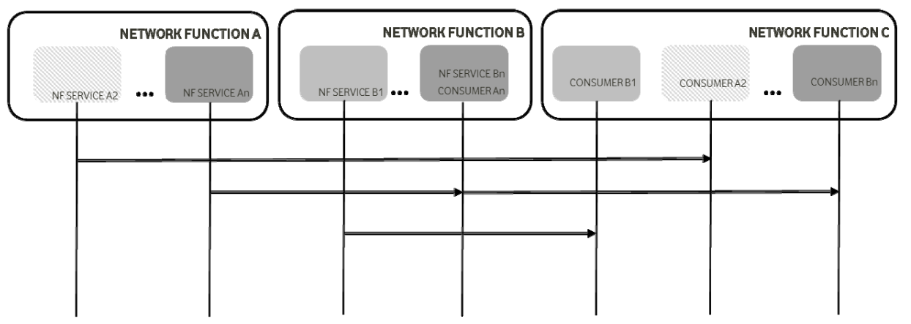

# 5 Control and User Plane Protocol Stacks

Overall protocol stacks between 5GS entities:

+ between the UE and the 5GC Network Functions
+ between the 5G-AN and the 5GC Network Functions
+ between the 5GC Network Functions

## 5.1 Control Plane Protocol Stacks

## 5.1.1 Control Plane Protocol Stacks between the 5G-AN and the 5G Core: N2

Following procedures are defined over N2: 

+ Procedures related with N2 Interface Management and that are not related to an individual UE, such as for Configuration or Reset of the N2 interface. These procedures are intended to be applicable to any access but may correspond to messages that carry some information only on some access (such as information on the default Paging DRX used only for 3GPP access)

+ Procedures related with an individual UE:
  + Procedures related with NAS Transport. These procedures are intended to be applicable to any access but may correspond to messages that for UL NAS transport carry some access dependent information such as User Location Information (e.g. Cell-Id over 3GPP access or other kind of User Location Information for Untrusted Non 3GPP access).
  + Procedures related with UE context management. These procedures are intended to be applicable to any access. The corresponding messages may carry: 
    + some information only on some access (such as Mobility Restriction List used only for 3GPP access).
    + some information (related e.g. with N3 addressing and with QoS requirements) that is to be transparently forwarded by AMF between the 5G-AN and the SMF.
  + Procedures related with resources for PDU Sessions. These procedures are intended to be applicable to any  access. They may correspond to messages that carry information (related e.g. with N3 addressing and with QoS requirements) that is to be transparently forwarded by AMF between the 5G-AN and the SMF.  
  
+ Procedures related with Hand-Over management. These procedures are intended for 3GPP access only.

The Control Plane interface between the 5G-AN and the 5G Core supports:

+ The connection of multiple different kinds of 5G-AN (e.g. 3GPP RAN, N3IWF for Un-trusted access to 5GC) to the 5CG via an unique Control Plane protocol: A single NGAP protocol is used for both the 3GPP access and  non-3GPP access; 
+ There is a unique N2 termination point in AMF per access for a given UE regardless of the number (possibly zero) of PDU Sessions of the UE;
+ The decoupling between AMF and other functions such as SMF that may need to control the services supported by 5G-AN(s) (e.g. control of the UP resources in the 5G-AN for a PDU Session). For this purpose, NGAP may support information that the AMF is just responsible to relay between the 5G-AN and the SMF.    

#### 5.1.1.1 **AN-AMF**

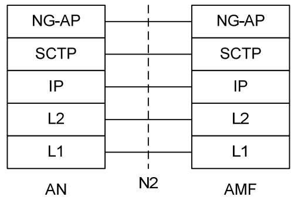

#### 5.1.1.2 **AN-SMF**

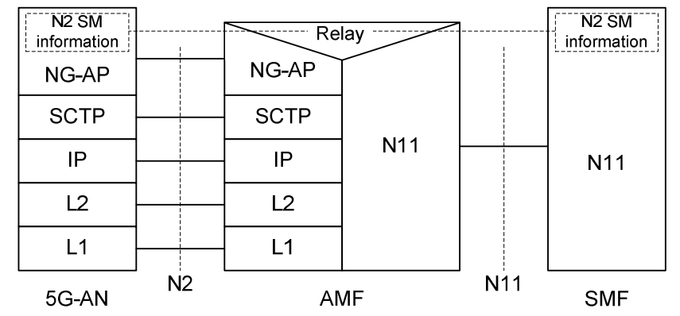

### 5.1.2 Control Plane Protocol Stacks between the UE and 5GC 

A single N1 NAS signalling connection is used for each access to which the UE is connected. The single N1 termination point is located in AMF. The single N1 NAS signalling connection is used for both Registration Management and Connection Management (RM/CM) and for SM-related messages and procedures for a UE.

The NAS protocol on N1 comprises a NAS-MM and a NAS-SM components. There are multiple cases of protocols between the UE and a core network function (excluding the AMF) that need to be transported over N1 via NAS-MM protocol, including:

+ Session Management Signalling
+ SMS
+ UE Policy
+ LCS

The NAS-MM supports generic capabilities:

+ NAS procedures that terminate at the AMF. This includes:
  + Handles Registration Management and Connection Management state machines and procedures with the UE, including NAS transport; the AMF supports following capabilities: 
    + Decide whether to accept the RM/CM part of N1 signalling during the RM/CM procedures without considering possibly combined other non NAS-MM messages (e.g., SM) in the same NAS signalling contents;  
    + Know if one NAS message should be routed to another NF (e.g., SMF), or locally processed with the NAS routing capabilities inside during the RM/CM procedures; 
  + Provide a secure NAS signalling connection (integrity protection, ciphering) between the UE and the AMF, including for the transport of payload;  
  + Provide access control if it applies;
  
 + It is possible to transmit the other type of NAS message (e.g., NAS SM) together with an RM/CM NAS message by supporting NAS transport of different types of payload or messages that do not terminate at the AMF, i.e. NAS-SM, SMS, UE Policy and LCS between the UE and the AMF. This includes:
     + Information about the Payload type; 
     + Additional Information for forwarding purposes;
     + The Payload (e.g. the SM message in the case of SM signalling);
  + There is a Single NAS protocol that applies on both 3GPP and non-3GPP access. When an UE is served by a single AMF while the UE is connected over multiple (3GPP/Non 3GPP) accesses, there is a N1 NAS signalling connection per access.

Security of the NAS messages is provided based on the security context established between the UE and the AMF.  

#### 5.1.2.1 **NAS transport for SM, SMS, UE Policy and LCS**

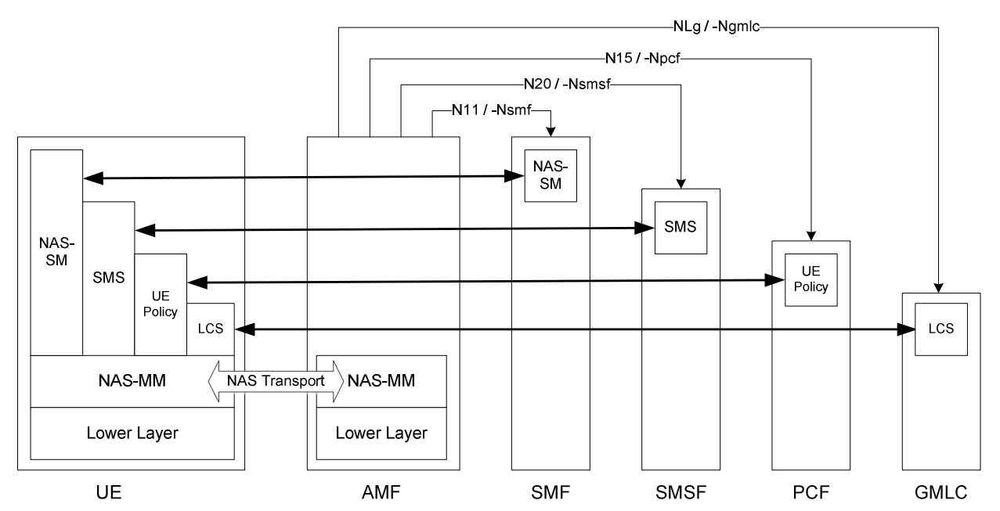

#### 5.1.2.2 **UE-AMF**

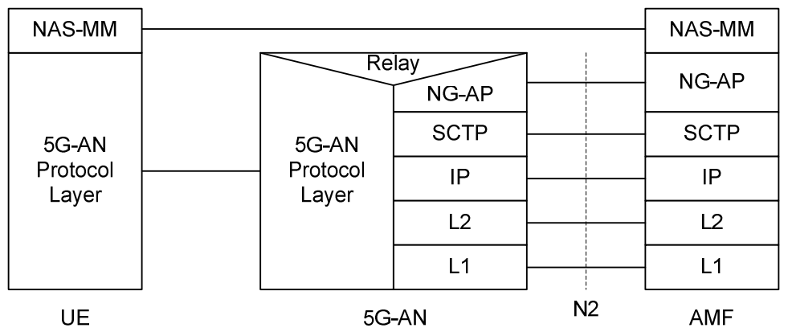

#### 5.1.2.3 **UE-SMF**

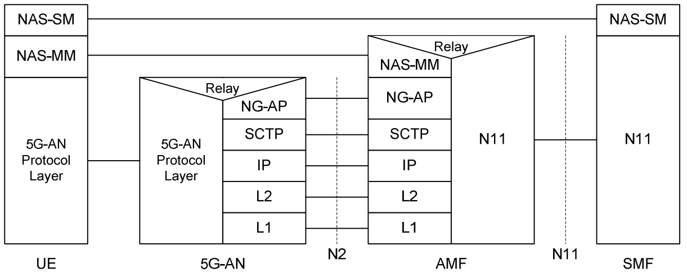

### 5.1.2 Control Plane Protocol Stacks between the UE and the 5GC

#### 5.1.2.1 NAS transport for SM, SMS, UE Policy and LCS

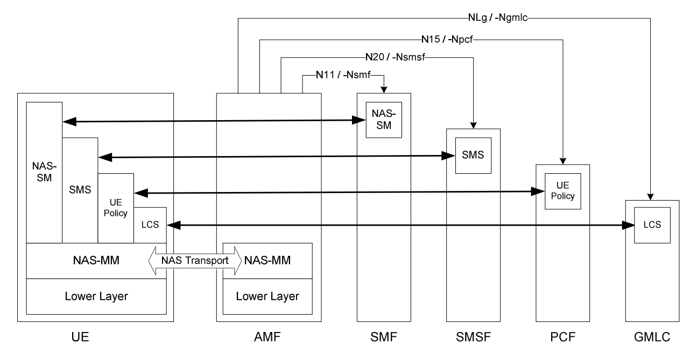

#### 5.1.2.2 UE-AMF

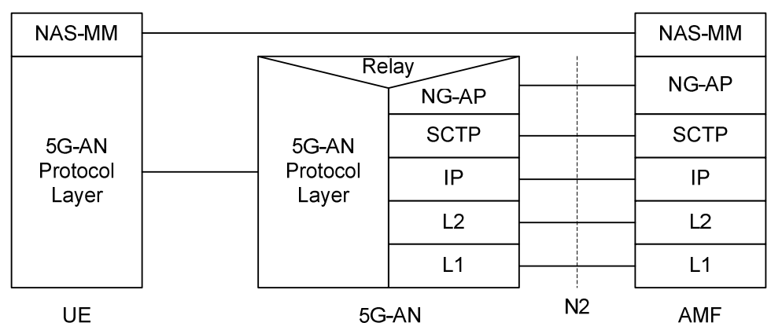

#### 5.1.2.3 UE-SMF

The NAS-SM supports the handling of Session Management between the UE and the SMF. The SM signalling message is handled in the NAS-SM layer of UE and the SMF. The content of the SM signalling message is not interpreted by the AMF.

NAS-SM: The NAS protocol for SM functionality supports user plane PDU Session  establishment, modification and release. It is transferred via the AMF, and transparent to the AMF

### 5.1.3 Control Plane Protocol Stacks between the network functions in 5GC

The control plane protocol for the service based interfaces is defined in the TS29.500.

The control plane protocol for SMF-UPF is defiend in TS29.244.

### 5.1.4 Control Plane for untrusted non 3GPP Access

Control Plane before the signalling IPSec SA established between UE and N3IWF

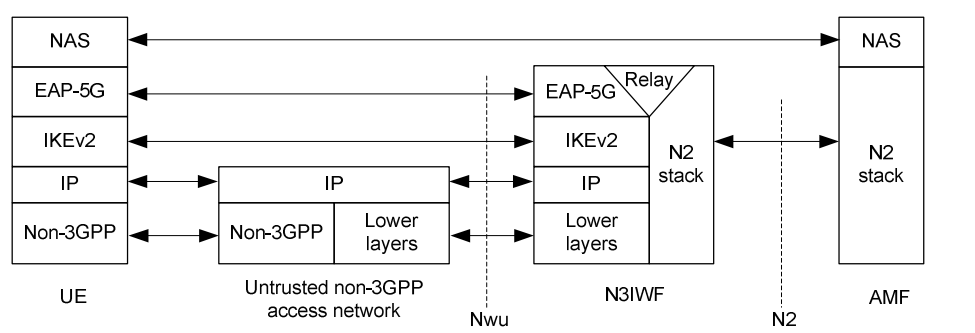

Control Plane after the signalling IPSec SA established between UE and N3IWF

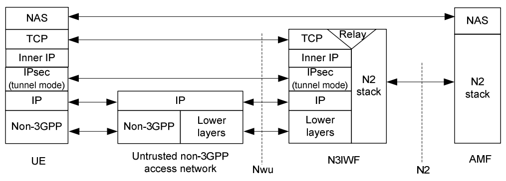

Control Plane for establishment of user-plane via N3IWF

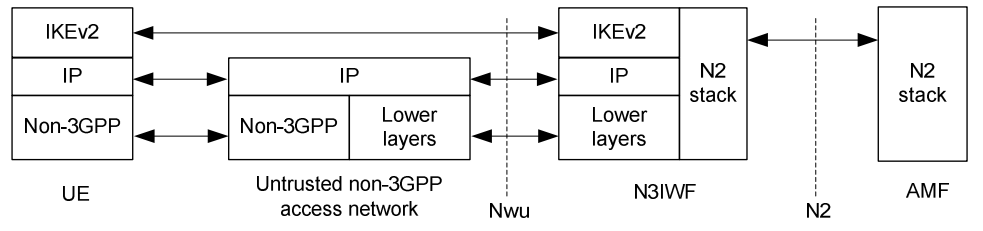

## 5.2 User Plane Protocol Stacks

### 5.2.1 User Plane Protocol Stack for a PDU Session

+ PDU layer: This layer corresponds to the PDU carried between the UE and the DN over the PDU Session. When the PDU Session Type is IPv4 or IPv6 or IPv4v6, it corresponds to IPv4 packets or IPv6 packets or both of them; When the PDU Session Type is Ethernet, it corresponds to Ethernet frames; 
+ GPRS Tunnelling Protocol for the user plane (GTP-U): This protocol supports tunnelling user data over N3 (i.e. between the 5G-AN node and the UPF) and N9 (i.e. between different UPFs of the 5GC) in the backbone network. GTP shall encapsulate all end user PDUs. It provides encapsulation on a per PDU Session level. This layer carries also the marking associated with a QoS Flow. 

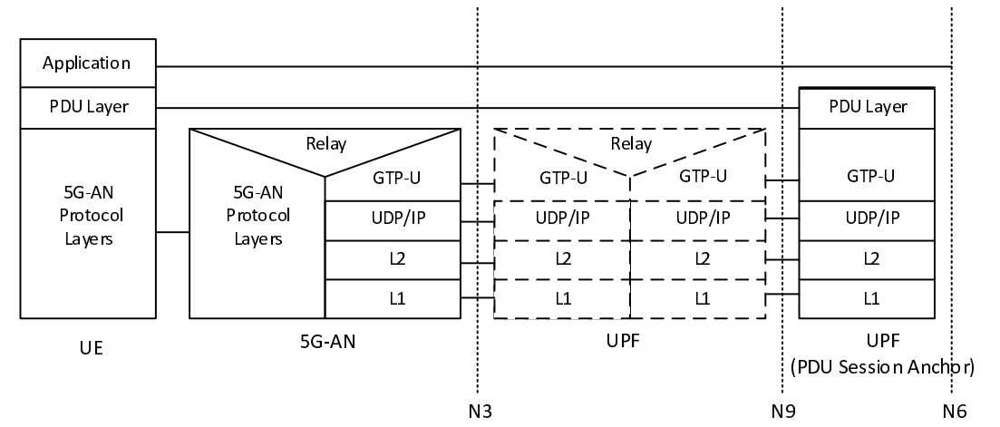

### 5.2.2 User Plane for untrusted non 3GPP Access

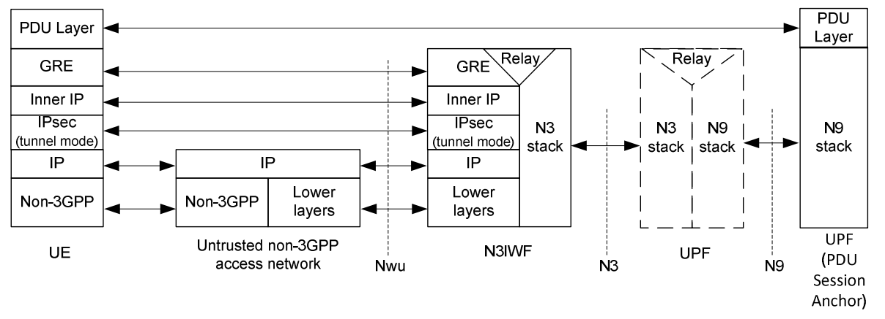