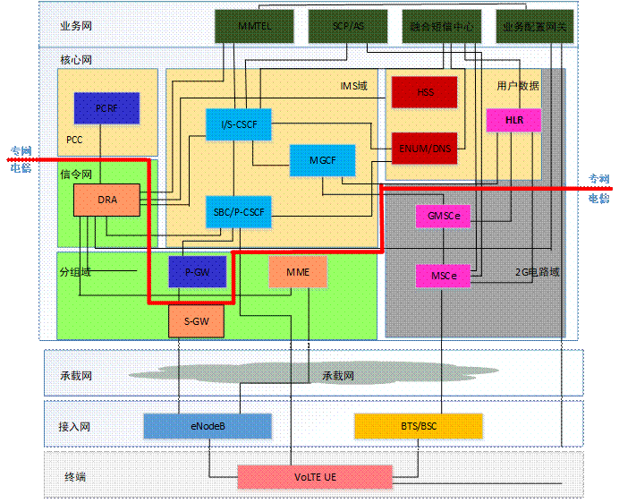
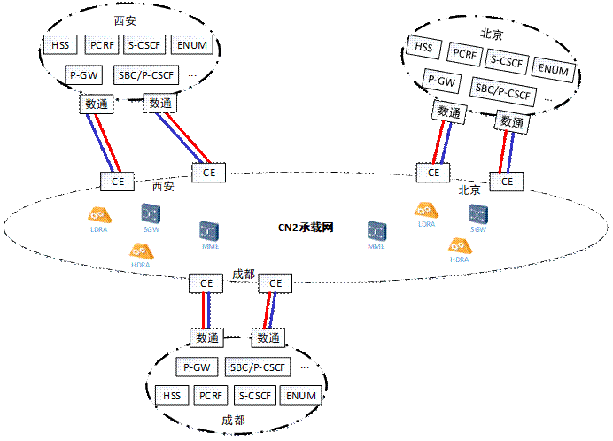
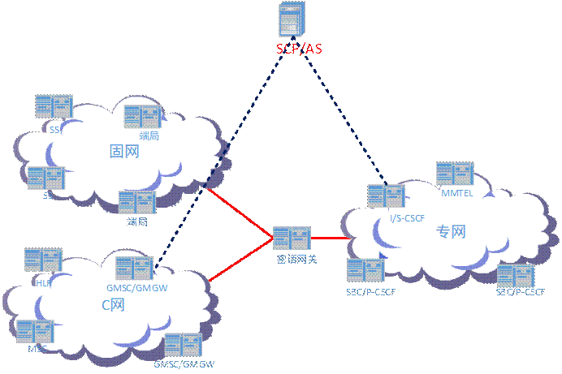
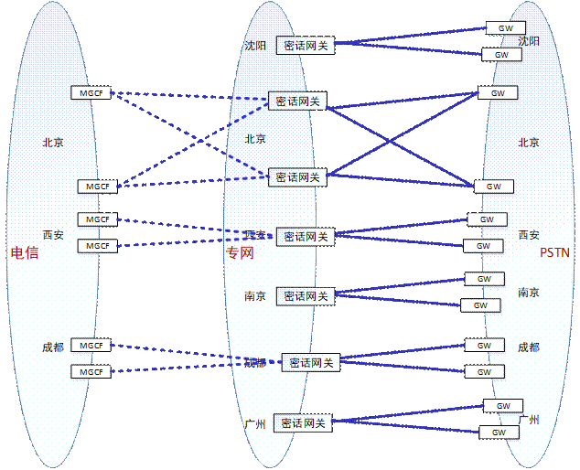
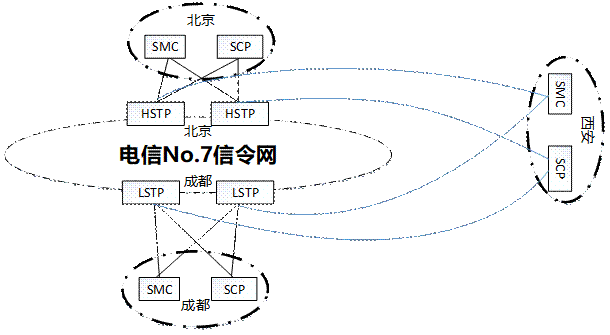
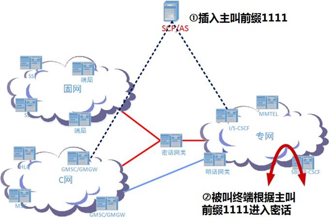
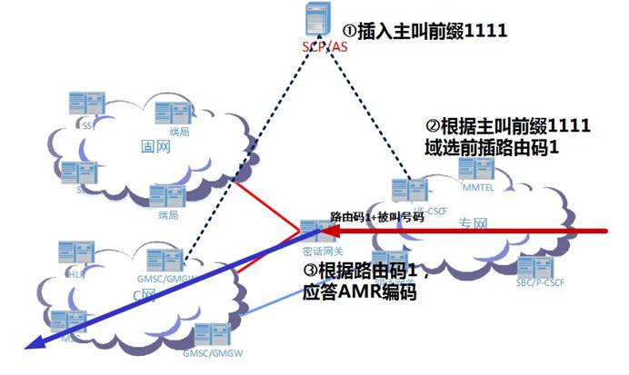

# 1 范围

+ 规定了专网VoLTE与C网、固网互通的网络组织、路由组织、数据配置和功能要求；

+ 专网EPC、专网VoLTE共用电信CN2承载网的CDMA-EPC VPN和CDMA-NGN VPN；

# 2 网络组织

## 2.1 专网网络架构

专网VoLTE是在LTE阶段基于IMS网络提供的基础语音类业务，业务范畴包括语音业务、视频通话业务、IP短消息业务、补充业务及智能网业务。专网VoLTE网络架构如图所示：

专网与电信在分组域对接：

+ 专网P-GW与电信S-GW之间的S5/S8接口；
+ 专网HSS与电信MME之间的S6a接口；

专网与电信在IMS域需对接：

+ 专网I-CSCF、S-CSCF与电信MGCF/IM-MGW之间的Mg接口；
+ 专网I-CSCF、S-CSCF与电信S-CSCF、I-CSCF之间的Mw接口； 
+ 专网二级ENUM/DNS与电信一级ENUM/DNS之间的接口； 
+ 专网HSS与电信I-CSCF之间的Cx接口；

## 2.2 分组域互通网络组织

专网EPC、专网VoLTE采用大区制组网，大区网元包括HSS、P-GW、PCRF、SBC/P-CSCF、S-CSCF、I-CSCF、ENUM、DNS等，通过数通设备接入到所在地电信CN2承载网的专网 CE。其中：

+ 专网EPC网元接入CDMA-EPC VPN；
+ 专网VoLTE网元接入CDMA-NGN VPN，开通Diameter链路的专网VoLTE网元同时接入CDMA-EPC VPN；
+ 专网HSS、P-GW、PCRF、SBC/P-CSCF、S-CSCF、I-CSCF等网元的Diameter信令链路与一对**电信****L-DRA**对接，接入电信DRA信令网。

## 2.3 电路域互通网络组织

专网VoLTE（以下简称专网）与专网固网（以下简称固网）、电信C网（以下简称C网）需通过专用互通网关为专网话务建立专用互通电路，由SCP/AS实现锚定和域选。专网VoLTE与周边网络互通如下图：

新建网元：

+ 密话网关：专网VoLTE与C网、固网密话互通网关，提供AMR编码密话与G.711编码密话分段转换；
+ SCP/AS：新建综合业务平台，分别与专网VoLTE、C网对接，为专网用户提供锚定和计费详单；

网络互通组织：

+ 专网与公网互通：与电信VoLTE同域，视为新增省份；

+ 专网与C网互通：专网大区通过密话网关，在关口局与电信MGCF对接；

+ 专网与信令网互通：专网大区新建融合短信中心和SCP/AS，通过SIGTRAN接入所在典型STP，通过No.7信令网实现电信C网与专网网元的信令互通。

  

# 3 路由规则

+ 明话路由：同电信VoLTE；
+ 密话路由：
  + 回落C网做锚定，按照就近原则路由到发话地大区密话网关；
  + 专网VoLTE跨网呼叫，按照就近原则路由到主叫归属大区密话网关；
  + 专网VoLTE域选，按照就近原则路由到被叫归属大区密话网关；
  + 专网固话PSTN网内，按照就远原则路由被叫归属大区密话网关；

# 4 锚定/域选

专网VoLTE在HLR和HSS均签约主被叫智能网业务。SCP/AS双跨C网和VoLTE，支持两个域各自触发业务。

SCP/AS在对接C网时处理规则为：

| **锚定场景** | **主叫用户** | **被叫用户** | **前插路由码** | **目的网关** |
| ------------ | :----------: | :----------: | :------------: | ------------ |
| 主叫锚定     |    4G C网    |    3G C网    |    路由码4     | 密话网关     |
|              |    4G C网    |   专网固话   |    路由码4     | 密话网关     |
| 被叫锚定     |    4G C网    |   4G VoLTE   |    路由码2     | 密话网关     |
|              |    3G C网    |              |      1934      | 密话端局     |
|              |     公网     |              |     111700     | MGCF         |

SCP/AS在对接IMS时处理规则为：

| **业务场景** | **主叫号码** | **被叫号码** | **原被叫号码** |   **处理动作**   |
| :----------: | :----------: | :----------: | :------------: | :--------------: |
|   主叫流程   |   4G VoLTE   |    3G C网    |                | 前插被叫路由码3  |
|              |              |   专网固话   |                |                  |
|   被叫流程   |   4G VoLTE   |   4G VolTE   |                | 前插主叫前缀1111 |
|              |    4G C网    |              |                | 前插主叫前缀1112 |
|              |    3G C网    |              |                | 前插主叫前缀1112 |
|              |   专网固话   |              |                | 前插主叫前缀1112 |
|   前转流程   |     公网     |     公网     |    4G VoLTE    |       放通       |
|              |     专网     |     公网     |    4G VoLTE    |       拦截       |
|              |     公网     |     专网     |    4G VoLTE    |       拦截       |

 MMTEL实现域选功能，根据不同主叫前缀前插不同域选路由码：

| **主叫用户** | **被叫用户** | **前插路由码** | **目的网关** | **网关动作**  |
| ------------ | ------------ | -------------- | ------------ | ------------- |
| 4G VoLTE     | 4G C网       | 路由码1        | 密话网关     | 应答AMR编码   |
| 4G C网       | 4G C网       | 路由码5        | 密话网关     | 应答G.711编码 |
| 3G C网       |              |                |              |               |
| 专网固话     |              |                |              |               |
| 公网         | 4G C网       | 1117xx         | MGCF         | 透传G.711编码 |

# 5 用户标识

## 5.1 IMSI和IMPI

电信为专网分配新的独立的IMSI号段，包括2G和4G IMSI，归属地为专网大区所在省。

+ IMPI是归属IMS网络运营者提供的用户唯一全球IMS标识，可以在归属IMS网络中标识用户签约数据，用于对VoLTE用户进行鉴权认证；

+ IMPI编码格式为：IMSI@ims.mnc<MNC>.mcc<MCC>.3gppnetwork.org。其中IMSI为用户USIM卡的IMSI，<MNC>为中国电信的移动网络码左侧加0，为011；<MCC>为中国电信的移动国家码，为460。

## 5.2 MDN和IMPU

电信为专网分配新的独立的MDN号段，归属地分别为专网大区所在省。

IMPU是用于VoLTE用户之间进行VoLTE呼叫路由的标识，也用来在HSS中标识用户数据。IMPU在使用前应该通过显式或者隐式的方式在IMS网络中进行注册。IMPU可以采用SIP URI格式或者TEL URI格式。每个VoLTE用户需要分配3个IMPU，其中2个为SIP URI，1个为TEL URI：

+ TEL URI：以“tel:”开头，码号遵循中国电信MSISDN编码规则，以“+86”开头。该码号用于呼叫，对用户可见。例如：tel: +8618901234567；
+ SIP URI 1：其格式为3GPP及GSMA定义的统一导出规则：sip:IMSI@ims. mnc<MNC>.mcc<MCC>.3gppnetwork.org（<MCC>=460；<MNC>=011）。该IMPU仅用于注册，不用于呼叫，对用户不可见；
+ SIP URI 2：该SIP URI用于在IMS网络中进行呼叫及路由，其格式为sip:+MSISDN@大区名缩写.大区所在省名缩写.ims.mnc011.mcc460.3gppnetwork.org。

|  省  | 省标签 | 大区 | 大区标签/缩写 |
| :--: | :----: | :--: | :-----------: |
| 北京 |   bj   | 总部 |  central/ce   |
|      |        | 中部 |   middle/mi   |
| 广东 |   gd   | 南部 |   south/so    |
| 江苏 |   js   | 东部 |    east/ea    |
| 辽宁 |   ln   | 北部 |   north/no    |
| 四川 |   sc   | 西部 |    west/we    |

## 5.3 S-CSCF能力集

S-CSCF能力集为存储在IMS HSS中的用户签约数据，代表S-CSCF能力信息。I-CSCF在用户注册时，从IMS HSS中获得用户签约的S-CSCF能力集，I-CSCF根据本地配置的S-CSCF能力集与S-CSCF主机名对应关系，为用户选择S-CSCF。S-CSCF能力集，需要在专网所有I-CSCF进行配置。

## 5.4 sIFC

Shared iFC编号采用四位数字编码格式。前2位为90，第三位1-6分配给各大区，0为全网性业务平台。

## 5.5 APN

专网4G用户的默认承载为CTNET APN，ANP NI格式为：CTNET。专网VoLTE用户需新增IMS APN和SOS APN，APN NI格式为：IMS、SOS。专网用户的APN OI格式为：大区所在省名缩写 .epc.mnc011.mcc460.3gppnetwork.org。

# 6 网间话务路由组织示例

## 6.1 4G VoLTE拨打4G VoLTE

标准IMS域内呼叫流程：

+ 主叫流程控制面路径：主叫VoLTE UE ->主叫SBC/P-CSCF ->主叫S-CSCF ->主叫MMTEL ->主叫S-CSCF ->主叫AS ->主叫S-CSCF；
+ 被叫流程控制面路径：主叫S-CSCF（查询ENUM/DNS）->被叫I-CSCF（查询HSS）->被叫S-CSCF ->被叫AS（主叫号码前插1111） ->被叫S-CSCF ->被叫MMTEL ->被叫S-CSCF ->被叫SBC/P-CSCF ->被叫VoLTE UE；
+ 媒体面路径：主叫VoLTE UE ->主叫SBC/P-CSCF ->被叫SBC/P-CSCF ->被叫VoLTE UE；

## 6.2 4G VoLTE拨打4G C网

被叫MMTEL做域选返回“路由码1+被叫号码”，S-CSCF分析路由码1，就近路由至密话网关。密话网关送MGCF，MGCF根据路由码1+被叫H码号段，向HLR发起MAP查询。

+ 主叫流程控制面路径：主叫VoLTE UE ->主叫SBC/P-CSCF ->主叫S-CSCF ->主叫MMTEL ->主叫S-CSCF ->主叫AS->主叫S-CSCF；
+ 被叫流程控制面路径：主叫S-CSCF（查询ENUM/DNS）->被叫I-CSCF（查询HSS）->被叫S-CSCF ->被叫AS（主叫号码前插1111） ->被叫S-CSCF ->被叫MMTEL（返回路由码1）->被叫S-CSCF ->密话网关 ->MGCF（查询HLR）->C网GMSCe ->C网VMSCe ->被叫4G C网UE；
+ 媒体面路径：主叫VoLTE UE ->主叫SBC/P-CSCF ->密话网关 -> C网MGW ->被叫4G C网UE；