# 1 5G概述

## 1.1 5G三大典型场景

IUT-R M.2083《IMT愿景-2020年及之后IMT未来发展的框架及总体目标》建议书提出三大典型应用场景：

+ 增强的移动宽带（eMBB）
+ 海量机器间通信（mMTC）
+ 超高可靠和超低时延（uRLLC）

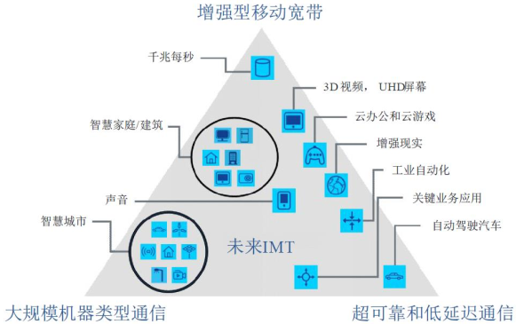

## 1.2 5G关键指标

ITU-R M.2083中，除了传统的峰值速率、移动性、时延和频谱效率等指标外，ITU还提出了用户体验速率、连接密度、流量密度和能效等四个新增关键能力指标。包含与IMT-Advanced（4G）的对比：

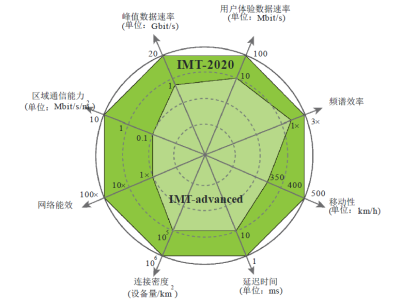

在《IMT-2020最小性能要求》报告中，又进一步细化了IMT-2020需要满足的14项技术性能指标：

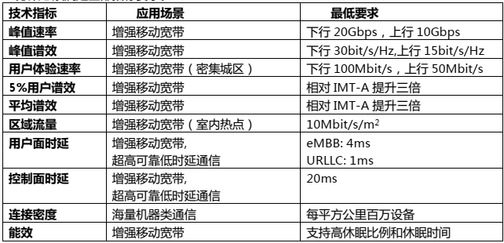

## 2.3 5G架构与组网模式

5G总体架构由5G核心网（5GC）和5G接入网NG-RAN组成：

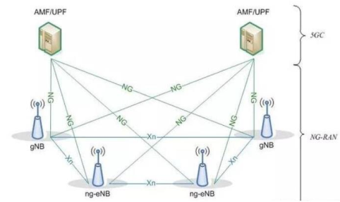

5GC主要包括三种主要逻辑节点：

+ 负责接入和移动管理功能的AMF（Access and Mobility Management Function)
+ 负责用户面管理功能UPF（User Plane Function）
+ 负责会话管理功能的SMF（Session Management Function）

NG-RAN由gNB和ng-eNB两种节点组成：

+ gNB向UE提供NR用户面和控制面协议终端的节点，并且经由NG接口连接到5GC；
+ NG-eNB向UE提供E-UTRA用户面和控制面协议终端的节点，并且经由NG接口连接到5GC；

5G两种组网架构：

+ 独立组网（SA）：有独立的接入网NR和核心网5GC，例如Option2/4
+ 非独立组网（NSA）：没有独立的5G核心网，而是LTE&NR共用核心网。初期LTE&NR共用升级后的4G核心网EPC+，后期共用5GC。基于NSA架构的5G载波仅承载用户数据，其控制信令仍通过4G网络传输

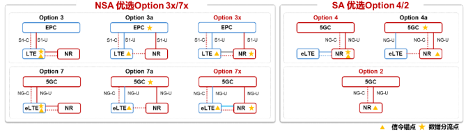

# 2 5G产业情况

## 2.1 标准情况

+ 第一个SA的5G标准（R15）的Main drop在2018年6月发布，Late drop在2019年6月发布；
+ R16预计完成uRLLC增强，计划于2020年3月完成。R16版本5G NR不包括物联网部分，NB-IoT和eMTC及其演进将长期存在；
+ R17业务需求冻结时间为2019年12月，架构和流程冻结时间为2020年9月。信令协议冻结时间未定，预计在2021年6月；

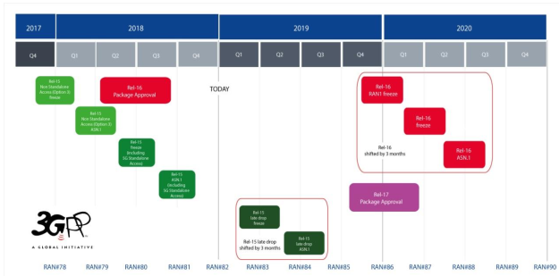

## 2.2. 频率情况

3GPP指定了两大频率范围：

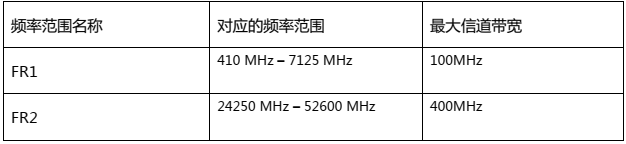

5G涉及的四个频段，建网策略如下：

+ C-Band：5G主频段，提供基础容量和覆盖；
+ 毫米波：5G容量不错，用于家庭宽带接入、自回传等场景；
+ 5G锚点频段（1.4G/1.8G/2.6GHHz）：通过上下行解耦，弥补C-Band上行覆盖不足，或者与3.5GHz频段实现载波聚合/双连接，提高用户体验；
+ Sub 1G频段（700M/800M/900MHz）：用于物联网、深度覆盖，提供无处不在的业务体验。

## 2.3 商用进展

5G核心网设备已基本成熟，运营商和主设备商成为5G网络建设的核心。5G商用后将逐渐向下游应用场景传导，产业链地图更庞大。

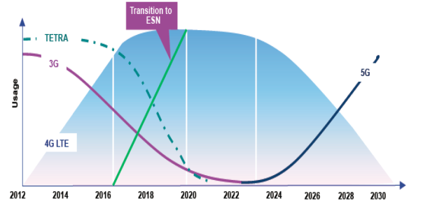

## 2.4 应用综述

5G三大应用场景在部分行业的可能应用如下表：

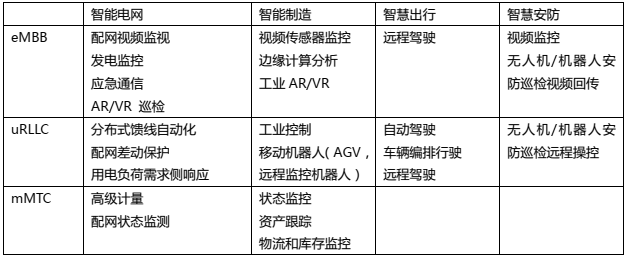

5G初期业务以eMBB为主要特征，5G中后期通过uRLLC与mMTC两大特性是能垂直行业。

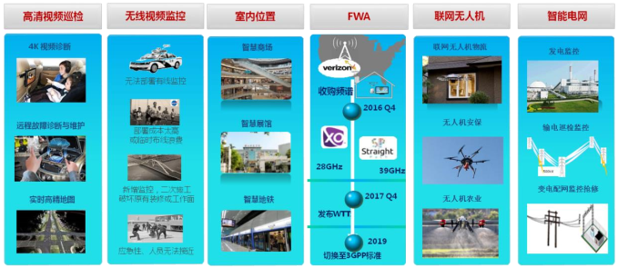

# 3 关键技术使能垂直行业

## 3.1 大带宽

5G大带宽的主要支撑技术为：

+ 新频段：引入C-Band和毫米波，增加可用频率带宽，从而提升系统容量；
+ 增强Massive-MIMO：通过增加天线数量与增强M-MIMO提升覆盖，实现多用户的资源服用（MU-MIMO），从而提升系统容量；

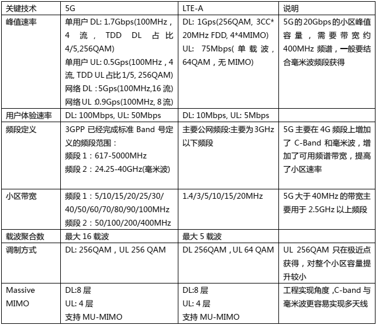

## 3.2 低时延和高可靠

### 3.2.1 低时延

支持5G低时延的主要技术包括：

+ 更短的时隙长度：科根据工作频段，使用不同的子载波间隔，从而降低时隙长度，减少TTI周期
  + 频率小于3GHZ：采用15kHz的子载波间隔，TTI周期为1ms（与LTE TTI周期相同）；
  + 频率大于3GHz的C-band，可采用30kHz的子载波间隔，TTI周期为0.5ms；
  + 频率为毫米波时，可采用120kHz的子载波间隔，TTI周期为0.125ms；

+ 基于符号的资源调度：在减少时隙长度基础上，引入更小的mini-slot机制，选取一个时隙中2/4/7个符合作为传输调度单位；
+ 自包含时隙：在TDD制式中，可在一个时隙内分配上下行发送符合，降低上下行时延；
+ 上行免授权：上行免授权接入，减少信令交付时间；
+ 移动边缘计算：用户免和控制面分离涉及，用户面数据可以在边缘网络处理，降低业务时延；

### 3.2.2 高可靠

5G网络高可靠性的要求是：在1ms内传输32bytes，且成功率可以达到99.999%。主要技术包括：

+ 盲重传：为了增加通信的可靠性，在发送端不基于 HARQ 就进行 K 次重传，牺牲频谱效率换取通信可靠性；
+ 采用低码率传送 uRLLC 业务： 如针对 uRLLC 和 eMBB 使用不同的 MCS 策略， 牺牲频谱效率换取通信可靠性； 
+ 利用 5G 新空口获得性能提升：多天线分集， 多站之间的分集等技术提升无线通信的性能 ；

### 3.3.3 局限性

考虑全球现在的 5G 频谱主要是 TDD 的 2.5GHz 和 3.5GHz TDD 频段， uRLLC 的性能收益会大打折扣， 主要约束为：

+ 可变时隙长度的实现约束：5G 新空口虽然定义了 5 种子载波间隔， 但考虑 OFDM调制需要的CP保护时间，在3GHz以下的频谱部署中，子载波间隔仍然是15kHz；
+ 在 3.5GHz 的频谱部署中， 可采用 30kHz 的子载波间隔， 此时时隙的最小周期为0.5ms；在毫米波可采用 120kHz 的子载波间隔，时隙的最小周期可以是 0.125ms。在 3.5GHz 频谱部署网络中， 时隙长度最小只能到 0.5ms， 无法实现最优的0.125ms；
+  动态 TDD 时隙和自包含时隙约束：TDD 系统要考虑基站之间的干扰（基站发射干扰基站接收，以及发送的拖尾效应），动态 TDD 时隙会导致严重干扰，而自包含时隙考虑 TDD 的拖尾效应保护时间也会降低空口容量。 所以目前 3.5GHz 建议的子帧配比为 DDDSU(4:1 配置)，不能实现 5G 系统定义的小于 1ms 的传输时延要求，极低时延的实现要引入 FDD 系统或毫米波。  

因此，在 3.5GHz TDD 为主要部署频段的 5G 网络中，uRLLC 的性能还不能完全满足5G 系统要求的 1ms 的端到端时延，需要将来结合毫米波频段或 FDD 制式，来满足小于 1ms的时延要求。

## 3.3 切片技术

5G端到端网络切片技术：

+ 在终端、接入网和核心网中引入了 S-NSSAI 标识(Single Network Slice Selection Assistance Information)；
+  终端发起 RRC 接入请求时携带 S-NSSAI，接入网和核心网引入 S-NSSAI 感知特性，为终端接入分配归属的网络切片； 
+ 在无线接入网(RAN)侧，在 CU（ Centralized Unit）和 DU（ Distributed Unit）中增加 S-NSSAI 属性，支持 CU/DU 与网络切片的灵活配置关系；同时在 CU 侧可增加对切片的资源调度策略，可为不同切片分配最小和最大资源占比；
+ 在核心网（ 5GC）侧引入微服务框架，可根据网络切片的不同需求， 按需编排网络功能（ NF Network Function）；  

### 3.3.1 切片网络感知

下图示意根据UE接入时携带的S-NSSAI进行AMF重分配的过程，通过各网络的参与和预先规划，实现网络切片的归属分配。

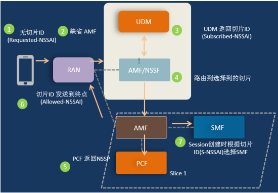

### 3.3.2 切片网络切分粒度

5G网络切片的切割方式：

+ S0：完全独立部署；
+ S1：切片级共享射频模块（RRU和天线），从DU开始分离，切片见到频率与资源独立；
+ S2：切片间共享射频模块/DU，从CU开始分离。切片见有公用的RRC控制（部署在主切片上），切片间可以有不同的RRM策略（例如针对uRLLC和mMTC不同切片的DRX、DTX和策略上报周期等）；
+ S3：切片间共享射频模块/DU/CU，从传输网络TN开始分离，不同切片间通过资源调度策略来控制；
+ S4：切片间共享射频模块/DU/CU/TN，从核心网开始分离（全部NF分离或部分NF分离），不同切片之间有部分独立的核心网NF，切片间的资源通过RAN和TN的资源调度策略来控制；
+ S5：所有网络资源共享，用户之间通过QoS来控制；

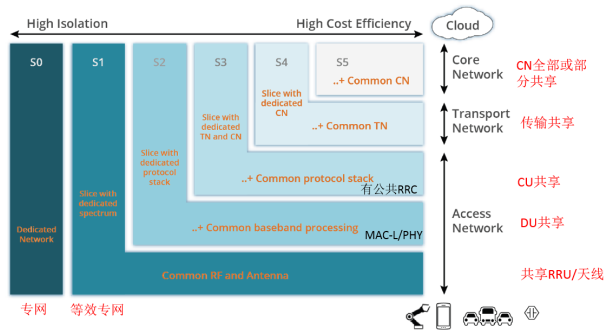

### 3.3.3 无线接入网（RAN）调度策略

RAN的可用资源包括时域和频域，相关资源如下图所示：

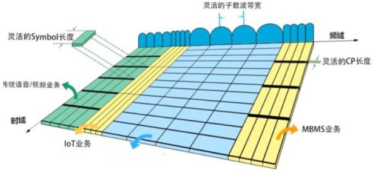

RAN可对不同的S-NSSAI确定调度策略：

+ 策略1：对各切片之间的资源调度不做限制；
+ 策略2：确定在一段时间内，各切片的平均资源占用率；
+ 策略3：支持复杂的调度策略，包括：
  + 某个切片的资源占用最小比或最大占用比；
  + 切片资源十分可与其他切片共享，如果可以共享，共享策略；

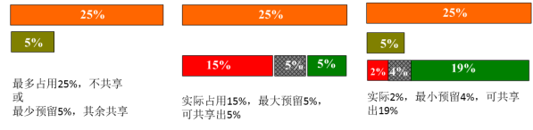

### 3.3.4 核心网（CN）按需编排

5G 核心网通过以微服务为中心的架构，来满足切片的差异化编排， 下图示例了不同场景下集中核心网部署方式： 

+ 切片核心网占用独立主机，核心网物理隔离；
+ 切片核心网共享主机，核心网逻辑独立部署； 
+ 切片核心网共享主机，并共享部分核心网的网络功能实体；  

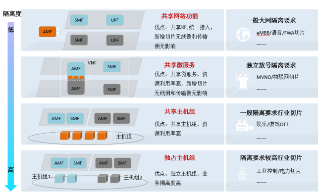

### 3.3.5 5G非连续组网情况下难以支持连续的网络切片

对于运营商的 5G 网络建设， 4G 和 5G 网络将长期共存， 其中：

+ 5G 频段为 3.5GHz 高频段， 小区覆盖半径较小， 建网成本高，因此会根据情况按需部署；
+ 现网的 1800MHz 和 2100MHz 作为 4G 的主力承载网，将与 5G 长期共存，逐步演进； 
+ GSM900/LTE900/NB900MHz 作为最基础网络覆盖。  

运营商在短时间内（预计 5 年） 不会形成一个无缝覆盖的 5G 网络，很多情况下终端需要回落到 2G/4G 网络， 而此时网络不支持切片感知， 所以无法支持端到端的网络切片。  

运营商建网初期会考虑成本和平滑演进，可能采用 NSA 组网架构。 在 NSA 模式下，终端的信令承载上 LTE 网络上， 4G 网络无法支持切片 ID 的感知， 所以 NSA 模式不能支持端到端切片功能。  

### 3.3.6 网络切片安全

对于网络切片安全， 安全威胁主要有： 

+ UE 访问未经授权的切片 
+ 越权进行切片运维
+ 切片 key 泄漏导致攻击者获取其他切片的数据 
+ 有合法访问权限的用户行为异常 
+ 威胁服务的可用性，包括 
  + 大量终端、或者网络侧发起 DDoS 攻击切片，导致资源过度消耗 
  + 影响其他切片的资源可用性、延时、吞吐等
  +  影响同切片内其他用户的体验  

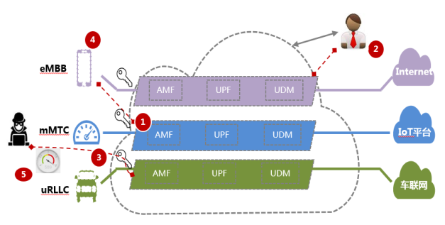

## 3.4 组播使能的集群业务

### 3.4.1 3GPP组播承载发展历史

+ R6：MBMS以支持UMTS中提供多播/广播服务；
+ R8：MBSFN以解决MBMS在小区边界的同频干扰问题；
+ R9：eMBMS；
+ R12：eMBMS为支持公共安全、CIoT和V2X等新业务不断进行更新增强；
+ R13：基于共享信道的SCPTM支持多播业务；

### 3.4.2 5G标准不支持组播承载

当前的5G标准尚不支持多播业务承载，但多播业务将在支持公共安全、CIoT和V2X业务中哦你哦个扮演非常重要的角色。5G系统架构需要做潜在增强，具体目标如下：

+ 定义架构：为支持多播/广播业务而定义 RAN 和 CN 的功能划分。例如 ad-hoc 多播/广播流，基于无线的软件分发，组通信和多播/广播的 IoT 应用， V2X 应用，公共安全 MC 应用等；
+ 支持不同等级的业务： 例如如仅传输模式 vs.全业务模式；
+ 支持灵活的（如分布式 vs.集中式）网络部署和运营（如 CP-UP 分离）；
+ 支持公共安全需求（见 TS 22.179 和 TS 22.280）； 
+ 同时考虑 E-UTRA 和 NR 作为无线接入技术； 
+ 对 RAN 的影响后续分析；  

## 3.5 L-NR频谱动态共享技术

4+5G 频谱共享是 5G 标准中的一项重要技术，允许 4G 和 5G 技术可以在同一个载波频率上同时运行、共享频谱。通过智能调度算法，根据实际流量需求，在同一载波频率内实现 4G 系统和 5G 系统之间的频谱动态共享。这将最大限度地减少频谱浪费，并实现最佳的最终用户性能。

4G/5G动态频谱共享技术：

+ 业务信道： 在保证一定的 4G 业务体验的前提下，剩余频谱， 5G 可以直接使用； 
+ 非业务信道：5G 技术摈弃了 4G“always on”小区公共信号和信道设计原则，其控制信道、广播信道、主辅同步信道均可灵活地配置于时域和频域。 因此，5G 小区可以在不影响 4G 小区的前提下，避开 LTE 的相关信道配置，避免制式之间非业务信道有相互干扰。  

频谱共享技术的挑战：

+ 4G 做为宽带系统，信道配置相对粗放，控制信道、导频等均为全频带映射；而5G 技术也做为宽带系统，同样也需要配置映射各类物理信道。如何既能完美解决两种制式之间的各种物理信道的干扰碰撞，又能提升业务信道在共享频谱上整体的频谱利用率，需要有统筹合理的算法支撑； 
+ 4G 技术采用固定的 15kHz 的子载波间隔，而 5G 技术可以支持不同参数集（ numerology）的混合使用，即允许配置不同的子载波间隔。不同的子载波间隔破坏了子载波间的正交性， NR 通过 OFDM 信号的 windowing/filtering 技术降低了符号间干扰，但 LTE 没有 windowing/filtering 技术，导致 4G 与 5G 进行频谱共享时，如果 5G 配置不同于 15kHz 的子载波间隔时，会对 LTE 产生干扰，引起 LTE 的系统性能损失。因此共享频谱技术，推荐 5G 系统采用与 4G 系统相同的子载波间隔配置方式；
+ 频谱共享技术主要针对没有 5G 专用频谱资源或 5G 频谱资源比较紧张的场景，如果具有充足的 5G 频谱资源，则没有必要使用频谱共享这么复杂的技术。 目前5G 的建设方案也都是采用专门 5G 新频段，新建基站的建网模式； 
+ 5G 终端需要支持共频谱技术，终端接收解调 NR 信号时， 需要明确地知道 4G 控制信道的配置；  

# 4 5G时代的行业无线专网展望建议

## 4.1 5G专网新频段可获取性

目前全球各国对 5G 专网频段的考虑较少，基本集中在工业互联网领域上考虑分配专用频率的可行性。5G 专网频段获取时间较长、难度较大，短期内没有看到分配 5G 专网频率可能性。待 5G 技术、应用与产业相对成熟后，根据 5G 技术在现有专网频段应用的投资收益比，考虑是否进行频率重耕与产品的升级演进。 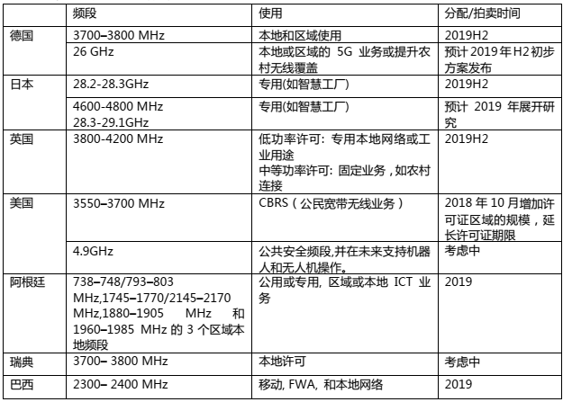 

## 4.2 5G网络演进路径

### 4.2.1 核心网演进

LTE 核心网 EPC 可以演进到 5G 核心网 5GC， 建议演进可分为三个阶段： 

+ NSA（ option3/3a/3x）组网：提供 eMBB 业务，4G 核心网 EPC 演进支持云化部署，软件功能升级为 EPC+，可以支持 5G NSA 组网。通过部分部署 5G 基站gNB，与现有 4G 基站 eNB 混合组网。当前公网运营商多采用这种建设模式； 
+ 5GC 与 EPC 互操作（可选）：引入 5G 核心网 5GC，提供 eMBB、uRLLC 网络切片等业务功能。云化核心网可以通过软件升级为 5GC，采用服务化架构，支持4G/5G 互操作。NR 基站可直接接入核心网 5GC（ Option7/7a/7x）； 
+ 全面融合核心网：随着 4G 存量终端逐渐退网，NR 基站逐渐完成连续覆盖，4G 核心网 EPC 逐步退网，全网演进为 5G SA 架构组网（ Option 2）。  

**EPC升级为EPC+**

4G核心网各网元功能影响如下图所示：

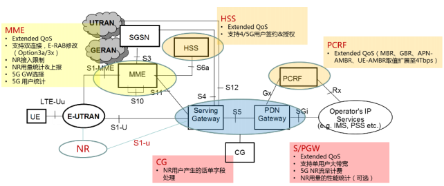

**5G核心网架构**

5G核心网使用网络功能虚拟化（NFV）和软件定义网络（SDN）技术实现了真正的Cloud Native，主要有两个方面的变革：

+ 控制面和用户面的分离：让用户面功能摆脱中心化的束缚，使其既可以灵活部署于核心网，也可以部署于更接近用户的接入网；
+ 控制面引入SBA（Service Based Architecture）：将控制面功能抽象成多个独立的网络服务并采用服务化接口，以软件化、模块化和服务化的方式来构建网络；

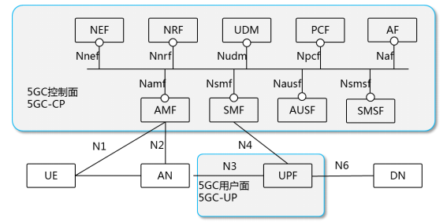

### 4.2.2 基站演进

支持NSA组网也需要对4G基站eNB进行升级，以兼容NR相关的用户面和控制面的数据和信令处理。可以通过插入或者替换合适的主控板、基带板等硬件设备，支持eNB连接5G基站，或者升级为5G基站。4G与5G基站可以共用BBU，主控板分离部署；或者4G与5G基站可以采用独立BBU。  

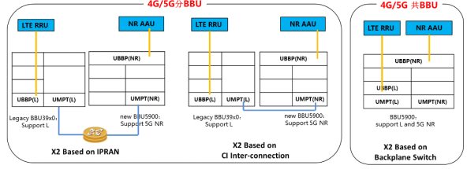

4G基站与5G基站推荐异频或者邻频部署， 当不能异频部署的时候， 可以采用L-NR共频谱技术实现4G与5G的同频混合组网。
基站可以支持多频段NSA，根据UE能力和锚点优先级配置灵活驻留： 

+ 如果4G专网仅支持单频段， 则该频点做为NSA锚点载波；
+ 如果4G专网有多频段， 则多个频段都可以做为NSA锚点载波，推荐覆盖连续的4G频点作为高优先级锚点。

传输网支5G业务的传输要求，其中传输时延、抖动、丢包率等指标要求与4G业务类似。但是传输网的带宽需要根据承载的5G业务容量进行评估，如果不能满足5G业务带宽， 则需要进行传输网带宽的扩容改造 。 

无线基站射频切换新平台，通过关键规格nTnR、功率、体积等及性能提升，可以持续演进。 

### 4.2.3 网管演进

对于现网升级为NSA的场景，可以采用原有网管升级扩容或者新增5G网管两种方式：

+ 原网管升级后，可以管理核心网EPC+； 
+ 原网管升级扩容支持NR gNB接入；如果原网管不扩容，则可新增5G网管，NSA部署区域LTE锚点基站与NR gNB整体割接到新网管。  

## 4.3 Sub 3GHz现有专网频段模式分析

### 4.3.1 模式一：先建4G专网，后继可同频段演进5G专网

+ 当前4G专网标准成熟，5G暂无专网标准可参考；
+ 当前产品能向5G演进，保护当前4G投资；

### 4.3.2 模式二：直接建设5G专网

+ Sub 2GHz频段下采用SA模式建设5G专网；
+ Sub 2GHz低频段可以支持5G技术，单空口收益较低；
+ 缺乏Sub 2GHz的5G手持数据终端；

### 4.3.3 建议：Sub 2GHz频段下推荐采用模式一的建网模式

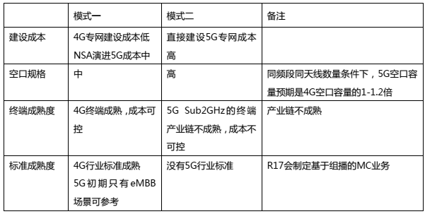

## 4.4 5G公网切片与行业专网的对比

### 4.4.1 支持5G公网切片的前提条件

5G引入了端到端的切片网络设计，在网络侧引入网络切片感知和分配功能。但对于5G的运营商网络部署，下面两个方面会约束网络切片的可获取性：

+ 运营商会在较长时间通过2/4G来做5G覆盖盲点的补充， 没有5G覆盖的地方，终端会回落到2/4G网络； 
+ 运营商会采用NSA组网，此时终端是通过4G控制面接入网络的，不能实现端到端的网络切片感知。

因此考虑上面两个因素， 5G的端到端切片无法全网的连续覆盖。  

### 4.4.2 网络切片与行业专网差异

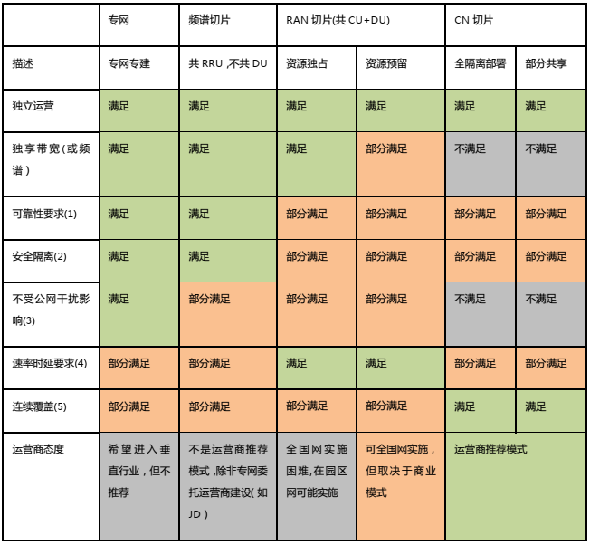

说明：

+ 可靠性要求，比如地铁、机场行业要求的双网备份网络增强等，这些定制化需求取决于与运营商的商务模式； 
+ 安全隔离，存在威胁模型，业界应用还待探索， 有待成熟； 
+ 公网通信受到干扰的场景主要有下面三个方面： 
  + 特殊场景下的公网干扰器导致公网不可用（ 如重大安保）；
  + 公网容量过大导致的速率拥塞；
  + 公网用户多导致的接入拥塞；
  + 5G低时延和大带宽特性取决于行业客户是否有宽带频谱；
  + 5G切片获取需要SA组网和5G连续网络覆盖才能该满足， 公网部署只能部分满足该要求；

### 4.4.3 小结

5G公网切片与行业专网相比，5G公网端到端切片不能等同于行业专网：

+ 5G切片是一个很好的创新技术，可以为行业客户提供一定的业务独立性，但不能完全代替专网；
  + 技术层面讲， 5G切片可以包含核心网、传输网，基站BBU（ DU+CU）， RRU/天线等多个维度的切片，最极端的切片才等效专用网络；
+ 专网与公网相比，专网在安全性、专业性、可靠性（ QoS）等方面具备独特优势，关键业务（ Mission Critical）只能承载在专网上： 
  + MCPTT等业务需要承载于组播信道，截止到R17为止， 5G标准中都没有考虑组播信道服务于MC业务； 
  + 在网络拥塞情况下， 5G切片技术不能解决大量公+专用户随机接入拥塞的问题，存在专网客户不能接入网络的技术缺陷； 
  + 公安客户多次明确表示“非预留频率与网络资源”的5G切片不能满足公安客户诉求；

+ 提供切片服务依赖于5G核心网5GC提供服务 
  + 运营商网络覆盖将会长期4G/5G互为补充， 5G初期几年的建网模式以NSA（非独立）组网为主，需要复用4G核心网，这种情况下不能提供切片服务； 
  + 独立(SA)模式组网下，标准技术层面提供了各种切片可能，极致的切片（独立频谱）可等效于专网，但目前没有成熟的商业模式，收费模式与运营模式，需要设备上，运营商，业务提供商，客户共同长期摸索。目前用于试验的5G端到端切片，多数在视频直播、 VR/AR、视频直播、固定宽带接入等公用场景会先期实施； 
  + 对于网络切片在垂直行业应用还处于初级探索阶段，试点较少，且现有的试点都是单一行业场景下（频谱独享），未见多行业共享。能否保证客户安全隔离等需求，还有待研究。不管是技术上还是商业模式上，都需要探索，可行性未知，且离商用还很遥远； 
 + 5G NR（新空口）引入了灵活的帧结构与时隙分配技术，以便能够为不同的行业客户提供低时延要求，上下行非对称等业务特征 
    + 但是一个运营商自己允许的同（邻）频段的部署网络时，必须保持相同的帧结构与时隙分配模式，这样就难以同时兼顾特定行业客户与公众用户的需求，或者多个行业客户的不同空口分配诉求；

## 4.5 4G专网 + 5G公网是一种长期存在的行业无线网络建网方式

公专网融合是行业客户的基本诉求与典型特征，4G专网承载MC（Mission Critical）业务，4G/5G公网承载NMC（Non Mission Critical） 业务，二者互为补充，更好的适配行业应用需求。

5G频点相对于4G较高，初期部署难以实现连续覆盖，通过公专融合(4G/5G公网和4G专网融合组网)，能够更好的适配行业应用需求。

同时，4G专网在保持安全和可靠基础上，也将引入更多5G新技术，向更高带宽、更低时延和更多连接的方向演进。  

# 5 总结与展望

5G技术定义了eMBB、uRLLC、mMTC等三大应用场景，并且通过网络切片，边缘计算等创新技术，预期为垂直行业客户提供专业的服务。但是综合标准与产业进展，5G网络与产业成熟还需要有更多的问题有待于探索，例如：  

+ 当前的5G网络与5G应用还是由运营商来主导，但是针对垂直行业客户，5G网络还不能完全满足客户需求，例如安全性，可靠性，低时延等，5G uRLLC与mMTC技术本身还有很多的演进与改进空间；
+  从运营模式方面讲，随着5G网络覆盖逐渐普遍，单纯依靠运营商难以服务于多样化的定制市场与定制行业，引入基于网络运营商会催生出一批5G网络业务提供商，为行业客户做出更多的网络资源与网络编排的定制； 
+ 5G网络目前还没有针对行业客户的特定频段，随着行业客户应用的普及，包括工业制造、电力能源、公共应急等垂直行业会更加迫切地需要特定频谱、专业网络的需求，以满足特定行业的特定网络要求；
+  在5G网络上承载专业级多媒体集群业务目前标准层面还是空白，可以在4G宽带集群技术基础上，向5G网络做技术的迁移与演进； 
+ 从5G网络架构演进节奏上来讲，NSA（非独立组网）以其部署速度快，利于首发和网络体验好的优势，成为众多运营商初期部署的首选，而为垂直行业提供5G 新业务的切片技术需要演进到SA才能支持。演进到SA面临着技术和财务的双重挑战，为5G支
  持垂直行业带来较大的变数；
+ 服务于垂直行业，安全措施将至关重要，在边缘计算MEC，网络切片，DU/CU架构分离，合法监听等领域的安全增强，需要进一步研究，并且能够与行业客户自行的安全机制协同。  